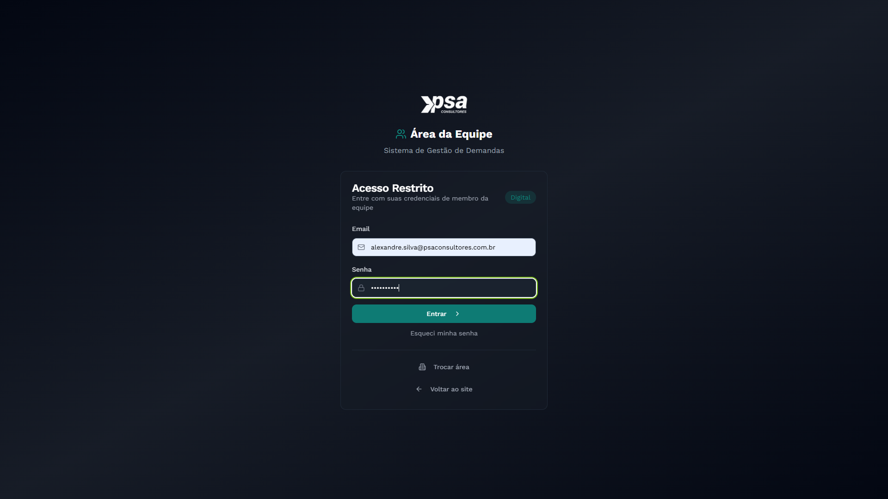

  

    1
    <h2 class="editable-text">Introdução</h2>
  

  

    
Este manual apresenta as funcionalidades da ferramenta de <strong>Análise Cruzada</strong> (também conhecida como Auditoria Cruzada), parte integrante do sistema PSA Elevate.

    
A ferramenta realiza a reconciliação fiscal detalhada, cruzando dados entre diversas fontes e obrigações acessórias para identificar eventuais divergências. Os cruzamentos disponíveis incluem: <strong>Balancete x EFD Contribuições</strong>, <strong>EFD ICMS x EFD Contribuições x XML de NFe</strong> e a verificação de <strong>XMLs de CT-e por lote</strong>.

  

  

    2
    <h2 class="editable-text">Acesso e Autenticação</h2>
  

  

    <h3 id="secao-acesso-1">2.1. Acesso ao portal e área da equipa</h3>
    
O acesso às ferramentas começa pelo portal corporativo da PSA Consultores. Aceda ao link <a href="https://psaconsultores.com.br" target="_blank">https://psaconsultores.com.br</a> e clique no ícone de <strong>"Equipe"</strong>, localizado no canto superior direito do ecrã, para entrar na área restrita.

    

        

            
        

        
Portal corporativo com destaque para o menu de acesso à Equipa

    

    <h3 id="secao-acesso-2">2.2. Seleção da área de atuação</h3>
    
No ecrã de departamentos, abra a lista suspensa e selecione a opção <strong>"Digital"</strong> para aceder ao sistema de gestão de demandas e às ferramentas internas.

    <h3 id="secao-acesso-3">2.3. Login no sistema</h3>
    
O ecrã de autenticação será exibido. Insira as suas credenciais corporativas (e-mail e palavra-passe) nos campos correspondentes e clique em <strong>"Entrar"</strong>.

    

        

            
        

        
Preenchimento dos dados de acesso

    

    <h3 id="secao-acesso-4">2.4. Seleção do ambiente de trabalho</h3>
    
Após o login, selecione o ambiente <strong>"Digital Dev"</strong>. Este é o ambiente de criação, desenvolvimento e utilização das ferramentas fiscais automatizadas.

    <h3 id="secao-acesso-5">2.5. Hub de Ferramentas</h3>
    
Ao entrar no ambiente Digital Dev, o sistema carregará o <strong>Hub de Ferramentas</strong>. Identifique o cartão correspondente e clique no botão <strong>"Acessar Ferramenta"</strong> no módulo de Análise Cruzada.

  

  

    3
    <h2 class="editable-text">Visão Geral da Ferramenta</h2>
  

  

    
A interface da ferramenta divide-se em duas partes fundamentais: o painel de <strong>Filtros de Busca</strong> na secção superior e a secção de resultados, organizada em três <strong>Abas (Separadores)</strong>. Cada aba é dedicada a um tipo específico de auditoria cruzada.

    

        

            
        

        
Interface principal, destacando os filtros e os separadores de auditoria

    

  

  

    4
    <h2 class="editable-text">Filtros de Busca e Configuração</h2>
  

  

    
Para iniciar qualquer análise, é obrigatório preencher os parâmetros de pesquisa no painel de filtros.

    <h3 id="secao-4-1">4.1. Cliente e Contribuinte</h3>
    
Comece por selecionar o <strong>Cliente</strong> no menu suspenso. De imediato, o campo <strong>Contribuinte</strong> será desbloqueado para que possa selecionar o CNPJ específico que deseja auditar. Se o cliente possuir apenas um contribuinte associado, o sistema fará a seleção de forma automática.

    <h3 id="secao-4-2">4.2. Período de Auditoria</h3>
    
Utilize os calendários para definir a <strong>Data Início</strong> e a <strong>Data Fim</strong> do período de análise.

    
Após preencher os quatro campos obrigatórios, clique no botão <strong>Consultar</strong>. O sistema processará as validações para todas as fontes em simultâneo. Caso necessite recomeçar, utilize o botão <strong>Limpar</strong>.

    
    

        

            
        

        
Filtros obrigatórios preenchidos para iniciar a auditoria

    

  

  

    5
    <h2 class="editable-text">Navegação pelas Abas de Auditoria</h2>
  

  

    
Após o processamento da consulta, os resultados são distribuídos por três separadores, permitindo identificar as divergências fonte a fonte.

    <h3 id="secao-5-1">5.1. Balancete (EFD Contribuições vs. Balancete)</h3>
    
No separador <strong>"Balancete"</strong>, o sistema compara as receitas e as retenções declaradas na EFD Contribuições contra os saldos das contas correspondentes no Balancete Contábil (arquivos ECD/Excel previamente importados). Este cruzamento é fundamental para detetar omissões de receitas ou lançamentos indevidos.

    <h3 id="secao-5-2">5.2. EFD ICMS | XML NFe</h3>
    
O separador <strong>"EFD ICMS | XML NFe"</strong> efetua um cruzamento a três vias: confronta as faturas (NFe) escrituradas no SPED Fiscal (EFD ICMS/IPI), as escrituradas na EFD Contribuições e as que constam fisicamente nos ficheiros XML originais do período. Aponta falhas de escrituração ou discrepâncias de valores entre as obrigações.

    <h3 id="secao-5-3">5.3. XMLs de CTE por Lote</h3>
    
O separador <strong>"XMLs de CTE por Lote"</strong> é dedicado à auditoria em lote dos Conhecimentos de Transporte Eletrónico (CT-e). O sistema verifica a integridade dos ficheiros, a coerência das chaves de acesso e a correta apropriação dos montantes de frete perante os registos do SPED.

    
    

        

            
        

        
Navegação entre os separadores de análise após a consulta

    

  

  

    6
    <h2 class="editable-text">Dicas e Boas Práticas</h2>
  

  

    

        warning
        
<strong>Volume de Dados:</strong> O cruzamento de ficheiros XML (NFe e CT-e) contra as obrigações EFD pode exigir um elevado processamento computacional. Recomenda-se realizar a auditoria por blocos mensais ou trimestrais para evitar lentidão excessiva no carregamento dos resultados.

    

    

        lightbulb
        
<strong>Sincronização de Ficheiros:</strong> Antes de efetuar a consulta, certifique-se de que os balancetes e os pacotes de XML (ZIP) daquele período já foram devidamente processados no sistema através das ferramentas de importação respetivas.

    

  

