

  

    1
    <h2 class="editable-text">Introdução</h2>
  

  

    
Este manual apresenta as funcionalidades da ferramenta de <strong>Análise Cruzada</strong> (também conhecida como Auditoria Cruzada), parte integrante do sistema PSA Elevate.

    
A ferramenta realiza a reconciliação fiscal detalhada, cruzando dados entre diversas fontes e obrigações acessórias para identificar eventuais divergências. Os cruzamentos disponíveis incluem: <strong>Balancete x EFD Contribuições</strong>, <strong>EFD ICMS x EFD Contribuições x XML de NFe</strong> e a verificação de <strong>XMLs de CT-e por lote</strong>.

    <h3>Principais Funcionalidades</h3>
    <ul>
        <li><strong>Conciliação multifonte:</strong> compara dados contábeis, arquivos EFD e documentos XML em uma única rotina.</li>
        <li><strong>Navegação por abas especializadas:</strong> separa os cruzamentos por cenário fiscal para acelerar a identificação de divergências.</li>
        <li><strong>Exploração hierárquica:</strong> permite expandir contas, períodos e detalhes de lote para investigar a origem de cada diferença.</li>
        <li><strong>Suporte operacional:</strong> exibe tooltips, filtros de coluna e controles de visualização para auditorias de maior volume.</li>
    </ul>
    

        info
        
<strong>Pré-requisito:</strong> antes de iniciar a auditoria, confirme que os arquivos EFD, XMLs e balancetes do período já foram processados nas ferramentas de carga correspondentes.

    

  

  

    2
    <h2 class="editable-text">Acesso e Autenticação</h2>
  

  

    <h3 id="secao-acesso-1">2.1. Acesso ao portal e área da equipe</h3>
    
O acesso às ferramentas começa pelo portal corporativo da PSA Consultores. Acesse o link <a href="https://psaconsultores.com.br" target="_blank">https://psaconsultores.com.br</a> e clique no ícone de <strong>"Equipe"</strong>, localizado no canto superior direito da tela, para entrar na área restrita.

    

        

            
        

        
Portal corporativo com destaque para o menu de acesso à Equipe

    

    <h3 id="secao-acesso-2">2.2. Seleção da área de atuação</h3>
    
Na tela de departamentos, abra a lista suspensa e selecione a opção <strong>"Digital"</strong> para acessar o sistema de gestão de demandas e às ferramentas internas.

    

        

            
        

        
Seleção da área de competência Digital

    

    <h3 id="secao-acesso-3">2.3. Login no sistema</h3>
    
A tela de autenticação será exibida. Insira suas credenciais corporativas (e-mail e senha) nos campos correspondentes e clique em <strong>"Entrar"</strong>.

    

        

            
        

        
Preenchimento dos dados de acesso

    

    <h3 id="secao-acesso-4">2.4. Seleção do ambiente de trabalho</h3>
    
Após o login, selecione o ambiente <strong>"Digital Dev"</strong>. Este é o ambiente de criação, desenvolvimento e utilização das ferramentas fiscais automatizadas.

    

        

            
        

        
Seleção do ambiente de trabalho

    

    <h3 id="secao-acesso-5">2.5. Hub de Ferramentas</h3>
    
Ao entrar no ambiente Digital Dev, o sistema carregará o <strong>Hub de Ferramentas</strong>. Identifique o card correspondente e clique no botão <strong>"Acessar Ferramenta"</strong> no módulo de Análise Cruzada.

    

        

            
        

        
Acesso via Hub de Ferramentas

    

  

  

    3
    <h2 class="editable-text">Visão Geral da Ferramenta</h2>
  

  

    
A interface da ferramenta divide-se em duas partes fundamentais: o painel de <strong>Filtros de Busca</strong> na seção superior e a seção de resultados, organizada em três <strong>Abas</strong>. Cada aba é dedicada a um tipo específico de auditoria cruzada.

    

        

            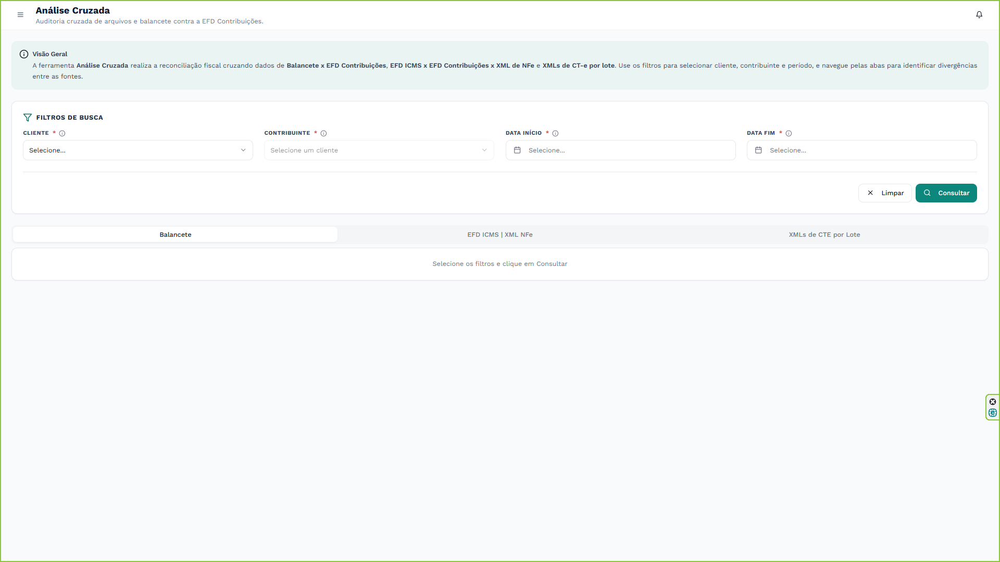
        

        
Interface principal, destacando o painel inicial sem dados

    

  

  

    4
    <h2 class="editable-text">Filtros de Busca e Configuração</h2>
  

  

    
Para iniciar qualquer análise, é obrigatório preencher os parâmetros de pesquisa no painel de filtros.

    <h3 id="secao-4-1">4.1. Cliente e Contribuinte</h3>
    
Comece selecionando o <strong>Cliente</strong> no menu suspenso.

    

        

            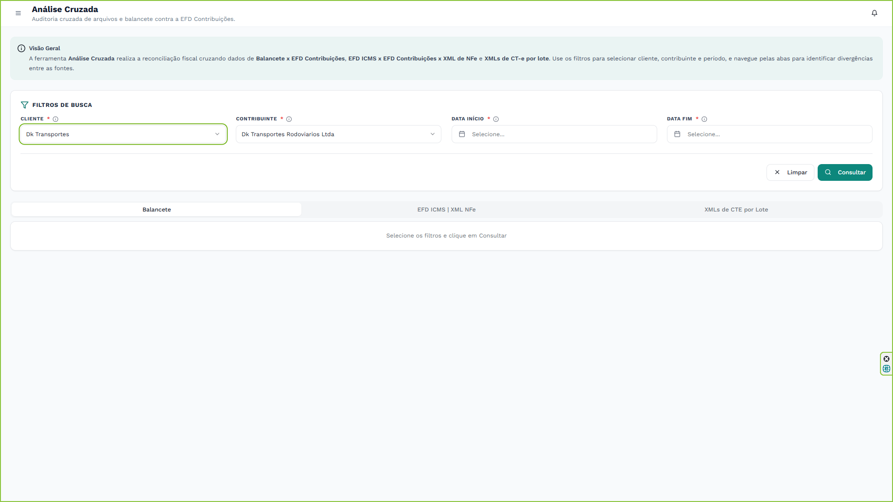
        

        
Menu suspenso para seleção de Cliente

    

    
De imediato, o campo <strong>Contribuinte</strong> será desbloqueado para que você possa selecionar o CNPJ específico que deseja auditar. Se o cliente possuir apenas um contribuinte associado, o sistema fará a seleção de forma automática.

    

        

            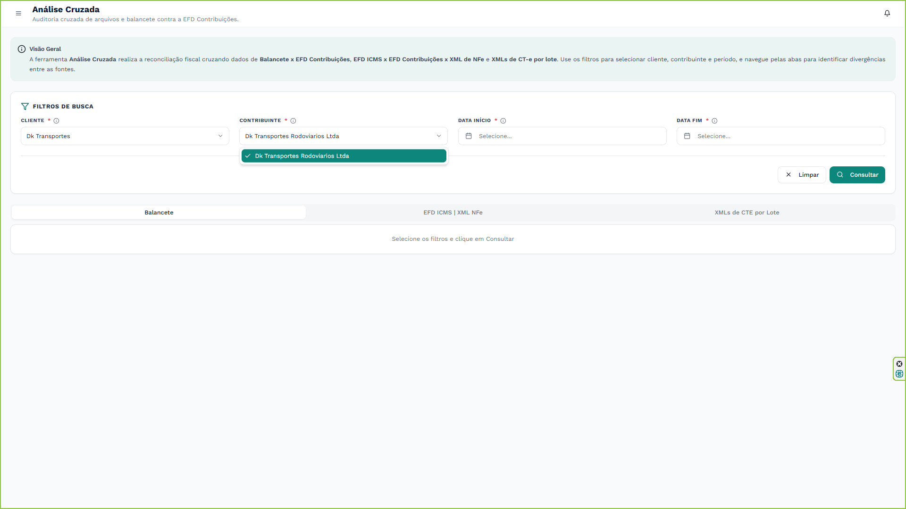
        

        
Menu suspenso para seleção de Contribuinte (CNPJ)

    

    <h3 id="secao-4-2">4.2. Período de Auditoria</h3>
    
Utilize os calendários para definir a <strong>Data Início</strong> e a <strong>Data Fim</strong> do período de análise.

    

        

            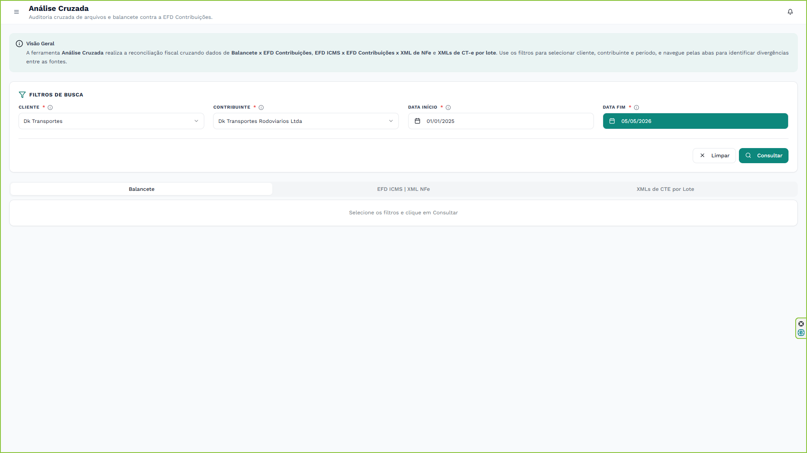
        

        
Datas de início e fim configuradas

    

    
Após preencher os quatro campos obrigatórios, clique no botão <strong>Consultar</strong>. O sistema processará as validações para todas as fontes simultaneamente. Caso necessite recomeçar, utilize o botão <strong>Limpar</strong>.

    

        

            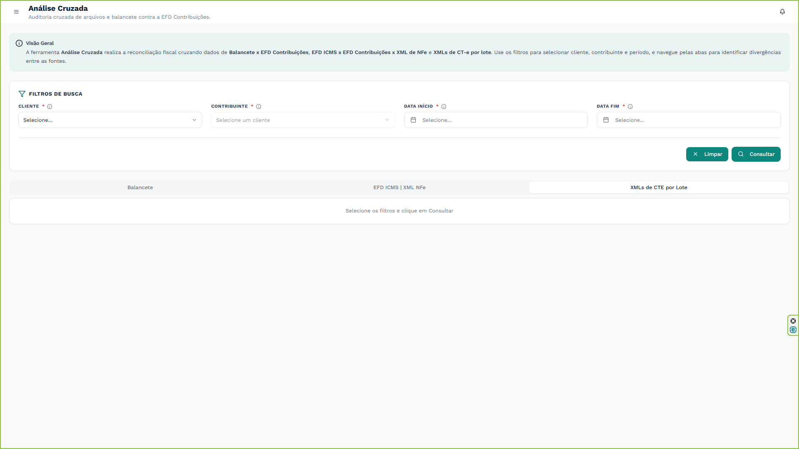
        

        
Botão Limpar para redefinir os parâmetros de pesquisa

    

  

  

    5
    <h2 class="editable-text">Navegação pelas Abas de Auditoria</h2>
  

  

    
Após o processamento da consulta, os resultados são distribuídos por três abas, permitindo identificar as divergências fonte a fonte.

    <h3 id="secao-5-1">5.1. Balancete (EFD Contribuições vs. Balancete)</h3>
    
Na aba <strong>"Balancete"</strong>, o sistema compara as receitas e as retenções declaradas na EFD Contribuições com os saldos das contas correspondentes no Balancete Contábil (arquivos ECD/Excel previamente importados). Esse cruzamento é fundamental para detectar omissões de receitas ou lançamentos indevidos.

    

        

            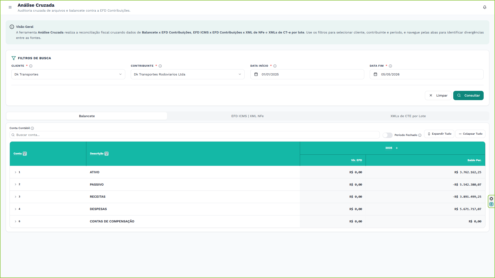
        

        
Visão geral do cruzamento EFD vs Balancete

    

    <h4>Controle de Contas Contábeis</h4>
    
Você pode segmentar a análise focando em contas contábeis específicas utilizando o filtro localizado acima da tabela ou diretamente no cabeçalho da coluna.

    

        

            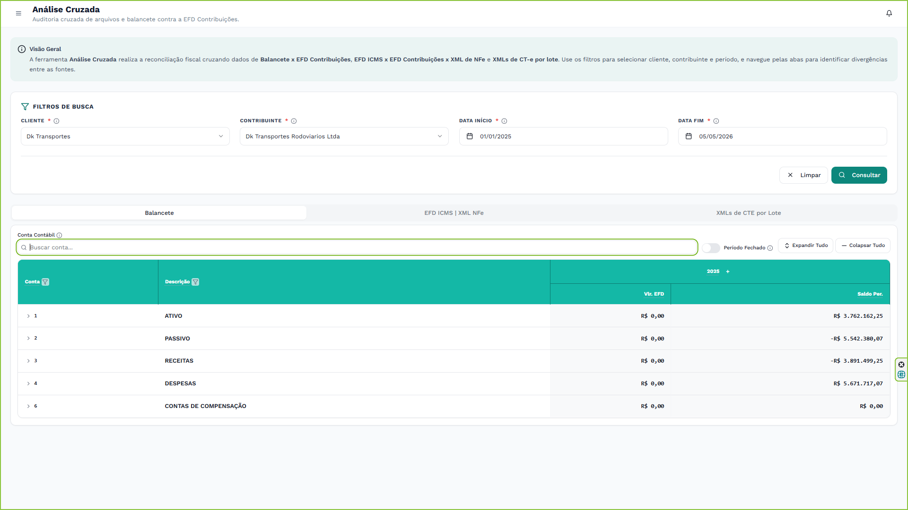
        

        
Filtro global de Contas Contábeis

    

    

        

            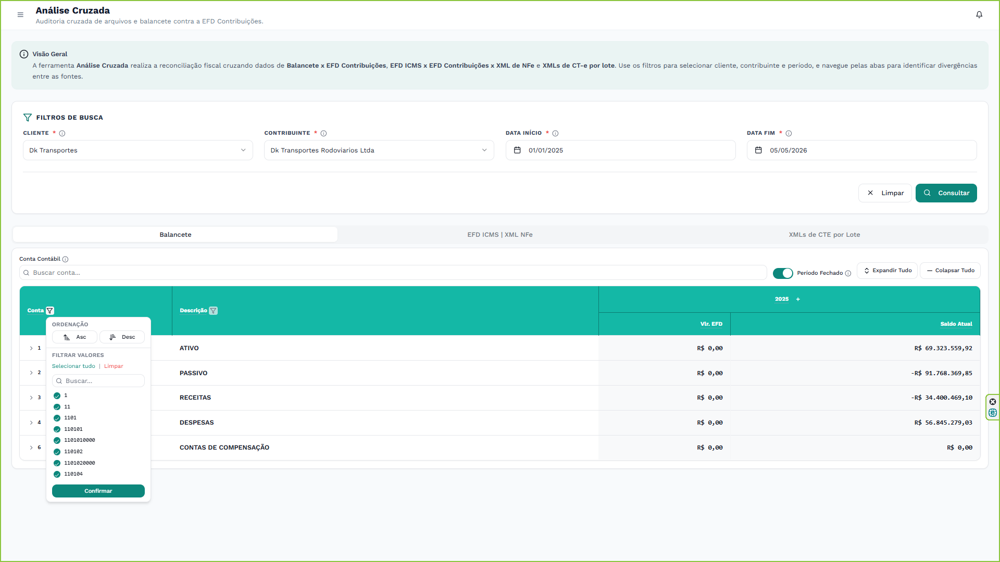
        

        
Filtro integrado na coluna de Conta

    

    <h4>Navegação na Árvore de Contas</h4>
    
A tabela do Balancete possui uma estrutura hierárquica (em árvore). Você pode expandir ou recolher as contas de forma individual clicando no ícone de seta ao lado do código da conta, ou utilizar os controles globais ("Expandir Tudo" / "Recolher Tudo").

    

        

            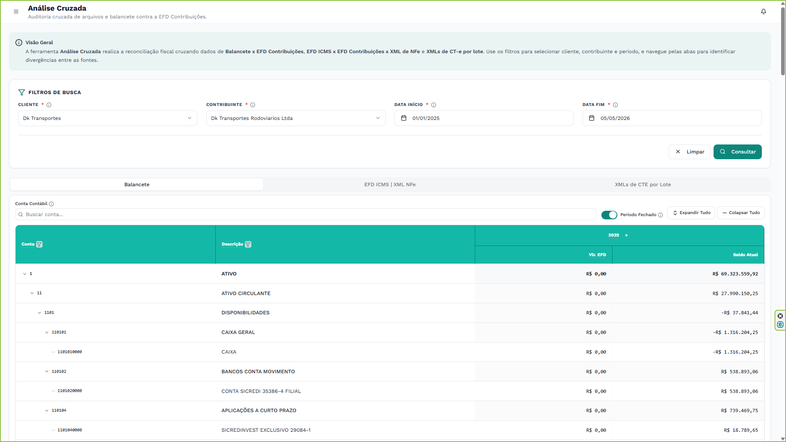
        

        
Expansão manual de uma conta analítica

    

    

        

            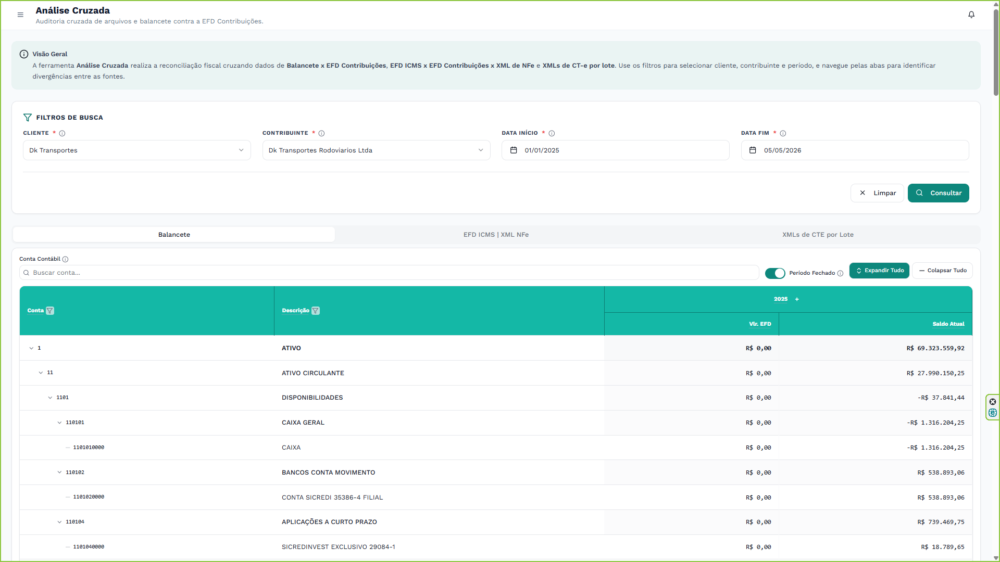
        

        
Opção para expandir todas as contas da hierarquia simultaneamente

    

    

        

            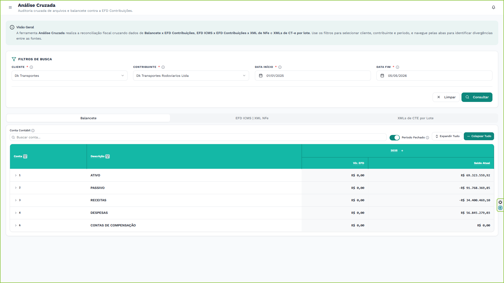
        

        
Opção para recolher a visão de árvore das contas

    

    <h4>Visualização de Meses e Períodos</h4>
    
Por padrão, o sistema exibe os totais por ano/período selecionado. Se desejar ver a desagregação mensal do cruzamento, você pode expandir os períodos utilizando as ferramentas de visualização da tabela.

    

        

            
        

        
Seletor rápido de períodos na aba Balancete

    

    

        

            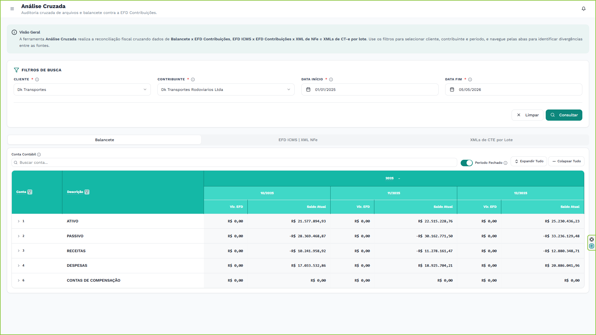
        

        
Meses expandidos, mostrando a comparação período a período

    

    

        

            
        

        
Ação para recolher os meses e voltar à visão consolidada

    

    <h3 id="secao-5-2">5.2. EFD ICMS | XML NFe</h3>
    
A aba <strong>"EFD ICMS | XML NFe"</strong> efetua um cruzamento a três vias: confronta as notas fiscais (NFe) escrituradas no SPED Fiscal (EFD ICMS/IPI), as escrituradas na EFD Contribuições e as que constam fisicamente nos arquivos XML originais do período. Aponta falhas de escrituração ou discrepâncias de valores entre as obrigações.

    

        

            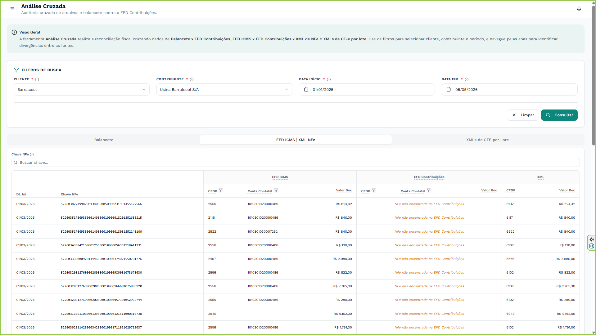
        

        
Matriz de cruzamento das obrigações EFD contra as Notas Fiscais (NFe)

    

    <h3 id="secao-5-3">5.3. XMLs de CTE por Lote</h3>
    
A aba <strong>"XMLs de CTE por Lote"</strong> é dedicada à auditoria em lote dos Conhecimentos de Transporte Eletrônico (CT-e). O sistema verifica a integridade dos arquivos, a coerência das chaves de acesso e a correta apropriação dos valores de frete perante os registros do SPED.

    

        

            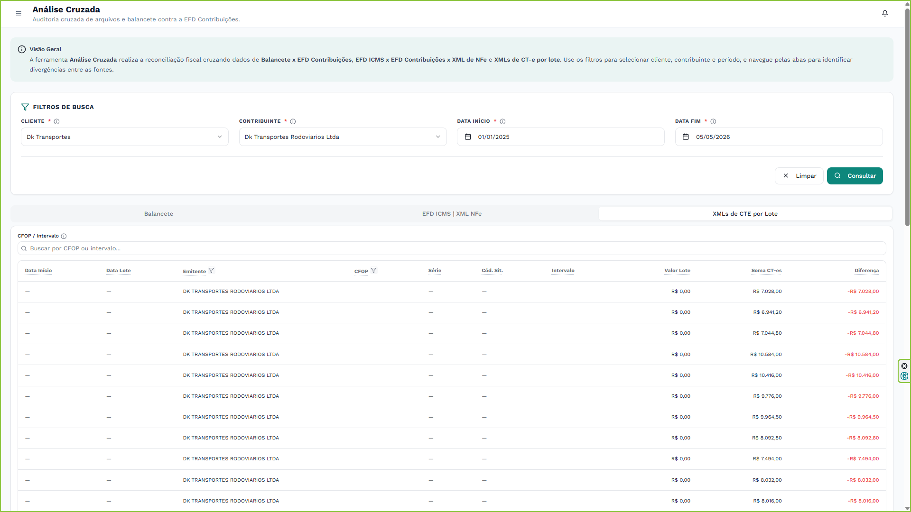
        

        
Listagem de lotes de CT-e processados

    

    
Para analisar as anomalias de um lote específico, clique no mesmo para visualizar os detalhes pormenorizados das chaves que apresentam divergências.

    

        

            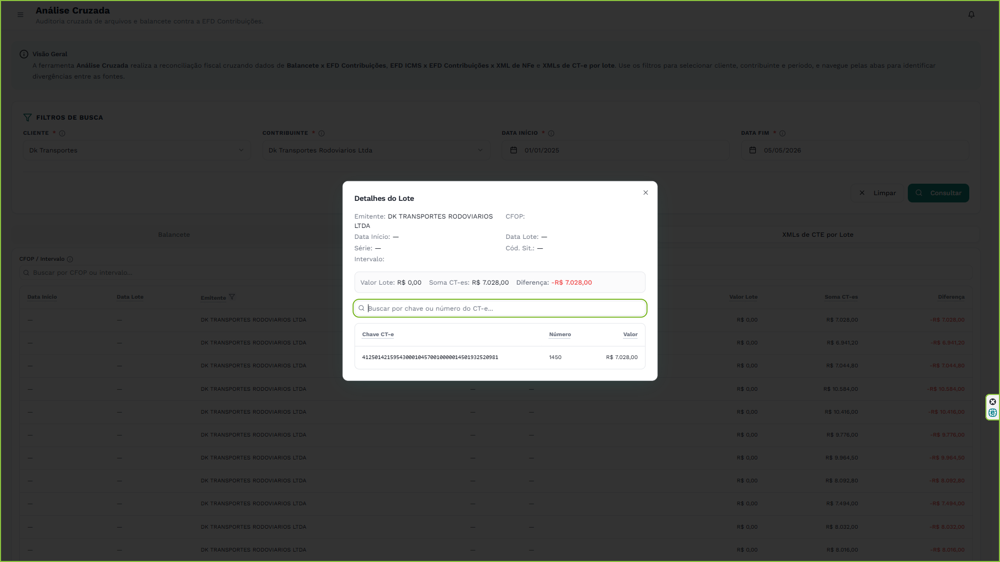
        

        
Janela de detalhes apresentando os CT-e faltantes ou com inconsistências num lote

    

  

  

    6
    <h2 class="editable-text">Dicas e Boas Práticas</h2>
  

  

    

        lightbulb
        
<strong>Dicas Flutuantes (Tooltips):</strong> Utilize os ícones de informação <code>(i)</code> dispersos pelos cabeçalhos e rótulos da ferramenta para compreender detalhadamente a lógica de cálculo de cada coluna ou as regras por trás de uma comparação.

    

    

        

            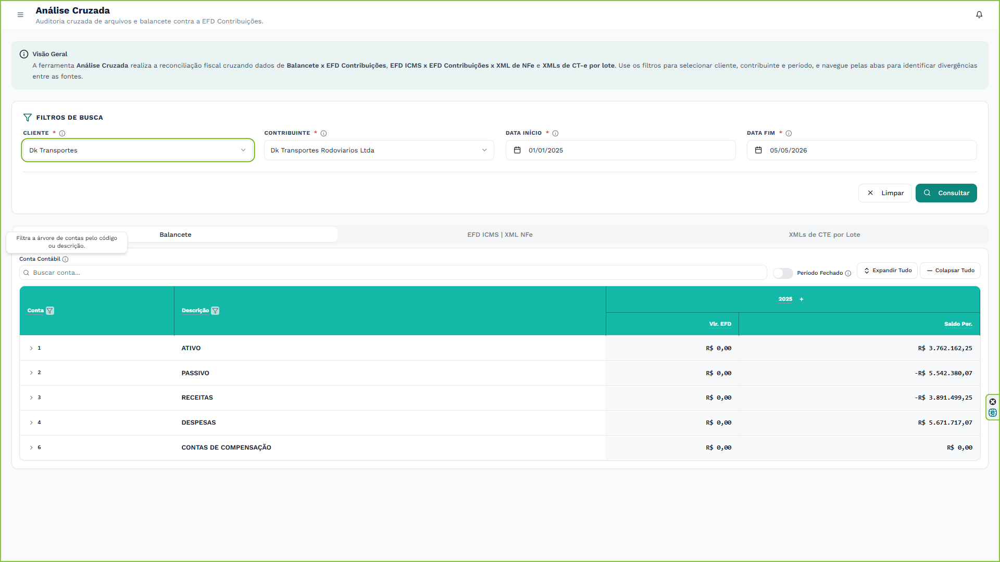
        

        
Passe o mouse sobre os ícones para obter descrições e contextualizações

    

    

        warning
        
<strong>Volume de Dados:</strong> O cruzamento de arquivos XML (NFe e CT-e) contra as obrigações EFD pode exigir um elevado processamento computacional. Recomenda-se realizar a auditoria por blocos mensais ou trimestrais para evitar lentidão excessiva no carregamento dos resultados.

    

  

