

  

    1
    <h2 class="editable-text">Introdução</h2>
  

  

    
Este manual apresenta as funcionalidades da ferramenta de <strong>Apuração PIS/COFINS</strong>, parte integrante do sistema PSA Elevate. Esta ferramenta consolida débitos, créditos, isenções e rateios do contribuinte para calcular o resultado do período e o saldo apurado mês a mês.

    
O objetivo é permitir a conferência detalhada da base de cálculo, seja através da importação de dados do <strong>EFD Contribuições</strong> (Modo Cliente) ou do <strong>Balancete contábil</strong> (Modo Prado).

    <h3>Principais funcionalidades</h3>
    <ul>
        <li><strong>Dois modos de análise:</strong> suporta apuração baseada em EFD Contribuições ou em Balancete contábil.</li>
        <li><strong>Visão por abas:</strong> distribui o resultado em Resumo, Débitos, Créditos, Apuração e Rateio.</li>
        <li><strong>Detalhamento por período:</strong> permite expandir anos e meses para validar a composição dos saldos.</li>
        <li><strong>Ferramentas de apoio:</strong> oferece filtros de coluna, filtros por conta e tooltips para interpretação da memória de cálculo.</li>
    </ul>
    

        lightbulb
        
<strong>Escolha do modo:</strong> defina corretamente o <em>Tipo de Análise</em> antes de consultar, pois isso altera as abas exibidas, os filtros aplicáveis e a origem dos dados apurados.

    

  

  

    2
    <h2 class="editable-text">Acesso e autenticação</h2>
  

  

    <h3 id="secao-acesso-1">2.1. Acesso ao portal e área da equipe</h3>
    
O acesso às ferramentas começa pelo portal corporativo da PSA Consultores. Acesse o link <a href="https://psaconsultores.com.br" target="_blank">https://psaconsultores.com.br</a> e clique no ícone de <strong>"Equipe"</strong>, localizado no canto superior direito da tela, para entrar na área restrita.

    

        

            
        

        
Portal corporativo com destaque para o menu de acesso à Equipe

    

    <h3 id="secao-acesso-2">2.2. Seleção da área de atuação</h3>
    
Na tela de departamentos, abra a lista suspensa e selecione a opção <strong>"Digital"</strong> para acessar o sistema de gestão de demandas e às ferramentas internas.

    

        

            
        

        
Seleção da área de competência Digital

    

    <h3 id="secao-acesso-3">2.3. Login no sistema</h3>
    
A tela de autenticação será exibida. Insira suas credenciais corporativas (e-mail e senha) nos campos correspondentes e clique em <strong>"Entrar"</strong>.

    

        

            
        

        
Preenchimento dos dados de acesso

    

    <h3 id="secao-acesso-4">2.4. Seleção do ambiente de trabalho</h3>
    
Após o login, selecione o ambiente <strong>"Digital Dev"</strong>. Este é o ambiente de criação, desenvolvimento e utilização das ferramentas fiscais automatizadas.

    

        

            
        

        
Seleção do ambiente de trabalho

    

    <h3 id="secao-acesso-5">2.5. Hub de Ferramentas</h3>
    
Ao entrar no ambiente Digital Dev, o sistema carregará o <strong>Hub de Ferramentas</strong>. Identifique o cartão correspondente e clique no botão <strong>"Acessar Ferramenta"</strong> no módulo de Apuração PIS/COFINS.

    

        

            
        

        
Acesso via Hub de Ferramentas

    

  

  

    3
    <h2 class="editable-text">Visão geral da ferramenta</h2>
  

  

    
A interface principal é composta por um painel superior de filtros de busca e uma seção de resultados organizada em abas (separadores). Um alerta inicial (em tom verde) resume o propósito da ferramenta: calcular e demonstrar a base de cálculo e saldos apurados mês a mês.

    

        

            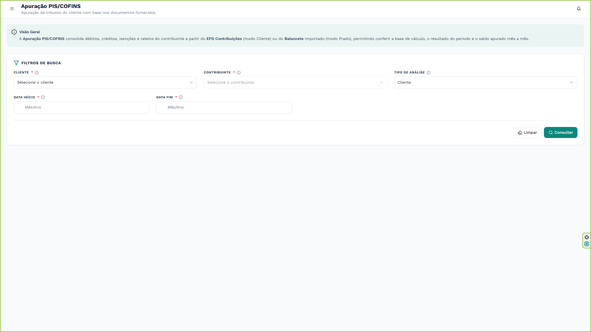
        

        
Interface principal destacando o painel de filtros e o alerta informativo

    

  

  

    4
    <h2 class="editable-text">Filtros de busca e configuração</h2>
  

  

    <h3 id="secao-4-1">4.1. Seleção de cliente e contribuinte</h3>
    
Obrigatório para iniciar. Selecione primeiro o <strong>Cliente</strong> (ou grupo) e, em seguida, o <strong>Contribuinte</strong> (CNPJ) alvo da apuração.

    

        

            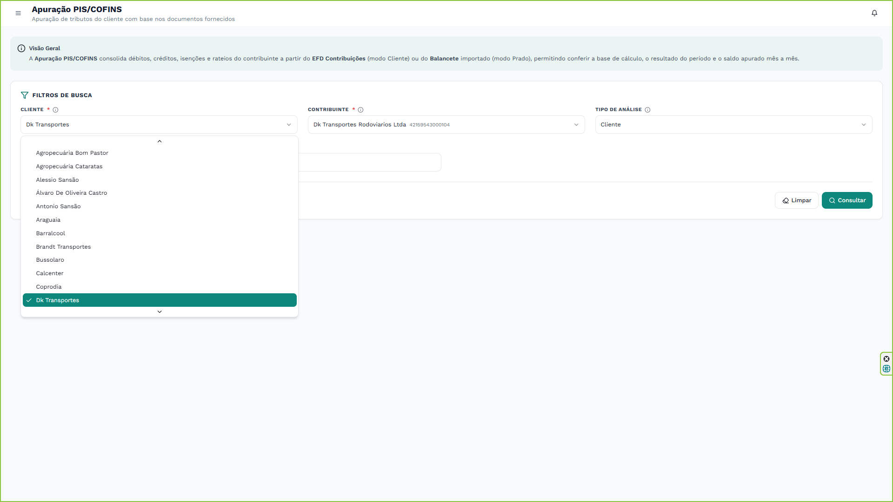
        

        
Menu suspenso para seleção do Cliente

    

    

        

            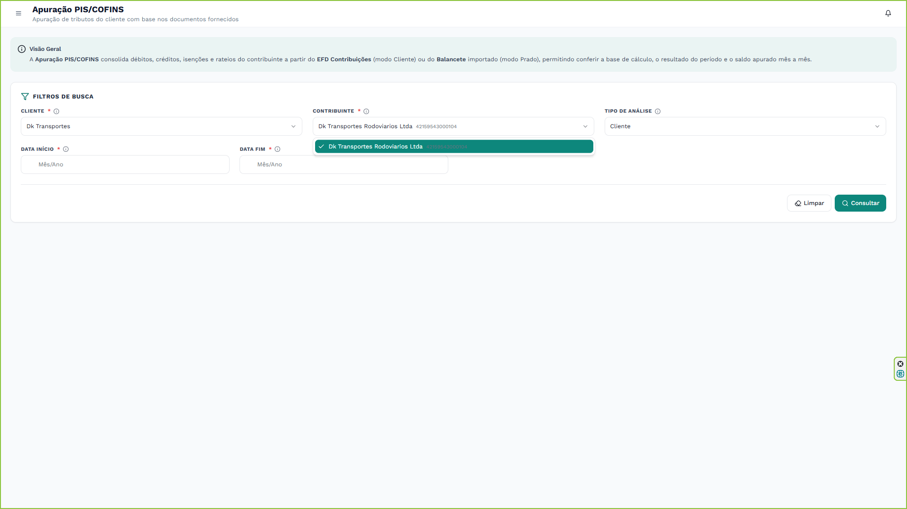
        

        
Menu suspenso para seleção do Contribuinte (CNPJ)

    

    <h3 id="secao-4-2">4.2. Tipo de análise (EFD vs. Balancete)</h3>
    
Você pode escolher entre duas metodologias de análise através do menu "Tipo de análise":

    <ul>
        <li><strong>Cliente (EFD):</strong> Utiliza os registros do EFD Contribuições como base para extrair os valores.</li>
        <li><strong>Prado (Balancete):</strong> Utiliza o balancete importado como base da análise.</li>
    </ul>
    

        

            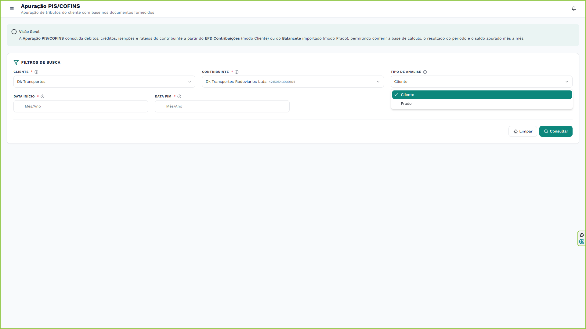
        

        
Seleção da fonte de dados para a apuração

    

    <h3 id="secao-4-3">4.3. Período de apuração</h3>
    
Defina a <strong>Data Início</strong> e a <strong>Data Fim</strong> (Mês/Ano). A data final deve ser igual ou superior à data inicial.

    

        

            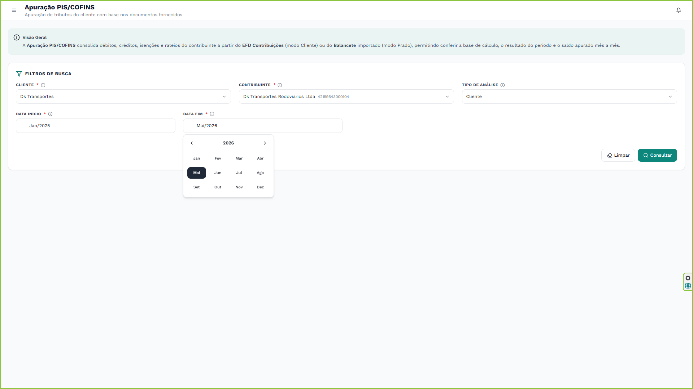
        

        
Definição do intervalo de apuração

    

    
Após configurar, clique no botão <strong>Consultar</strong>. Caso queira redefinir os parâmetros, utilize o botão <strong>Limpar</strong>.

    

        

            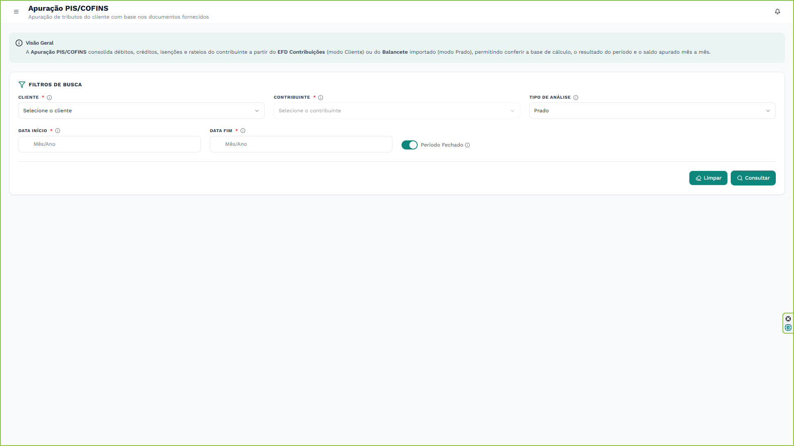
        

        
Limpando os filtros para uma nova busca

    

  

  

    5
    <h2 class="editable-text">Navegação pelas abas de resultados (modo EFD/Cliente)</h2>
  

  

    
Ao consultar os dados (utilizando o Tipo de Análise "Cliente"), o sistema apresenta os resultados divididos nas seguintes abas:

    

        

            
        

        
Interface carregada com as abas de resultados

    

    <h3 id="secao-5-1">5.1. Resumo</h3>
    
Apresenta a "Base da Apuração" (EFD Contribuições). Você pode utilizar o filtro de seleção múltipla para focar em contas contábeis específicas.

    

        

            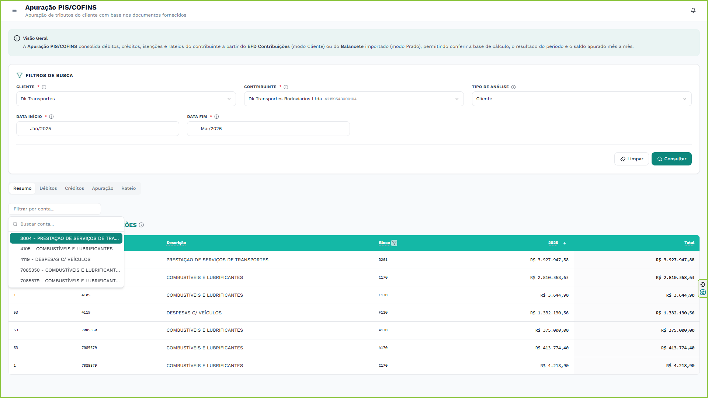
        

        
Filtrando a base de dados por contas contábeis específicas

    

    <h3 id="secao-5-2">5.2. Débitos</h3>
    
Consolida os valores a pagar. Os itens com Código de Situação Tributária (CST) de 01 a 10 são considerados débitos, enquanto os CSTs de 04 a 09 representam as Isenções e Exclusões. Apresenta quadros de "Base Normal" e "Débitos do Mês" separados por PIS, COFINS e as respectivas Alíquotas Reduzidas.

    

        

            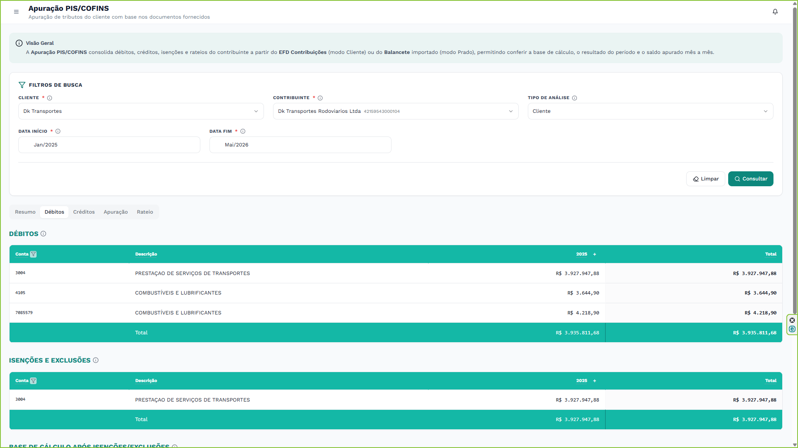
        

        
Cálculo detalhado dos Débitos apurados

    

    <h3 id="secao-5-3">5.3. Créditos</h3>
    
Demonstra os valores a abater. Para créditos, são considerados itens com CST de 50 a 66. As operações não geradoras de crédito abrangem os CSTs de 70 a 99.

    

        

            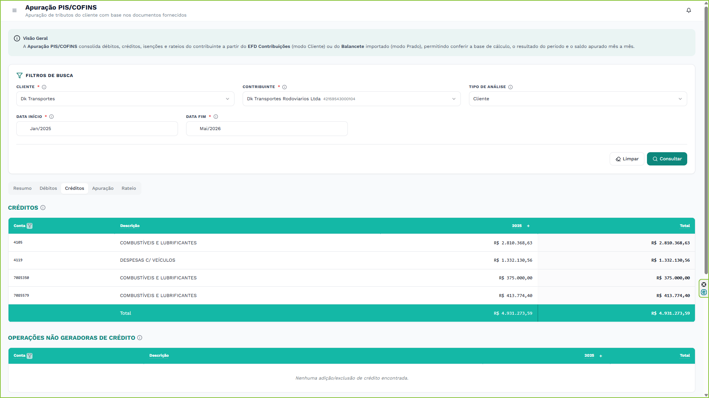
        

        
Visualização do cálculo de créditos com valores mensais

    

    <h3 id="secao-5-4">5.4. Apuração</h3>
    
Demonstra o resultado final do PIS e da COFINS no período. Inclui a Contribuição Bruta, o Crédito do Mês, o Crédito Anterior, o Valor Devido e o Saldo Acumulado para o mês seguinte.

    

        

            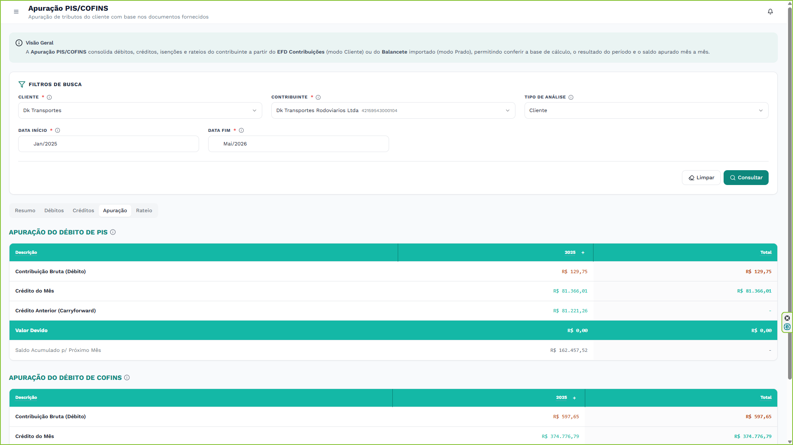
        

        
Resumo final do valor devido e saldos acumulados

    

    <h3 id="secao-5-5">5.5. Rateio</h3>
    
Demonstra a distribuição percentual das receitas (tributadas no mercado interno, não tributadas e de exportação) e a respectiva aplicação sobre o crédito apurado, segmentados pelos códigos 101, 201 e 301 para PIS e COFINS.

    

        

            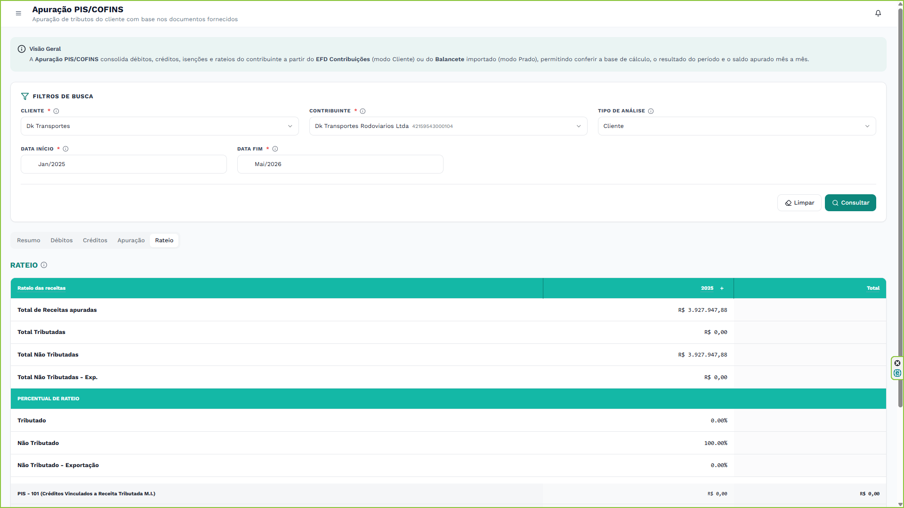
        

        
Cálculo do percentual de rateio sobre as receitas

    

  

  

    6
    <h2 class="editable-text">Apuração via balancete (modo Prado)</h2>
  

  

    
Ao selecionar "Prado" no Tipo de Análise, o sistema constrói a apuração utilizando os saldos do balancete contábil como base.

    

        

            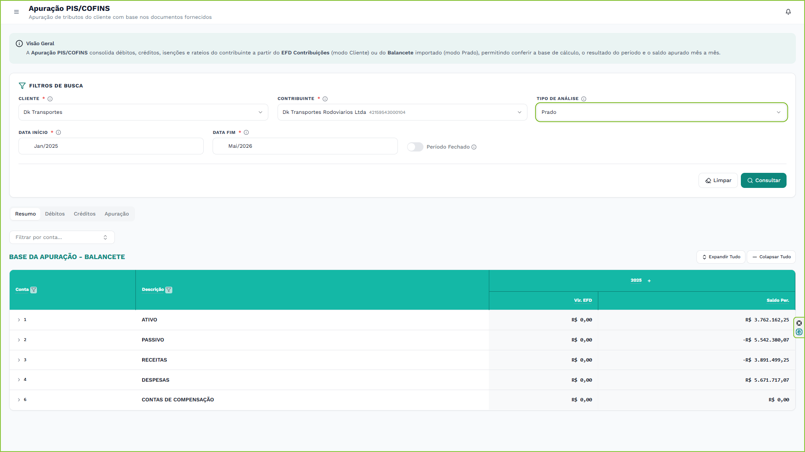
        

        
Análise baseada nos saldos contábeis do Balancete

    

    <h4>Período fechado</h4>
    
Neste modo, o filtro <strong>"Período Fechado"</strong> fica disponível. Quando ativado, o sistema considera apenas as competências já encerradas no balancete para trazer o saldo final da conta, ao invés da movimentação periódica.

    

        

            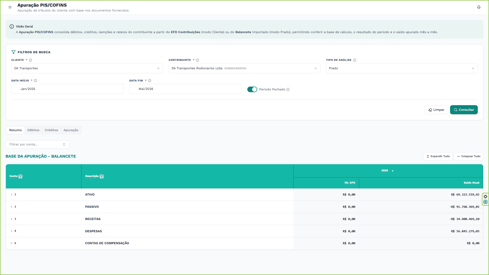
        

        
Opção para consultar apenas saldos de competências encerradas

    

    <h4>Navegação na árvore de contas</h4>
    
A aba Resumo exibe o plano de contas em formato hierárquico. Você pode expandir ou recolher as contas manualmente ou usar os botões globais ("Expandir Tudo" / "Recolher Tudo").

    

        

            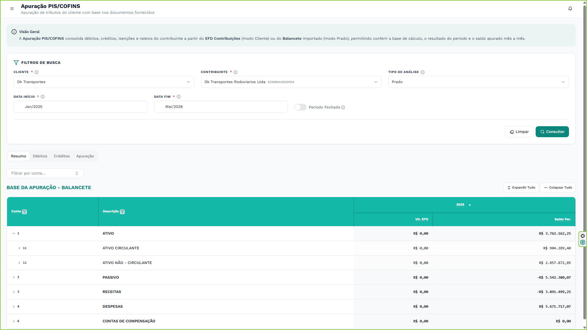
        

        
Expansão de níveis do plano de contas

    

    

        

            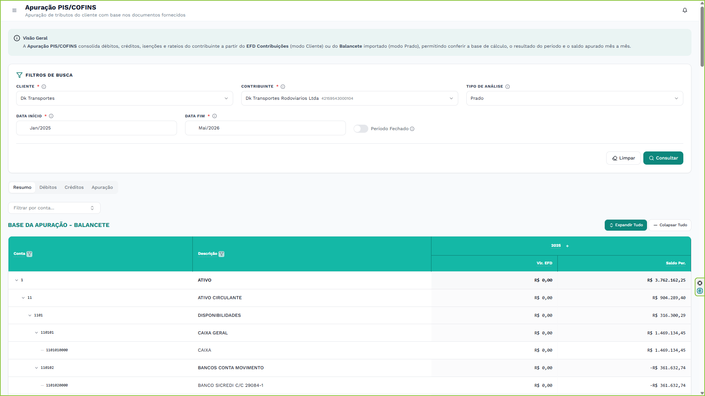
        

        
Expandindo toda a hierarquia de contas de uma vez

    

    

        

            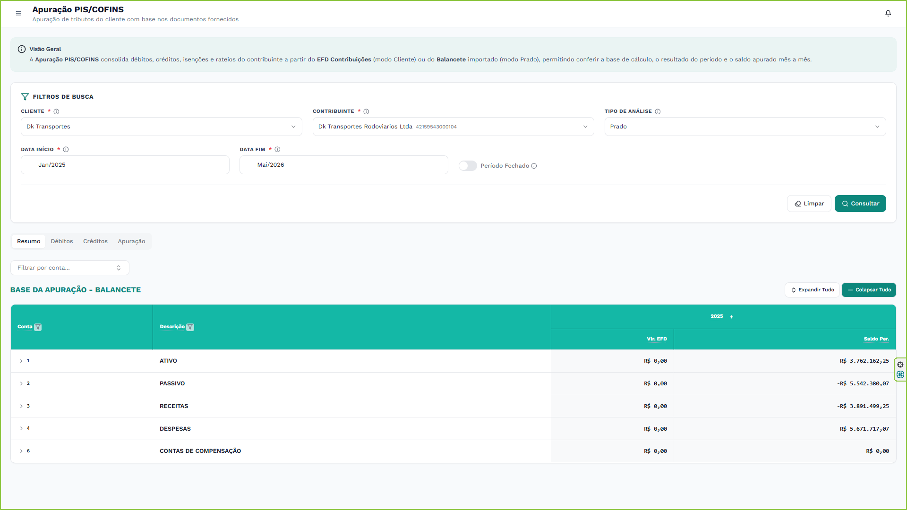
        

        
Recolhendo os níveis para voltar à visualização sintética

    

    <h4>Visualização das demais abas no modo Prado</h4>
    
As abas de Débitos, Créditos e Apuração funcionam com a mesma lógica do modo EFD, porém consumindo e formatando os dados provenientes da matriz do balancete.

    

        

            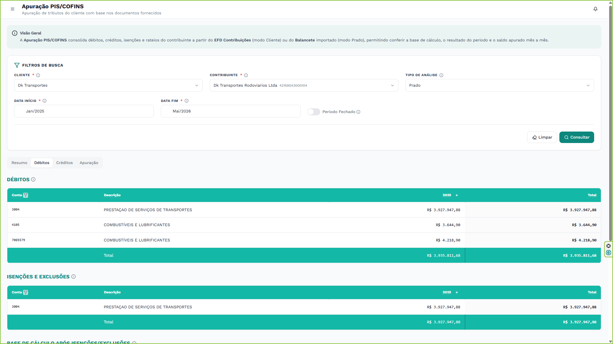
        

        
Aba de Débitos gerada via Balancete

    

    

        

            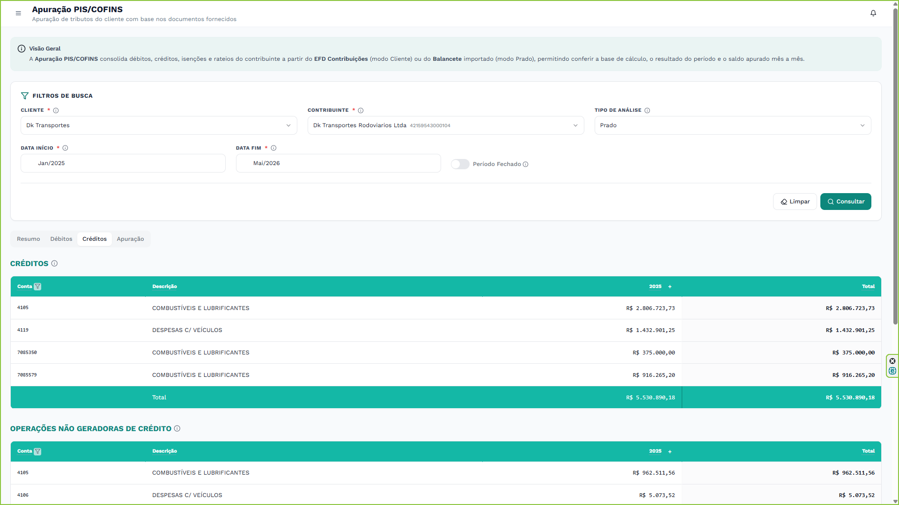
        

        
Aba de Créditos gerada via Balancete

    

    

        

            
        

        
Resultado final da Apuração pelo modo Prado

    

  

  

    7
    <h2 class="editable-text">Interação com as tabelas de dados</h2>
  

  

    
As tabelas foram desenhadas para facilitar a análise de grandes volumes de dados ao longo de múltiplos meses:

    
    <h4>Expansão de meses</h4>
    
Os cabeçalhos das tabelas apresentam os totais agrupados por ano. Clique no sinal de <code>+</code> junto ao ano para expandir e visualizar as colunas de cada mês individualmente. Para voltar ao total anual, clique no <code>-</code>.

    

        

            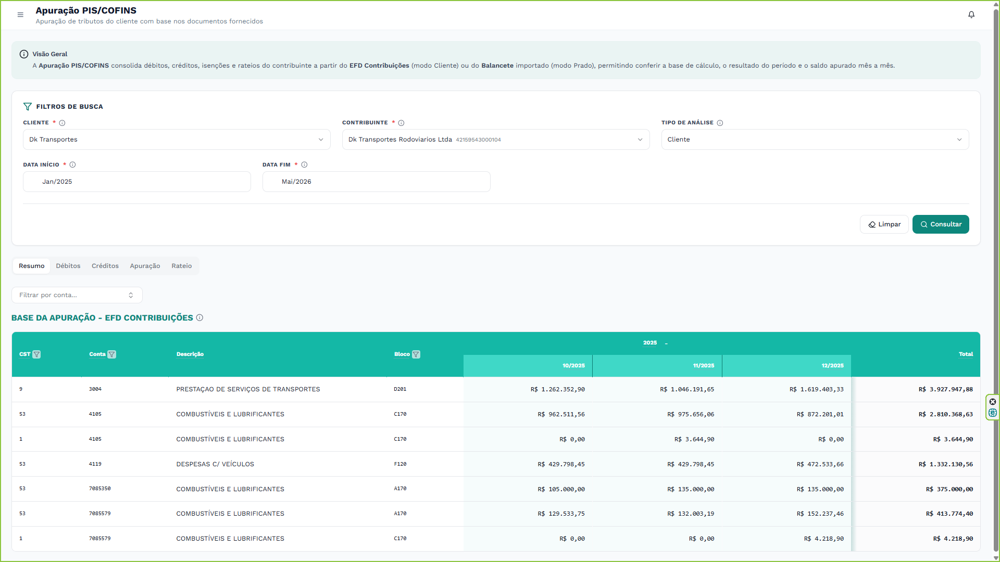
        

        
Expandindo o agrupamento anual para ver a quebra mensal

    

    

        

            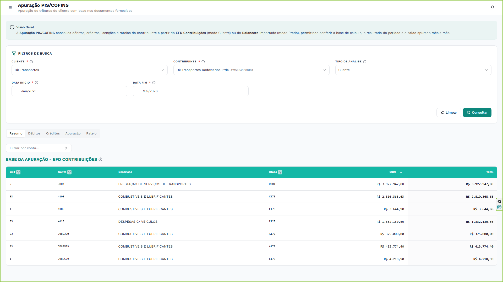
        

        
Recolhendo os meses para a visão sintética anual

    

    <h4>Dicas flutuantes (tooltips)</h4>
    
Passe o mouse sobre os títulos de colunas (como CST, Bloco, Conta) ou sobre os ícones de informação <code>(i)</code> para obter descrições rápidas sobre o significado de cada campo e seção.

    

        

            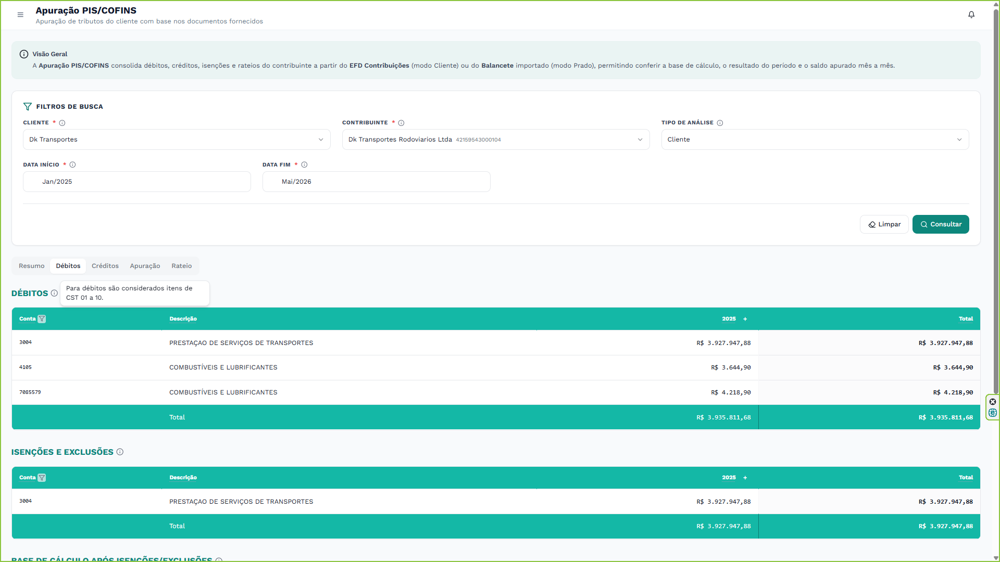
        

        
Ícones de informação auxiliam no entendimento das regras de negócio

    

    <h4>Filtros de coluna</h4>
    
Na aba de Resumo, os cabeçalhos possuem um ícone de funil, permitindo aplicar filtros rápidos na base de dados, ordenando ou isolando registros específicos.

    

        

            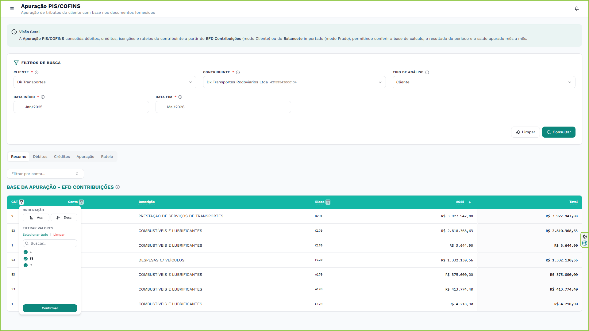
        

        
Utilizando filtros em colunas específicas na tabela de dados

    

    

        

            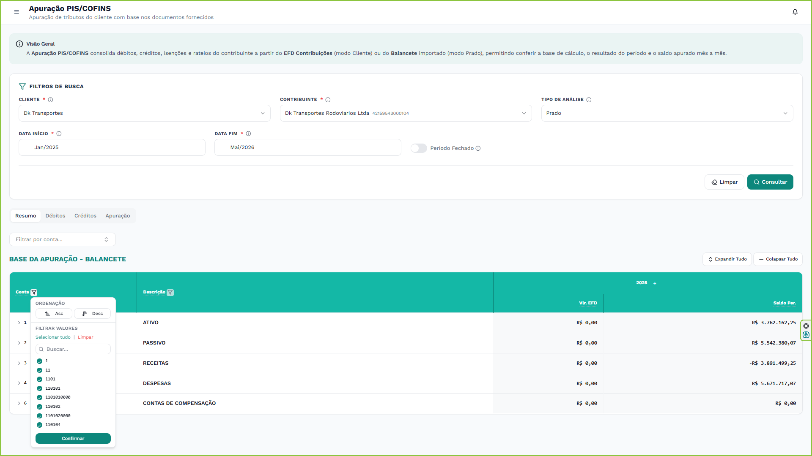
        

        
Painel suspenso com os valores disponíveis na coluna

    

    
As contas contábeis e as categorias de receitas e despesas também possuem filtros globais na parte superior de suas respectivas abas.

    

        

            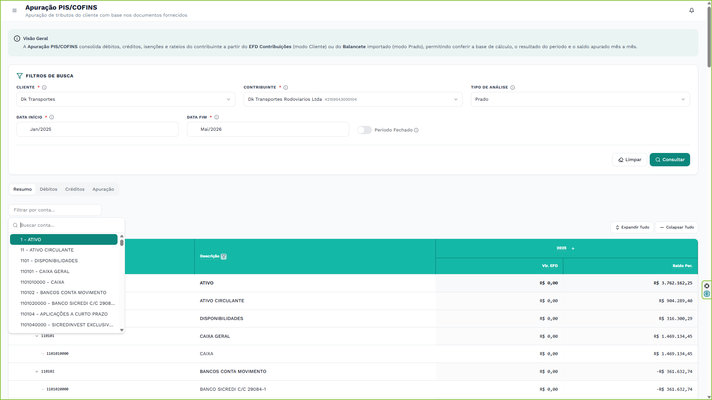
        

        
Seleção de múltiplas contas contábeis

    

  

