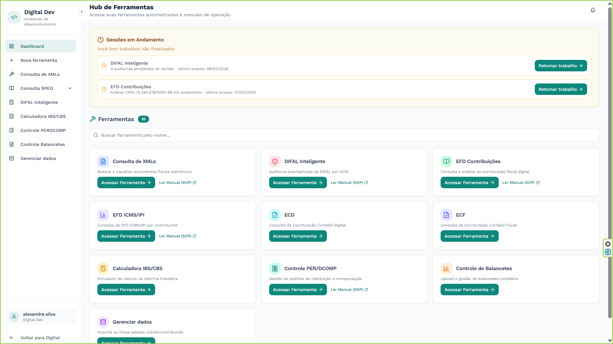
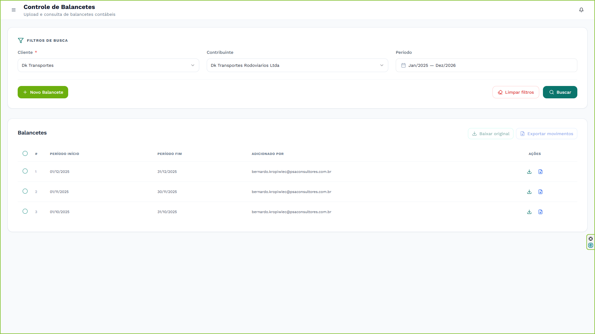

<!-- SEÇÃO 1 -->

  

    1
    <h2 class="editable-text">Introdução</h2>
  

  

    
Este manual apresenta as funcionalidades da ferramenta de <strong>Controle de Balancetes</strong>, parte integrante do sistema PSA Elevate.

    
A ferramenta foi desenvolvida para centralizar o envio, a consulta e a exportação de balancetes contábeis dos clientes. Através dela, a equipe pode realizar o upload seguro de arquivos originais, padronizar configurações de detalhamento por contribuinte e extrair os movimentos contábeis de forma unificada.

    <h3>Principais Funcionalidades</h3>
    <ul>
        <li><strong>Busca filtrada:</strong> Localize balancetes por cliente, contribuinte e intervalo de datas.</li>
        <li><strong>Upload de arquivos originais:</strong> Envio seguro de planilhas (restrito aos formatos Excel .xlsx e .xls).</li>
        <li><strong>Configuração de detalhamento:</strong> Sistema inteligente vinculado ao contribuinte.</li>
        <li><strong>Download flexível:</strong> Baixe planilhas originais individualmente ou em lote (ZIP).</li>
        <li><strong>Exportação padronizada:</strong> Extraia os movimentos contábeis tratados para planilhas Excel estruturadas.</li>
    </ul>
  

<!-- SEÇÃO ACESSO -->

  

    2
    <h2 class="editable-text">Acesso e Autenticação</h2>
  

  

    <h3 id="secao-acesso-1">2.1. Acesso ao portal e área da equipe</h3>
    
O acesso às ferramentas começa pelo portal corporativo da PSA Consultores. Acesse o link <a href="https://psaconsultores.com.br" target="_blank">https://psaconsultores.com.br</a> e clique no ícone de <strong>"Equipe"</strong>, localizado no canto superior direito da tela, para entrar na área restrita.

    

        

            
        

        
Portal corporativo com destaque para o menu de acesso à Equipe

    

    <h3 id="secao-acesso-2">2.2. Seleção da área de atuação</h3>
    
Na tela de departamentos, abra a lista suspensa e selecione a opção <strong>"Digital"</strong> para acessar o sistema de gestão de demandas e as ferramentas internas.

    

        

            
        

        
Seleção da área de competência Digital

    

    <h3 id="secao-acesso-3">2.3. Login no sistema</h3>
    
A tela de autenticação será exibida. Insira suas credenciais corporativas (e-mail e senha) nos campos correspondentes e clique em <strong>"Entrar"</strong>.

    

        

            
        

        
Preenchimento dos dados de acesso

    

    <h3 id="secao-acesso-4">2.4. Seleção do ambiente de trabalho</h3>
    
Após o login, selecione o ambiente <strong>"Digital Dev"</strong>. Este é o ambiente de criação, desenvolvimento e utilização das ferramentas contábeis automatizadas.

    

        

            
        

        
Escolha do ambiente da área Digital

    

    <h3 id="secao-acesso-5">2.5. Hub de Ferramentas</h3>
    
Ao entrar no ambiente Digital Dev, o sistema carregará o <strong>Hub de Ferramentas</strong>. Localize o card correspondente e clique no botão <strong>"Acessar Ferramenta"</strong> no módulo Controle de Balancetes.

    

        

            
        

        
Visão geral do Hub de Ferramentas

    

  

<!-- SEÇÃO 3 -->

  

    3
    <h2 class="editable-text">Conhecendo a Tela Principal</h2>
  

  

    
Ao acessar a ferramenta, a tela inicial é dividida em duas áreas funcionais principais: o painel superior de <strong>Filtros de Busca</strong> (onde você pesquisa ou inicia um novo envio) e o painel inferior de <strong>Balancetes</strong> (a tabela de resultados).

    

        

            
        

        
Visão geral da ferramenta no estado inicial

    

  

<!-- SEÇÃO 4 -->

  

    4
    <h2 class="editable-text">Utilizando os Filtros e Realizando Buscas</h2>
  

  

    <h3 id="secao-4-1">4.1. Seleção de Cliente</h3>
    
No painel de filtros, clique no menu suspenso e selecione o cliente. Este campo é obrigatório (marcado com um asterisco vermelho).

    

        

            
        

        
Seleção de cliente obrigatória

    

    <h3 id="secao-4-2">4.2. Seleção de Contribuinte</h3>
    
Após selecionar o cliente, este campo será habilitado. Escolha a empresa (CNPJ) ou pessoa (CPF) para a qual deseja listar os balancetes.

    

        

            
        

        
Seleção do contribuinte específico

    

    <h3 id="secao-4-3">4.3. Período de consulta</h3>
    
Para restringir a busca, clique no campo Período para abrir o calendário e definir um intervalo de meses (Início e Fim).

    

        

            
        

        
Definição do intervalo de datas

    

    <h3 id="secao-4-4">4.4. Executando a Busca e Limpando Filtros</h3>
    
Com os dados preenchidos, clique no botão <strong>Buscar</strong>. O sistema processará as informações e listará os arquivos encontrados na tabela inferior.

    

        

            
        

        
Resultados da busca exibidos na tabela

    

    
Caso precise reiniciar sua pesquisa, clique no botão vermelho <strong>Limpar filtros</strong> para apagar os dados dos campos e esvaziar a tabela de uma só vez.

    

        

            
        

        
Botão para limpar todos os filtros

    

  

<!-- SEÇÃO 5 -->

  

    5
    <h2 class="editable-text">Enviando um Novo Balancete</h2>
  

  

    <h3 id="secao-5-1">5.1. Abrindo a janela de envio</h3>
    
No canto esquerdo do painel de filtros, clique no botão verde <strong>+ Novo Balancete</strong> para abrir a janela (modal) de upload.

    

        

            
        

        
Janela de novo balancete aberta

    

    <h3 id="secao-5-2">5.2. Inserindo o arquivo</h3>
    
Arraste uma planilha do seu computador para dentro da área tracejada ou clique sobre ela. O sistema aceita apenas formatos <code>.xlsx</code> ou <code>.xls</code>. Após anexar, a área exibirá as informações do arquivo.

    

        

            
        

        
Arquivo validado e anexado com sucesso

    

    <h3 id="secao-5-3">5.3. Preenchimento de dados e detalhamento</h3>
    
Na lateral direita, preencha Cliente, Contribuinte e Período referentes à planilha. Verifique a chave de <strong>Detalhamento</strong> e ative-a (Sim/Não) conforme a estrutura do balancete da empresa.

    

        

            
        

        
Dados de identificação e configuração de detalhamento preenchidos

    

    <h3 id="secao-5-4">5.4. Confirmação e Envio</h3>
    
Clique no botão <strong>Enviar</strong>. Uma janela de confirmação exibirá um resumo do envio para que você faça uma conferência final.

    

        

            
        

        
Resumo dos dados antes da confirmação final

    

    
Ao confirmar, o sistema realizará o upload. Em caso de sucesso, a janela se fechará e a tabela principal será atualizada exibindo o novo balancete.

    

        

            
        

        
Novo documento listado na tabela de resultados

    

  

<!-- SEÇÃO 6 -->

  

    6
    <h2 class="editable-text">Ações Individuais na Tabela</h2>
  

  

    <h3 id="secao-6-1">6.1. Baixar arquivo original</h3>
    
Na coluna de Ações de cada linha, clique no ícone de <strong>Seta para baixo</strong> para fazer o download da planilha bruta, exatamente como foi enviada ao sistema.

    

        

            
        

        
Ação para download individual do arquivo bruto

    

    
O sistema solicitará uma confirmação de segurança antes de iniciar o download no seu navegador.

    

        

            
        

        
Janela de confirmação de segurança para download

    

    <h3 id="secao-6-2">6.2. Exportar movimentos (Excel)</h3>
    
Para extrair os dados tratados, clique no ícone de <strong>Documento com seta</strong>.

    

        

            
        

        
Ação para gerar planilha de movimentos formatada

    

    
O sistema processará o balancete de acordo com os filtros selcionados e gerará uma nova planilha Excel com as colunas padronizadas.

    

        

            
        

        
Exemplo do arquivo final exportado e estruturado

    

  

<!-- SEÇÃO 7 -->

  

    7
    <h2 class="editable-text">Ações em Lote</h2>
  

  

    
A ferramenta permite que você processe múltiplos balancetes simultaneamente. Caso sua pesquisa retorne vários arquivos, você pode baixar os originais ou exportar os movimentos de todos de uma só vez.

    <ol>
        <li>Utilize as <strong>caixas de seleção (checkboxes)</strong> localizadas na primeira coluna da tabela para marcar os balancetes desejados (ou utilize a caixa no cabeçalho para selecionar todos os listados).</li>
        <li>Observe que os botões superiores <strong>Baixar original</strong> e <strong>Exportar movimentos</strong> serão ativados, exibindo uma <em>badge</em> numérica com a quantidade de itens selecionados.</li>
        <li>Clique na ação desejada. O sistema processará as requisições em segundo plano e efetuará o download de um único arquivo compactado (<strong>.zip</strong>) contendo todas as planilhas selecionadas.</li>
    </ol>
    

        bolt
        
A exportação em lote é ideal para contribuintes que possuem o envio do balancete fragmentado (ex: arquivos mensais) e necessitam da análise de um exercício inteiro consolidado.

    

  

f