

  

    1
    <h2 class="editable-text">Introdução</h2>
  

  

    
Este manual apresenta as funcionalidades da ferramenta <strong>Correções no SPED</strong>, parte do sistema de ferramentas digitais da PSA Consultores.

    
A ferramenta permite revisar e ajustar os registros do SPED Contribuições (blocos <strong>C170, A170, D100, F100, F120, F130</strong>) cruzando os dados da escrituração com os XMLs originais. Através de uma interface de edição em massa, o analista pode corrigir CSTs, Alíquotas e Valores de PIS/COFINS, gerando um histórico rastreável e exportável de todas as modificações.

    <h3>Principais Funcionalidades</h3>
    <ul>
        <li><strong>Cruzamento documental:</strong> relaciona registros do SPED com os XMLs originais para localizar inconsistências.</li>
        <li><strong>Edição controlada:</strong> habilita correções em massa com campos específicos por aba e por registro fiscal.</li>
        <li><strong>Regras auxiliares:</strong> permite consultar e manter regras de NCM que apoiam os tratamentos tributários aplicados.</li>
        <li><strong>Rastreabilidade:</strong> registra o histórico das alterações e suporta envio/exportação das correções processadas.</li>
    </ul>
    

        warning
        
<strong>Persistência das alterações:</strong> editar a grade não é suficiente por si só. Após revisar os registros, conclua o fluxo com o salvamento e o envio das correções para garantir que a alteração seja efetivamente aplicada.

    

    

        

            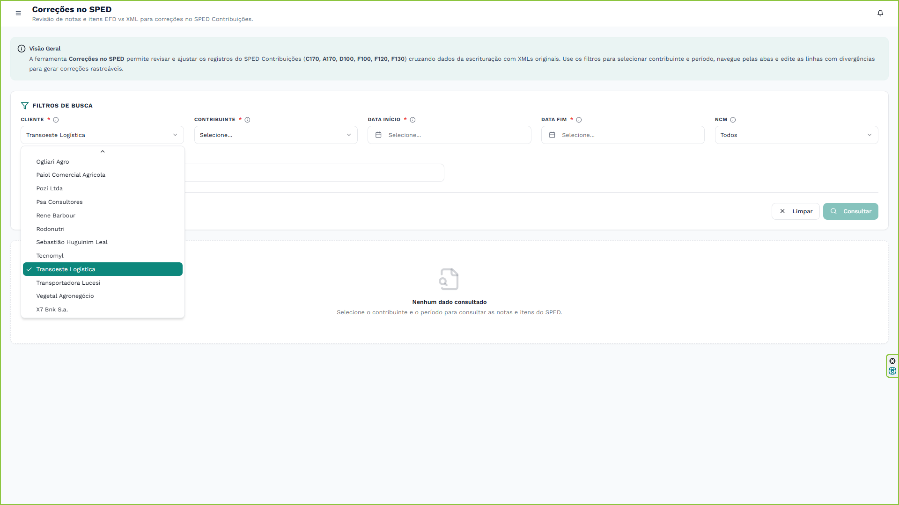
        

        
Visão inicial da ferramenta Correções no SPED

    

  

  

    2
    <h2 class="editable-text">Acesso e Autenticação</h2>
  

  

    <h3 id="secao-acesso-1">2.1. Acesso ao portal e área da equipe</h3>
    
O acesso às ferramentas começa pelo portal corporativo da PSA Consultores. Acesse o link <a href="https://psaconsultores.com.br" target="_blank">https://psaconsultores.com.br</a> e clique no ícone de <strong>"Equipe"</strong>, localizado no canto superior direito da tela, para entrar na área restrita.

    

        

            
        

        
Portal corporativo com destaque para o menu de acesso à Equipe

    

    <h3 id="secao-acesso-2">2.2. Seleção da área de atuação</h3>
    
Na tela de departamentos, abra a lista suspensa e selecione a opção <strong>"Digital"</strong> para acessar o sistema de gestão de demandas e as ferramentas internas.

    

        

            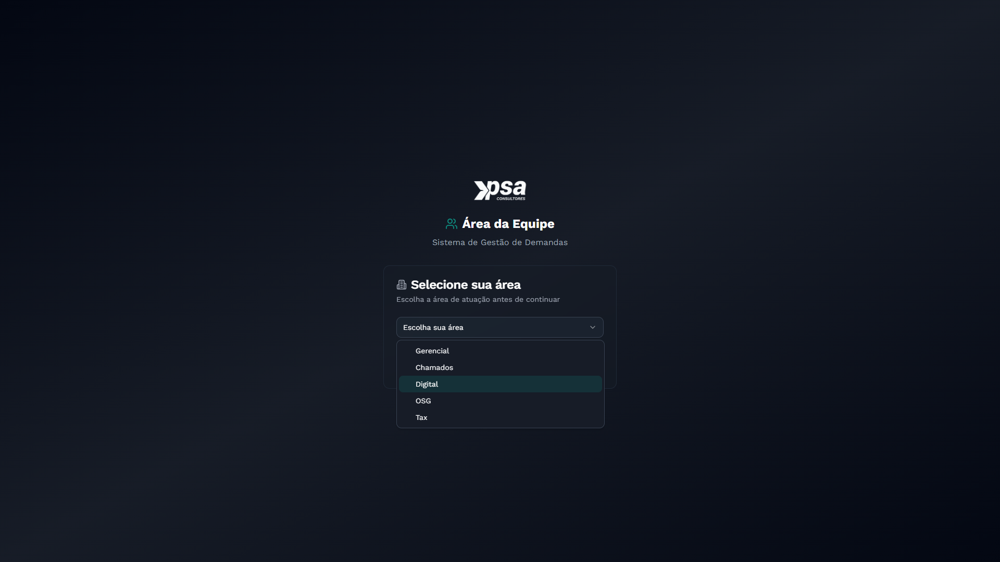
        

        
Seleção da área de competência Digital

    

    <h3 id="secao-acesso-3">2.3. Login no sistema</h3>
    
A tela de autenticação será exibida. Insira suas credenciais corporativas (e-mail e senha) nos campos correspondentes e clique em <strong>"Entrar"</strong>.

    

        

            
        

        
Preenchimento dos dados de acesso

    

    <h3 id="secao-acesso-4">2.4. Seleção do ambiente de trabalho</h3>
    
Após o login, selecione o ambiente <strong>"Digital Dev"</strong>. Este é o ambiente de criação, desenvolvimento e utilização das ferramentas fiscais automatizadas.

    

        

            
        

        
Escolha do ambiente da área Digital

    

    <h3 id="secao-acesso-5">2.5. Hub de Ferramentas</h3>
    
Ao entrar no ambiente Digital Dev, o sistema carregará o <strong>Hub de Ferramentas</strong>. Identifique o card correspondente e clique no botão <strong>"Acessar Ferramenta"</strong> no módulo de Correções no SPED.

    

        

            
        

        
Visão geral do Hub de Ferramentas e sessões ativas

    

  

  

    3
    <h2 class="editable-text">Filtros de Busca e Configuração</h2>
  

  

    
Para iniciar qualquer correção, é necessário preencher os parâmetros obrigatórios no painel de filtros superiores.

    <h3 id="secao-3-1">3.1. Cliente e Contribuinte</h3>
    
Selecione o Cliente e, em seguida, o Contribuinte (CNPJ). Caso a empresa tenha apenas um contribuinte, ele será selecionado automaticamente.

    

        

            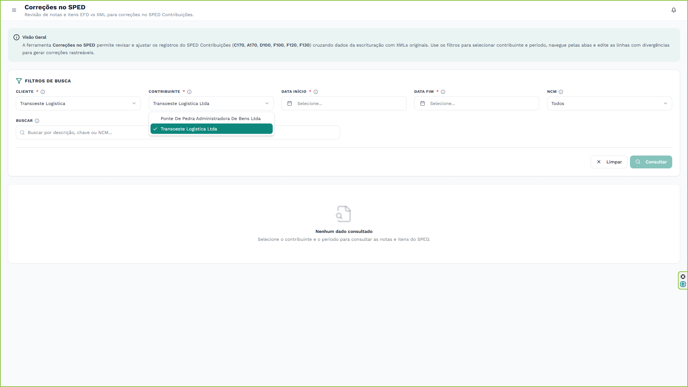
        

        
Seleção do Contribuinte

    

    <h3 id="secao-3-2">3.2. Período e NCM</h3>
    
Defina o intervalo de datas (Data Início e Data Fim) da escrituração. Opcionalmente, utilize o filtro de NCM para trazer apenas itens com ou sem NCM cadastrado.

    

        

            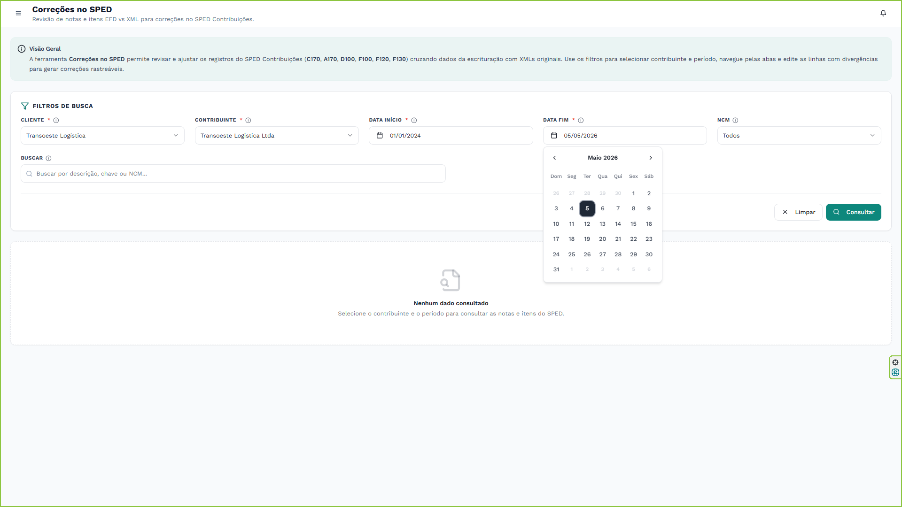
        

        
Definição de Datas Início e Fim

    

    

        

            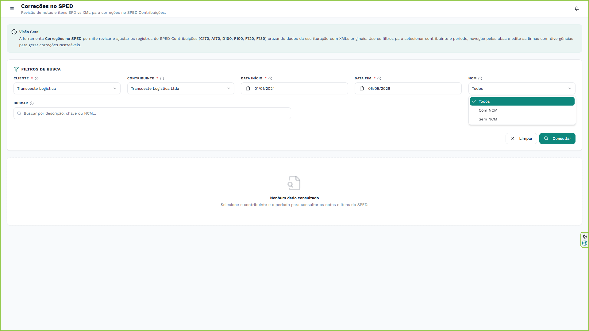
        

        
Filtro condicional de NCM

    

    <h3 id="secao-3-3">3.3. Filtros Específicos (Aba F100)</h3>
    
A aba F100 exige a definição de parâmetros exclusivos para evitar sobrecarga de dados. Para consultá-la, você <strong>deve</strong> informar a "Nat. Base de Crédito" e/ou o "Código da Conta".

    

        

            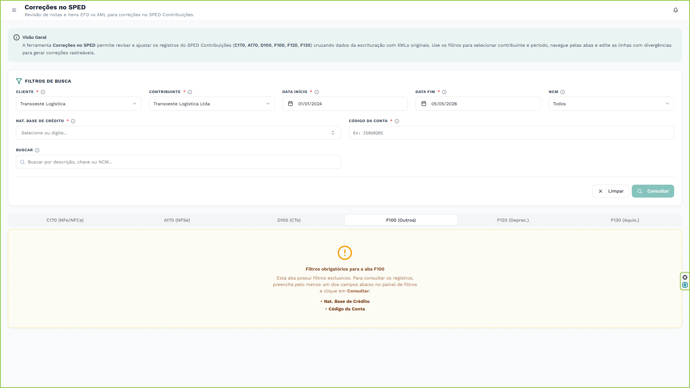
        

        
Mensagem solicitando filtros específicos para a aba F100

    

    

        

            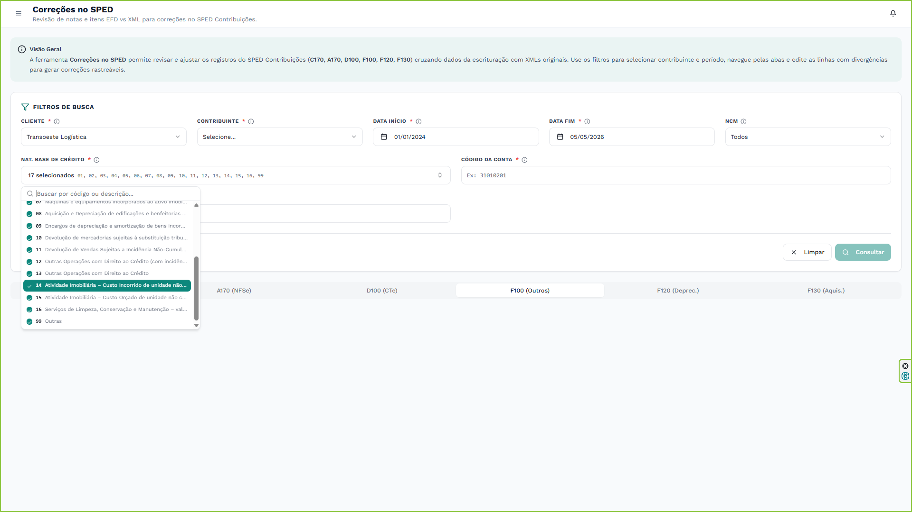
        

        
Preenchendo a Natureza de Base de Crédito no dropdown múltiplo

    

    
Após preencher os dados, clique em <strong>Consultar</strong>.

    

        

            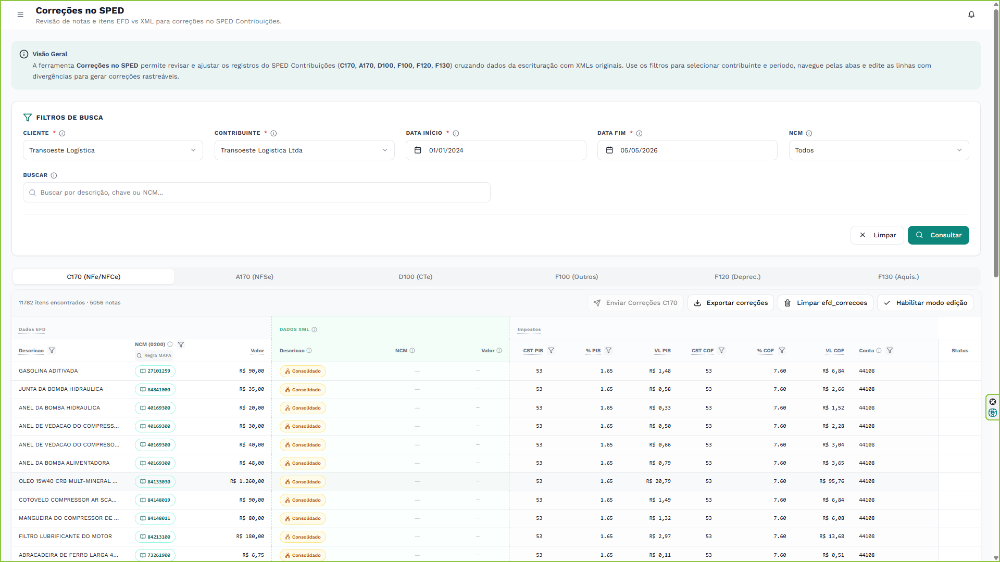
        

        
Tabela carregada após a execução da consulta

    

    
Para resetar os parâmetros e realizar uma nova pesquisa, clique no botão <strong>Limpar</strong>.

    

        

            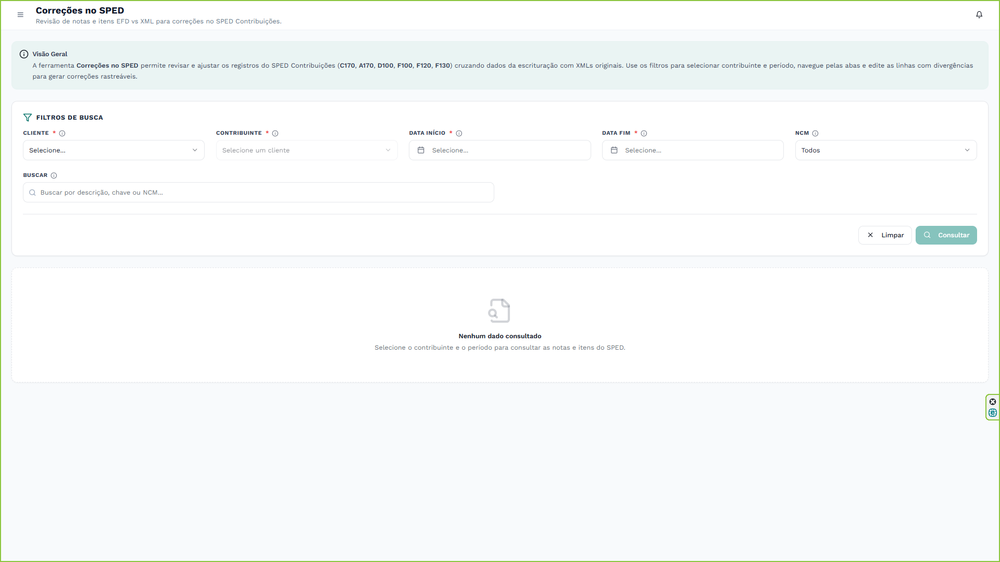
        

        
Botão Limpar para redefinir formulários e tela

    

  

  

    4
    <h2 class="editable-text">Visão Geral das Abas (Registros SPED)</h2>
  

  

    
Após a consulta, o sistema organiza os resultados em abas, dividindo as informações por tipo de registro da EFD Contribuições.

    
    <ul>
        <li><strong>C170 (NFe/NFCe):</strong> Itens de notas fiscais eletrônicas de produto. Esta aba exibe um cruzamento lado-a-lado com os dados lidos do arquivo XML.</li>
        <li><strong>A170 (NFSe):</strong> Itens de notas fiscais de serviço.</li>
        

            

                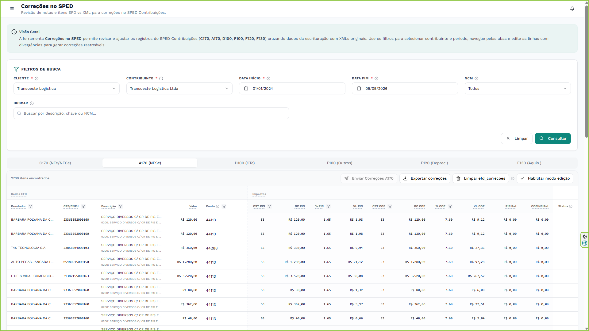
            

            
Registros de Notas de Serviço (A170)

        

        <li><strong>D100 (CTe):</strong> Conhecimentos de transporte.</li>
        

            

                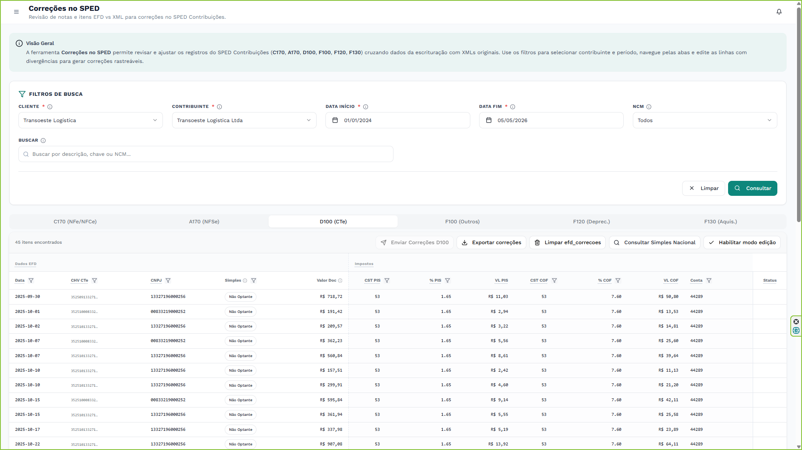
            

            
Registros de Conhecimento de Transporte (D100)

        

        <li><strong>F100 (Outros):</strong> Demais receitas e operações com direito a crédito não abrangidas nos blocos A, C e D.</li>
        

            

                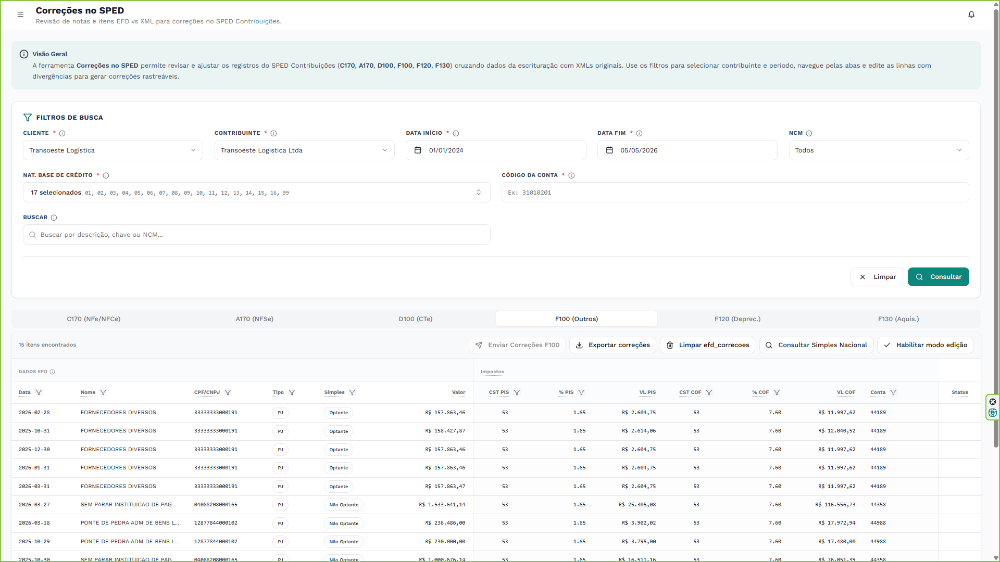
            

            
Registros consolidados no Bloco F100

        

        <li><strong>F120 (Depreciação):</strong> Créditos sobre encargos de depreciação de bens do imobilizado.</li>
        

            

                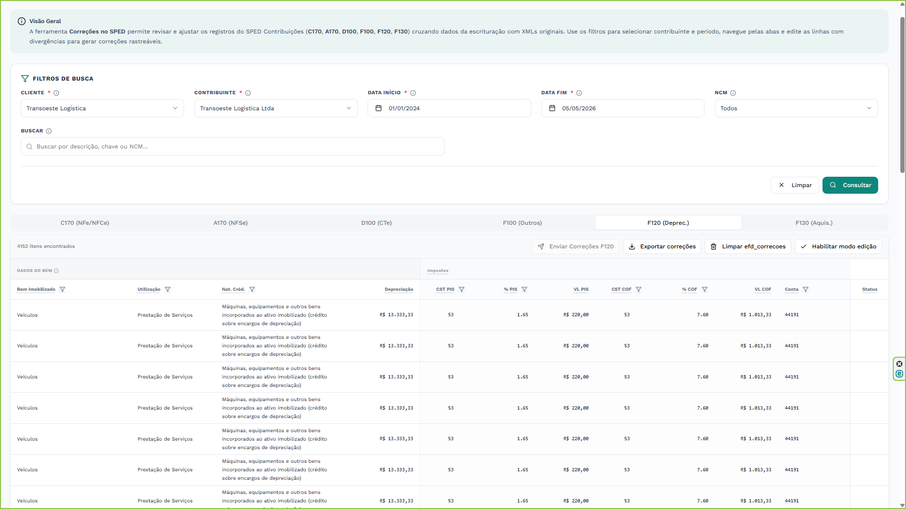
            

            
Registros de depreciação e amortização

        

        <li><strong>F130 (Aquisição):</strong> Créditos sobre valor de aquisição de bens do ativo imobilizado.</li>
        

            

                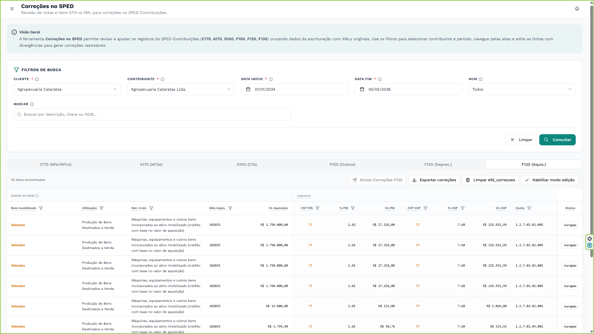
            

            
Registros de bens adquiridos

        

    </ul>
  

  

    5
    <h2 class="editable-text">Navegação e Análise de Dados</h2>
  

  

    <h3 id="secao-5-1">5.1. Dicas flutuantes (Tooltips)</h3>
    
Passe o mouse sobre os cabeçalhos de coluna pontilhados ou ícones de informação <code>(i)</code> para exibir balões explicativos sobre o campo ou registro.

    

        

            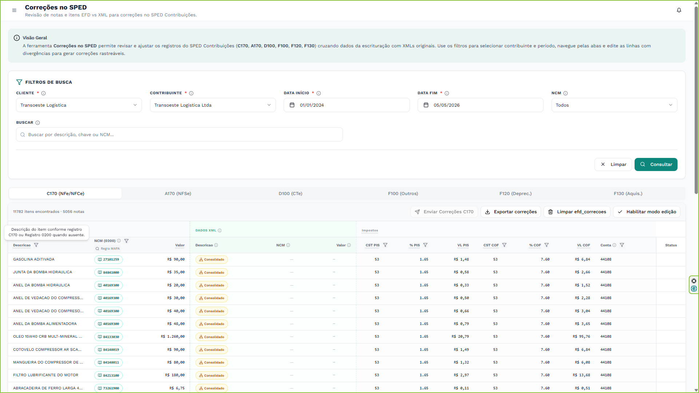
        

        
Tooltips detalhando a origem contábil ou fiscal do campo

    

    <h3 id="secao-5-2">5.2. Filtros de Coluna</h3>
    
Utilize os ícones de filtro ao lado dos cabeçalhos para classificar (crescente/decrescente) ou selecionar valores específicos (ex: exibir apenas itens com determinado NCM ou CST).

    

        

            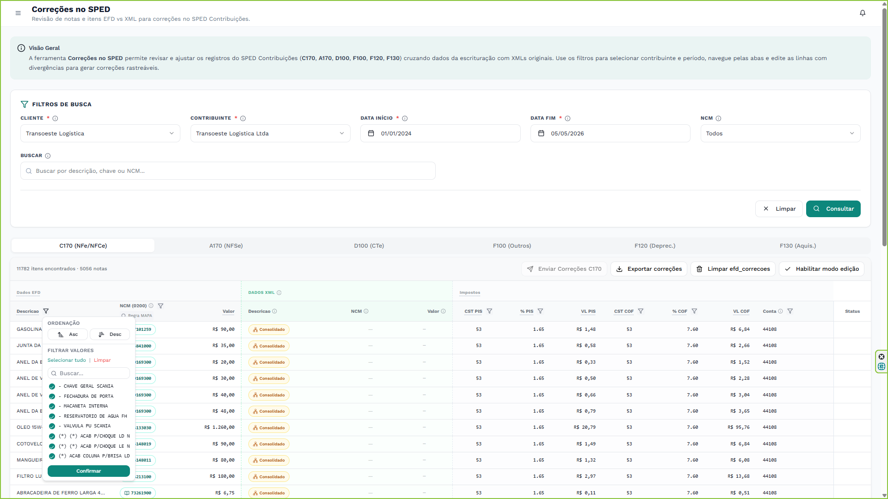
        

        
Filtro drop-down nas colunas de dados

    

    <h3 id="secao-5-3">5.3. Detalhes de NFe e Itens Consolidados</h3>
    
Na aba <strong>C170</strong>, você verá a coluna de "Dados XML". O sistema alerta (em vermelho) quando há divergência de NCM entre o SPED e o XML, e em laranja quando há divergência de Valor.  
    Se o item no SPED foi agrupado, exibirá o selo <strong>Consolidado</strong>. Ao clicar nesta coluna, um modal abrirá detalhando todos os itens originários da NFe.

    

        

            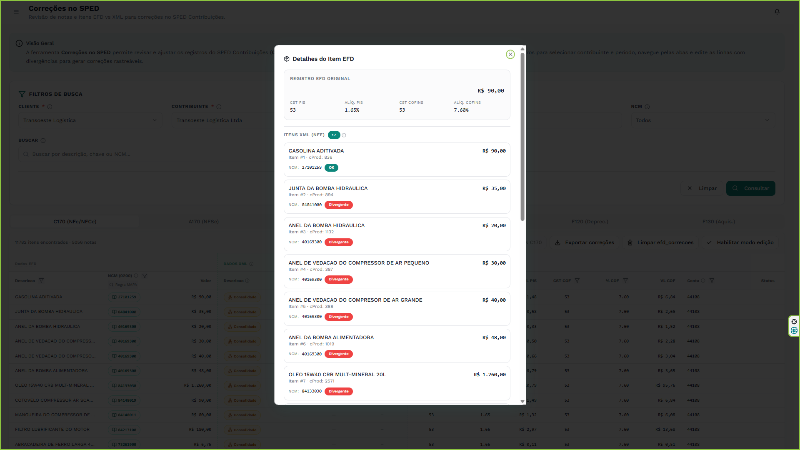
        

        
Modal detalhando a NFe e seus itens originais cruzados com a EFD

    

    
Para voltar, basta clicar no <code>X</code> ou fora da janela modal.

    

        

            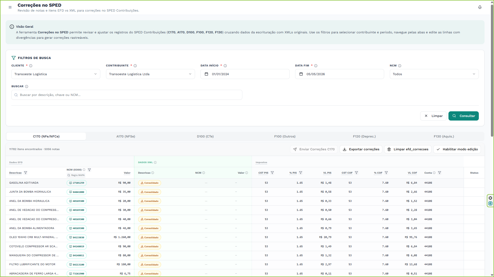
        

        
Fechando os detalhes da NFe para retomar a edição na tabela

    

  

  

    6
    <h2 class="editable-text">Regras de NCM</h2>
  

  

    
Na aba C170, ao clicar sobre um NCM destacado, o sistema abre o <strong>Mapa NCM</strong>, que exibe os tratamentos tributários mapeados (CSTs e Alíquotas) para aquele código em específico.

    

        

            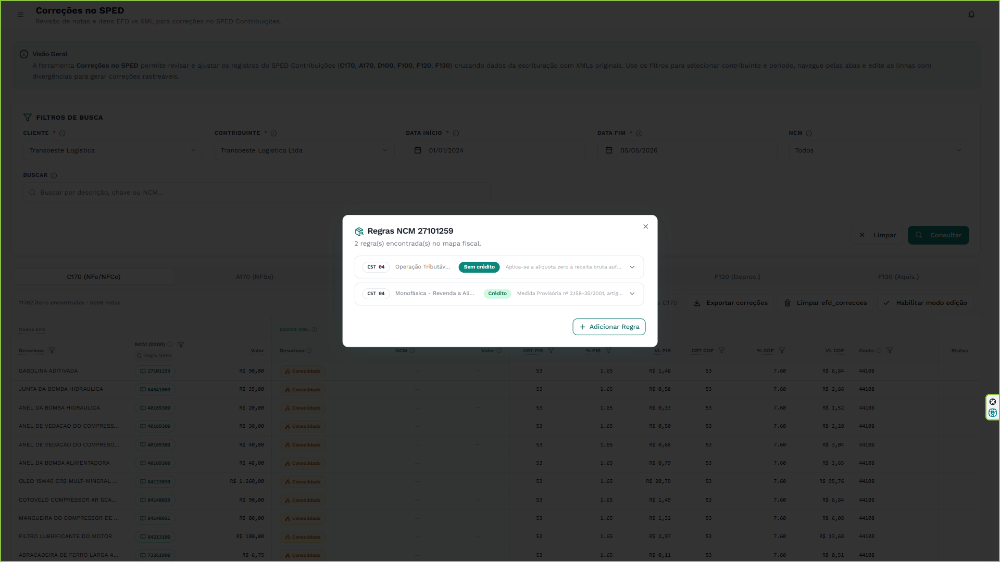
        

        
Regras tributárias associadas ao NCM clicado

    

    

        

            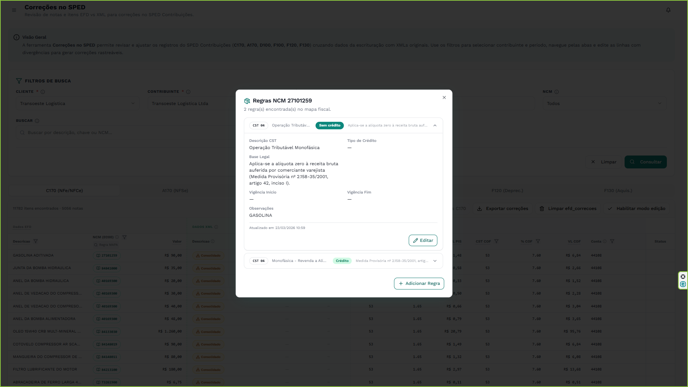
        

        
Expandindo o card para visualizar a Base Legal

    

    
Nesta tela de apoio, você pode <strong>Editar</strong> uma regra existente ou <strong>Adicionar Nova Regra</strong> para o Mapa, caso ela ainda não conste na base.

    

        

            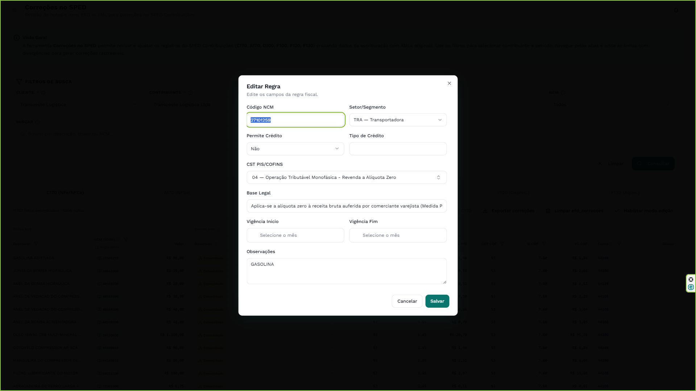
        

        
Modal para edição do mapa tributário

    

    

        

            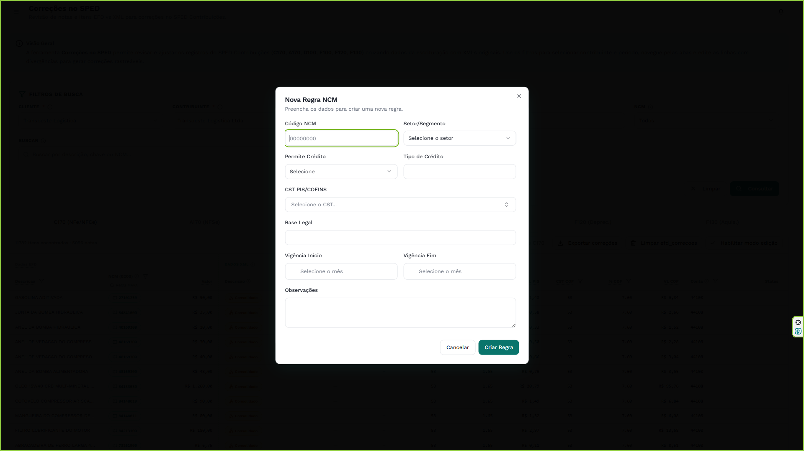
        

        
Formulário de cadastro de nova regra

    

    
As modificações feitas aqui serão refletidas instantaneamente. Para voltar, feche o modal.

    

        

            
        

        
Fechando o painel de Regras de NCM

    

  

  

    7
    <h2 class="editable-text">Modo de Edição e Correções</h2>
  

  

    
A ferramenta permite alterar diretamente as informações tributárias da tabela sem afetar o arquivo SPED original, gerando uma camada segura de correção.

    <h3 id="secao-7-1">7.1. Habilitando a edição</h3>
    
No canto superior direito da tabela de resultados, clique no botão <strong>Habilitar modo edição</strong>. As colunas da tabela se tornarão campos preenchíveis.

    

        

            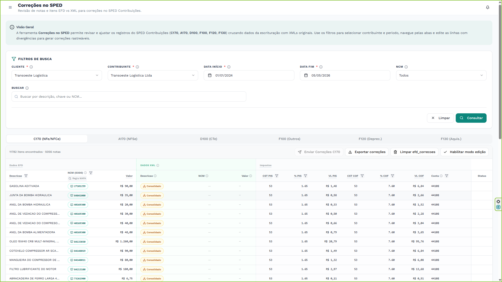
        

        
Botão para entrar no modo de correção em massa

    

    <h3 id="secao-7-2">7.2. Editando registros</h3>
    
Você pode alterar os valores digitando diretamente nos campos de texto ou utilizando os menus dropdown (como os códigos da Tabela 4.3.7 em F120/F130). As linhas modificadas ou selecionadas ficarão destacadas em verde.

    

        

            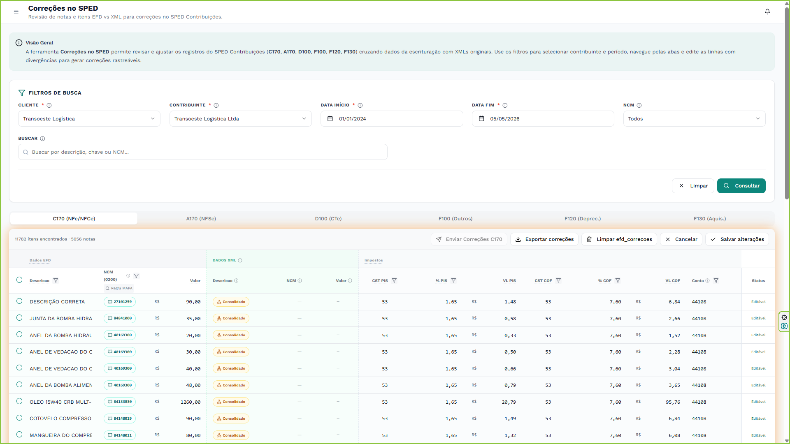
        

        
Interface da tabela com inputs de texto habilitados

    

    

        bolt
        
<strong>Dica de Produtividade:</strong> Utilize a caixa de seleção na primeira coluna para marcar várias linhas simultaneamente. Ao editar um campo (ex: CST) em uma linha selecionada, a mesma alteração será replicada para todas as linhas marcadas no lote.

    

    <h3 id="secao-7-3">7.3. Salvando as alterações</h3>
    
Após concluir as modificações desejadas, clique no botão verde <strong>Salvar alterações</strong>.

    

        

            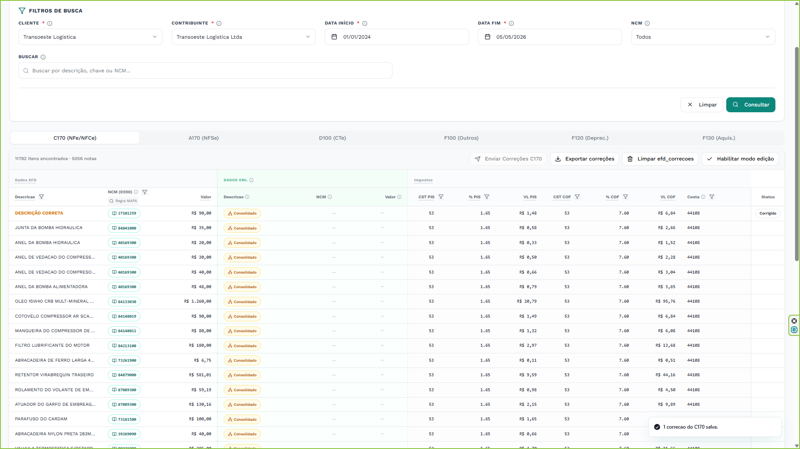
        

        
Confirmando e gravando as edições no banco

    

    
O sistema processará os dados e, em caso de sucesso, exibirá a tag "Corrigido" na última coluna da linha. Os valores alterados ficarão destacados na cor laranja.

  

  

    8
    <h2 class="editable-text">Consulta Simples Nacional (D100/F100)</h2>
  

  

    
Nas abas D100 e F100, é fundamental identificar se o participante da operação (o prestador ou fornecedor) é optante pelo Simples Nacional.

    
Para isso, utilize o botão <strong>Consultar Simples Nacional</strong> localizado acima da tabela.

    

        

            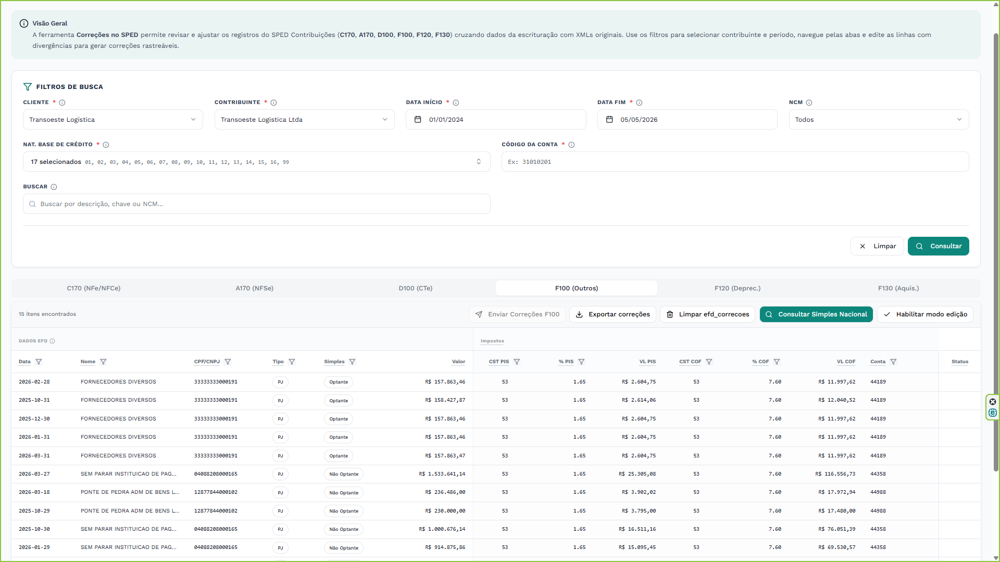
        

        
Botão de integração com a consulta do Simples

    

    
O sistema processará as requisições em lote para os CNPJs exibidos na tabela.

    

        

            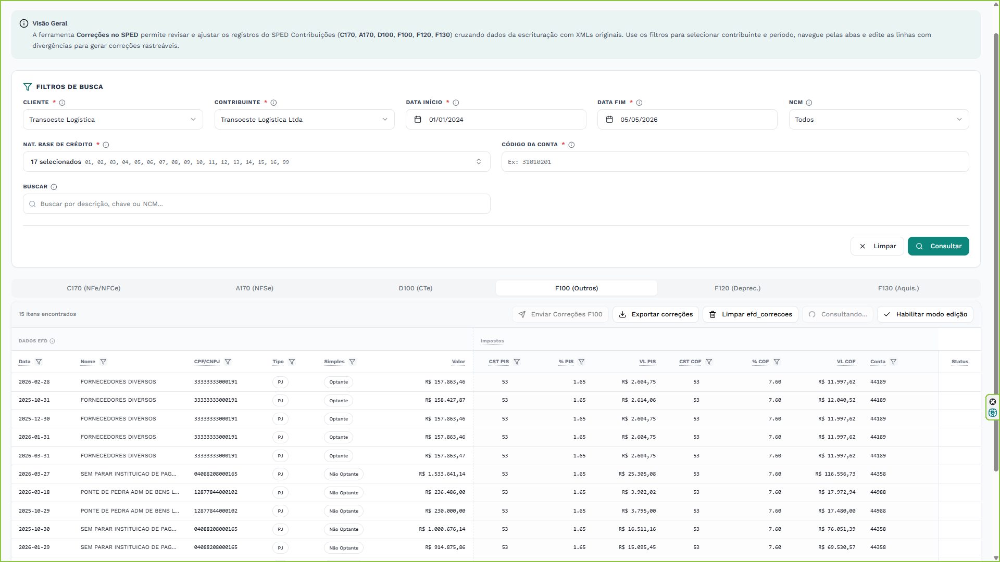
        

        
Processando os CNPJs em segundo plano

    

    
Após a conclusão, a coluna "Simples" será automaticamente populada com o selo "Optante" ou "Não Optante", fundamentando as suas decisões de tomada de crédito.

    

        

            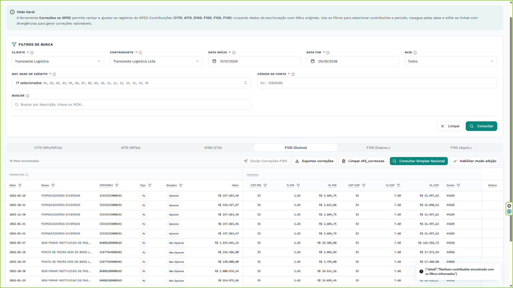
        

        
Coluna populada com a condição do Simples Nacional

    

  

  

    9
    <h2 class="editable-text">Envio e Exportação</h2>
  

  

    
Após salvar as correções localmente (passo 7.3), é necessário submetê-las ou extrair o relatório destas modificações.

    
Para efetivar o processo no banco central e atualizar a inteligência do projeto, clique em <strong>Enviar Correções</strong>.

    

        

            
        

        
Submissão definitiva das correções efetuadas

    

    

        

            
        

        
Status de envio dos registros corrigidos

    

    
Uma notificação confirmará o sucesso da sincronização.

    

        

            
        

        
Confirmação de sincronização concluída com sucesso

    

    

        info
        
<strong>Exportar Correções:</strong> Caso precise do relatório para envio contábil ou análise offline, utilize o botão <strong>Exportar correções</strong>, que gerará uma planilha (Excel) com o antes e depois de cada linha modificada, detalhando exatamente as melhorias efetuadas.

    

  

