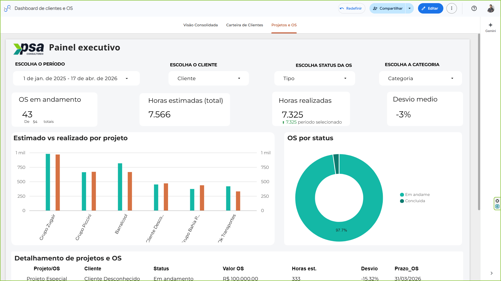
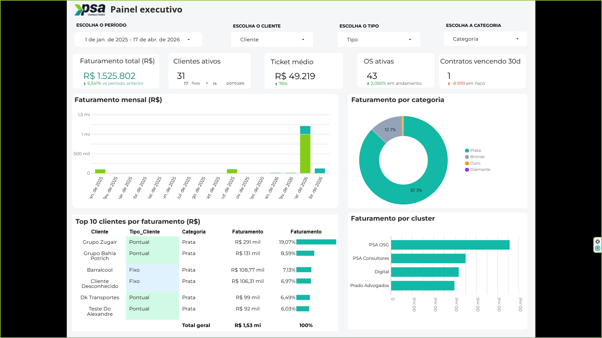
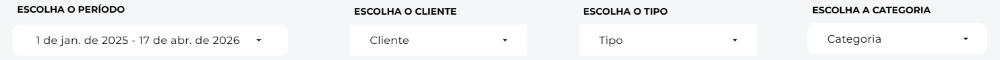
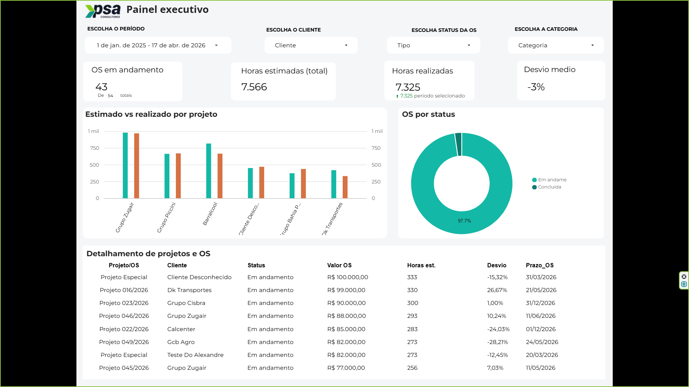
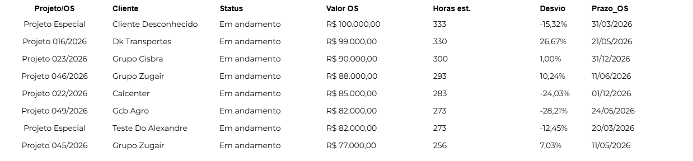
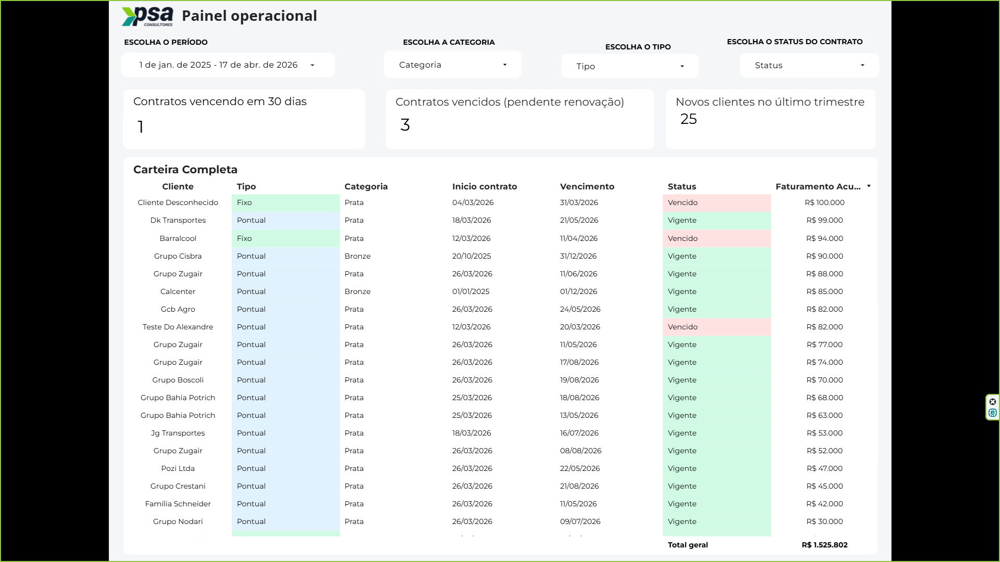
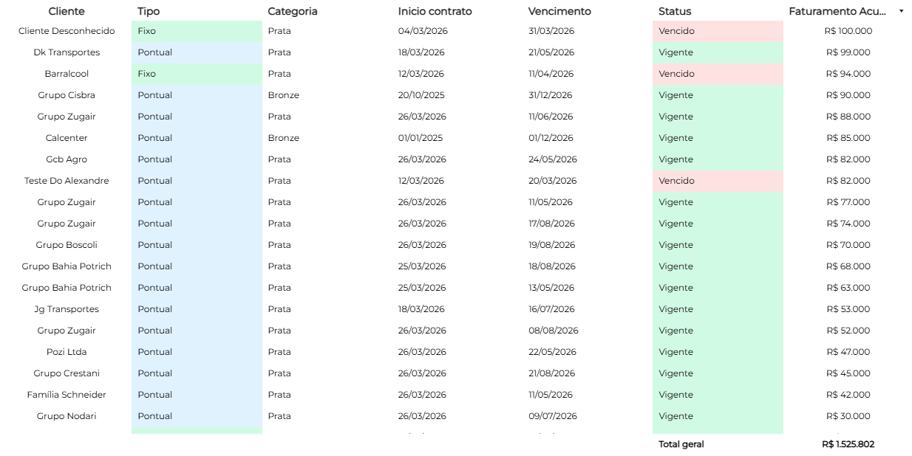

---

layout: manual

title: "Dashboard de Clientes e OS"

versao: "1.0"

github_url: "https://github.com/psa-elevate/dashboard-clientes-os"

toc:

&#x20; - id: secao-intro

&#x20;   title: "1. Introdução"

&#x20; - id: secao-2

&#x20;   title: "2. Visão geral do dashboard"

&#x20; - id: secao-3

&#x20;   title: "3. Painel Executivo - Faturamento e Clientes"

&#x20;   items:

&#x20;     - id: secao-3-1

&#x20;       title: "3.1. Visão geral da página"

&#x20;     - id: secao-3-2

&#x20;       title: "3.2. Filtros disponíveis"

&#x20;     - id: secao-3-3

&#x20;       title: "3.3. Indicadores (KPIs)"

&#x20;     - id: secao-3-4

&#x20;       title: "3.4. Gráficos de análise"

&#x20;     - id: secao-3-5

&#x20;       title: "3.5. Tabela de visão consolidada"

&#x20; - id: secao-4

&#x20;   title: "4. Painel Executivo - Ordens de Serviço (OS)"

&#x20;   items:

&#x20;     - id: secao-4-1

&#x20;       title: "4.1. Visão geral da página"

&#x20;     - id: secao-4-2

&#x20;       title: "4.2. Filtros de OS"

&#x20;     - id: secao-4-3

&#x20;       title: "4.3. Indicadores de OS"

&#x20;     - id: secao-4-4

&#x20;       title: "4.4. Gráficos de acompanhamento"

&#x20;     - id: secao-4-5

&#x20;       title: "4.5. Tabela analítica de OS"

&#x20; - id: secao-5

&#x20;   title: "5. Painel Operacional"

&#x20;   items:

&#x20;     - id: secao-5-1

&#x20;       title: "5.1. Visão geral da página"

&#x20;     - id: secao-5-2

&#x20;       title: "5.2. Filtros e Indicadores"

&#x20;     - id: secao-5-3

&#x20;       title: "5.3. Tabela de detalhamento operacional"

---

&#x20; 

&#x20;   1

&#x20;   <h2 class="editable-text">Introdução</h2>

&#x20; 

&#x20; 

&#x20;   
Este manual apresenta as funcionalidades do <strong>Dashboard de Clientes e OS</strong>, uma ferramenta estratégica desenvolvida no Looker Studio para o ecossistema PSA Elevate. O painel centraliza indicadores críticos de performance, permitindo o acompanhamento em tempo real do faturamento, do perfil da carteira de clientes e do status operacional das Ordens de Serviço (OS).

&#x20;   
O objetivo deste documento é orientar gestores e analistas na exploração das três visões principais do relatório, facilitando a tomada de decisão baseada em dados consolidados e métricas de ticket médio e produtividade.

&#x20; 

&#x20; 

&#x20;   2

&#x20;   <h2 class="editable-text">Visão geral do dashboard</h2>

&#x20; 

&#x20; 

&#x20;   
O dashboard é dividido em páginas temáticas que separam a visão executiva financeira da visão operacional detalhada. A navegação entre as abas permite transitar entre dados macro (faturamento total) e micro (detalhes de uma OS específica).

&#x20;   

&#x20;       

&#x20;       
Figura 1 - Visão geral da estrutura de navegação do dashboard

&#x20;   

&#x20; 

&#x20; 

&#x20;   3

&#x20;   <h2 class="editable-text">Painel Executivo - Faturamento e Clientes</h2>

&#x20; 

&#x20; 

&#x20;   
Esta aba foca na saúde financeira da operação e na segmentação da carteira de clientes ativos.

&#x20;   <h3 id="secao-3-1">3.1. Visão geral da página</h3>

&#x20;   
Apresenta o faturamento consolidado e a distribuição de receita por categoria de cliente.

&#x20;   

&#x20;       

&#x20;       
Figura 2 - Visão geral do Painel Executivo de Faturamento

&#x20;   

&#x20;   <h3 id="secao-3-2">3.2. Filtros disponíveis</h3>

&#x20;   
No topo da página, é possível refinar a análise através dos seguintes controles:

&#x20;   <ul>

&#x20;       <li><strong>Escolha o período:</strong> Define o intervalo de tempo da análise.</li>

&#x20;       <li><strong>Escolha o cliente:</strong> Filtra os dados por grupos específicos.</li>

&#x20;       <li><strong>Escolha o tipo:</strong> Segmenta entre clientes fixos ou pontuais.</li>

&#x20;       <li><strong>Escolha a categoria:</strong> Filtra pelo nível de segmentação (ex: Prata, Ouro).</li>

&#x20;   </ul>

&#x20;   

&#x20;       

&#x20;       
Figura 3 - Barra de filtros do Painel Executivo

&#x20;   

&#x20;   <h3 id="secao-3-3">3.3. Indicadores (KPIs)</h3>

&#x20;   
Os cartões de performance destacam métricas vitais para a gestão:

&#x20;   <ul>

&#x20;       <li><strong>Faturamento total:</strong> Soma absoluta da receita no período, com comparativo percentual.</li>

&#x20;       <li><strong>Clientes ativos:</strong> Quantidade total, detalhando o volume de <strong>Fixos</strong> e <strong>Pontuais</strong>.</li>

&#x20;       <li><strong>Ticket médio:</strong> Valor médio faturado por cliente.</li>

&#x20;   </ul>

&#x20;   

&#x20;       

&#x20;       
Figura 4 - Indicadores principais de faturamento e clientes

&#x20;   

&#x20;   <h3 id="secao-3-4">3.4. Gráficos de análise</h3>

&#x20;   
O painel utiliza visualizações gráficas para identificar tendências de mercado:

&#x20;   <ul>

&#x20;       <li><strong>Faturamento mensal:</strong> Histórico de evolução da receita ao longo do tempo.</li>

&#x20;       <li><strong>Faturamento por categoria:</strong> Distribuição percentual da receita por nível de cliente.</li>

&#x20;       <li><strong>Faturamento por tipo:</strong> Comparativo entre o peso de clientes recorrentes (fixos) e esporádicos (pontuais).</li>

&#x20;   </ul>

&#x20;   

&#x20;       

&#x20;       
Figura 5 - Gráfico de barras de faturamento mensal

&#x20;   

&#x20;   

&#x20;       

&#x20;       
Figura 6 - Distribuição de faturamento por categoria

&#x20;   

&#x20;   

&#x20;       

&#x20;       
Figura 7 - Proporção de faturamento por tipo de cliente

&#x20;   

&#x20;   <h3 id="secao-3-5">3.5. Tabela de visão consolidada</h3>

&#x20;   
Exibe o ranking de faturamento por cliente, permitindo identificar os maiores contribuintes para a receita total.

&#x20;   

&#x20;       

&#x20;       
Figura 8 - Tabela consolidada de faturamento por cliente

&#x20;   

&#x20; 

&#x20; 

&#x20;   4

&#x20;   <h2 class="editable-text">Painel Executivo - Ordens de Serviço (OS)</h2>

&#x20; 

&#x20; 

&#x20;   
Esta seção é dedicada ao monitoramento do fluxo de trabalho e entrega das demandas contratuais.

&#x20;   <h3 id="secao-4-1">4.1. Visão geral da página</h3>

&#x20;   
Apresenta o volume de OS abertas e a situação de cada projeto.

&#x20;   

&#x20;       

&#x20;       
Figura 9 - Visão geral do Painel de Ordens de Serviço

&#x20;   

&#x20;   <h3 id="secao-4-2">4.2. Filtros de OS</h3>

&#x20;   
Além dos filtros padrão de cliente e período, permite segmentar pela situação atual das ordens.

&#x20;   

&#x20;       

&#x20;       
Figura 10 - Filtros específicos para gestão de OS

&#x20;   

&#x20;   <h3 id="secao-4-3">4.3. Indicadores de OS</h3>

&#x20;   
Destaca o volume de <strong>OS ativas</strong> e a variação percentual de projetos em andamento.

&#x20;   

&#x20;       

&#x20;       
Figura 11 - Indicadores de volume de ordens ativas

&#x20;   

&#x20;   <h3 id="secao-4-4">4.4. Gráficos de acompanhamento</h3>

&#x20;   
Analisa a distribuição das OS por status operacional e categoria de serviço.

&#x20;   

&#x20;       

&#x20;       
Figura 12 - Ordens de serviço por status

&#x20;   

&#x20;   

&#x20;       

&#x20;       
Figura 13 - Distribuição de OS por categoria

&#x20;   

&#x20;   <h3 id="secao-4-5">4.5. Tabela analítica de OS</h3>

&#x20;   
Lista detalhadamente os contratos vigentes, datas de início e fim, situação e valores envolvidos.

&#x20;   

&#x20;       

&#x20;       
Figura 14 - Listagem analítica de Ordens de Serviço

&#x20;   

&#x20; 

&#x20; 

&#x20;   5

&#x20;   <h2 class="editable-text">Painel Operacional</h2>

&#x20; 

&#x20; 

&#x20;   
A visão operacional é voltada para a conferência minuciosa dos dados e auditoria de faturamento individual por item.

&#x20;   <h3 id="secao-5-1">5.1. Visão geral da página</h3>

&#x20;   
Exibe a grade completa de registros operacionais com filtros estendidos.

&#x20;   

&#x20;       

&#x20;       
Figura 15 - Visão geral do Painel Operacional

&#x20;   

&#x20;   <h3 id="secao-5-2">5.2. Filtros e Indicadores</h3>

&#x20;   
Permite buscas específicas por cliente, contribuinte e status, mantendo os KPIs de faturamento visíveis para conferência imediata.

&#x20;   

&#x20;       

&#x20;       
Figura 16 - Filtros da visão operacional

&#x20;   

&#x20;   

&#x20;       

&#x20;       
Figura 17 - Indicadores aplicados à visão operacional

&#x20;   

&#x20;   <h3 id="secao-5-3">5.3. Tabela de detalhamento operacional</h3>

&#x20;   
Tabela rica em dados que serve como extrato detalhado para conciliação financeira e acompanhamento de datas críticas de vigência.

&#x20;   

&#x20;       

&#x20;       
Figura 18 - Extrato operacional detalhado para auditoria

&#x20;   

&#x20; 

