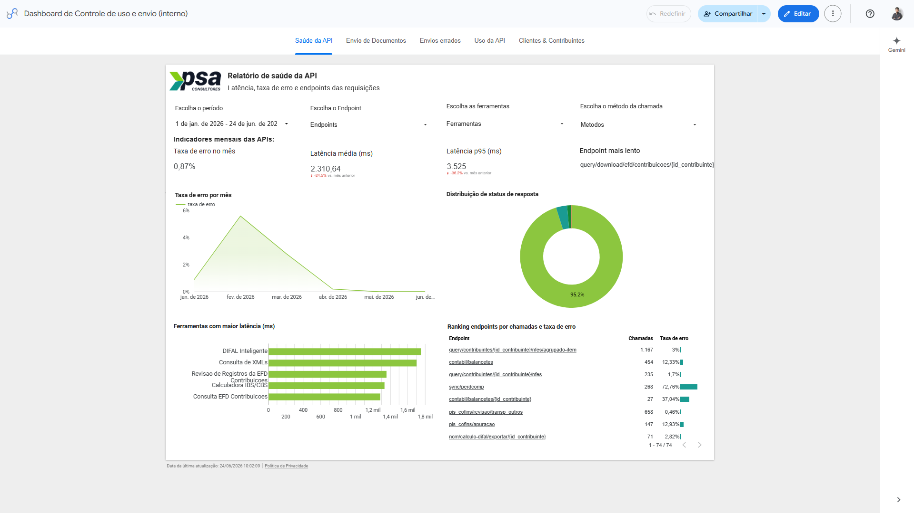
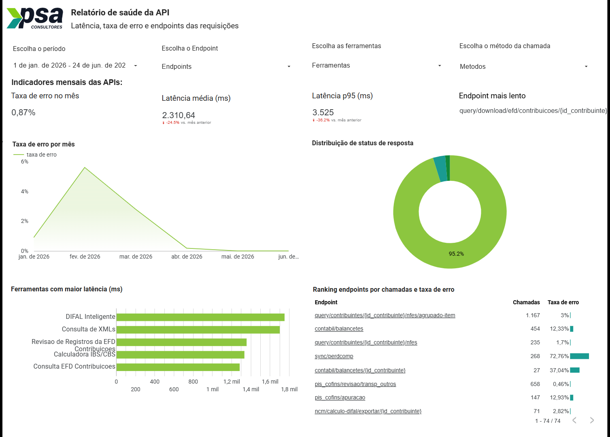
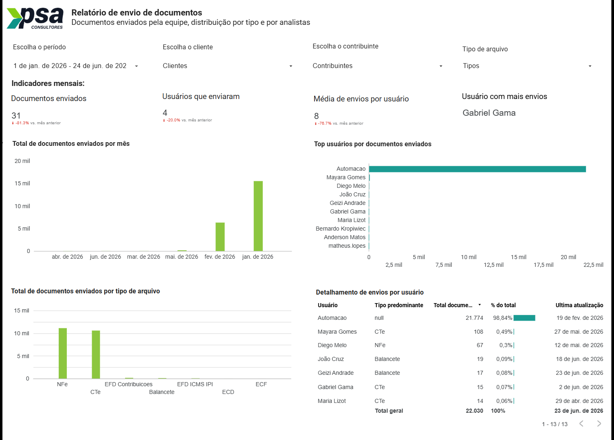
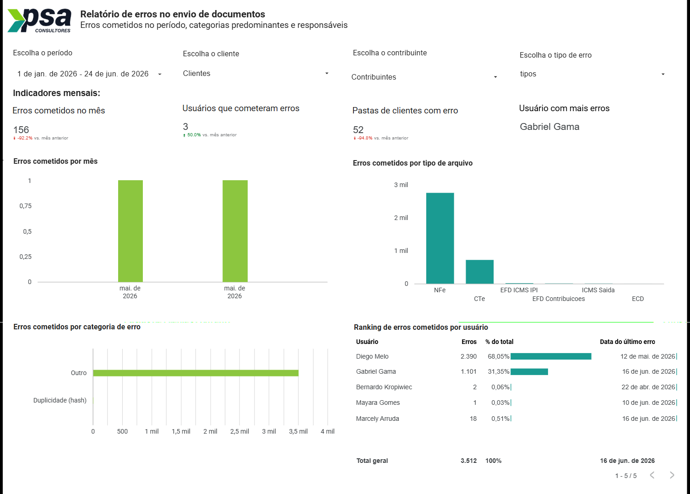
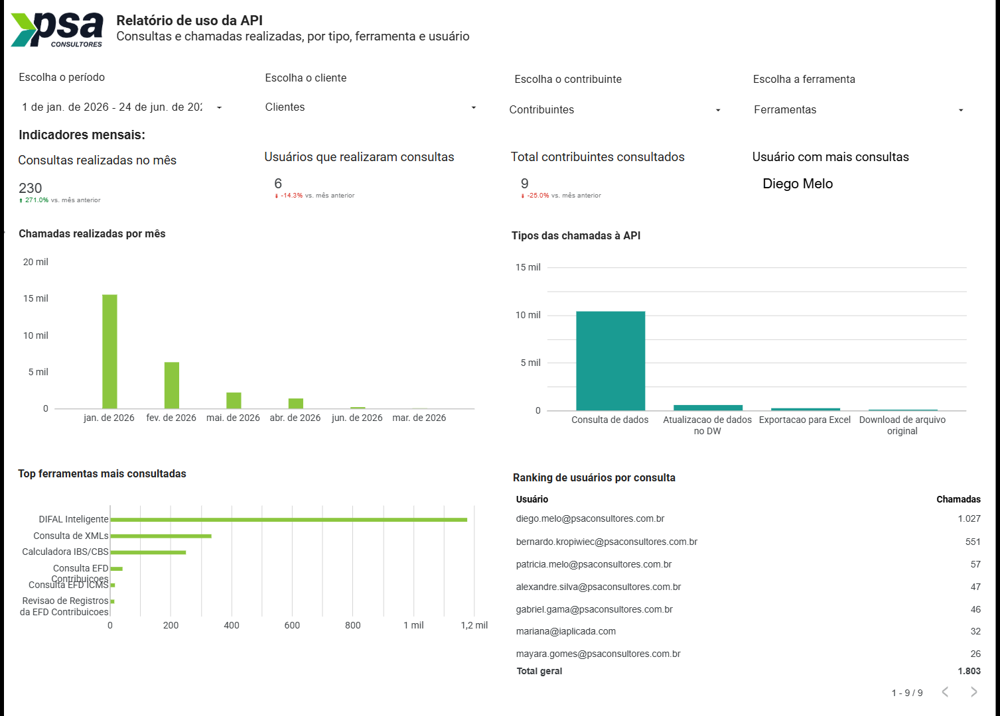
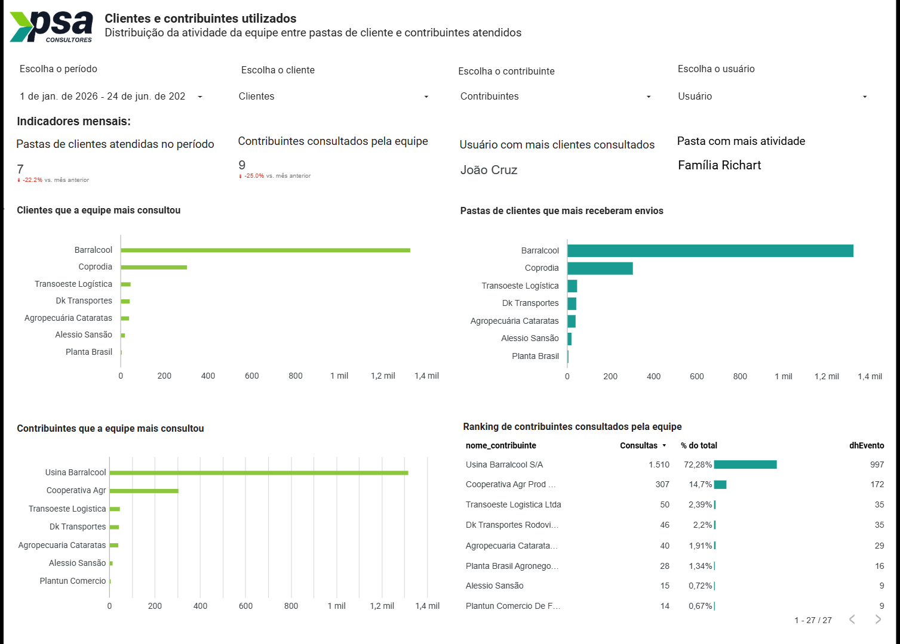

  

    1
    <h2 class="editable-text">Introdução</h2>
  

  

    
Este manual apresenta as funcionalidades do <strong>Controle de Uso e Envio de Documentos (Interno)</strong>, dashboard desenvolvido no Data Studio para o ecossistema PSA Elevate. O painel consolida, em uma única ferramenta, o monitoramento do volume de documentos enviados ao Drive da PSA, o acompanhamento dos erros cometidos nesses envios, o uso das consultas realizadas pela equipe e a saúde técnica das requisições feitas às APIs da plataforma.

    
Esta é a versão <strong>interna</strong>, destinada à equipe técnica e de gestão da PSA Consultores. Ela contém uma aba exclusiva de <strong>Saúde da API</strong>, voltada ao monitoramento de latência e taxa de erro das requisições, que não está presente na versão externa.

    
O objetivo deste documento é orientar a equipe na leitura dos indicadores e na interpretação dos gráficos e tabelas de cada página, apoiando a tomada de decisão sobre volumetria de dados, produtividade da equipe e estabilidade técnica do sistema.

    

      lightbulb
      
As imagens deste manual são da página completa. Clique sobre qualquer captura para ampliar e navegar nos detalhes de cada gráfico ou tabela.

    

  

  

    2
    <h2 class="editable-text">Visão geral do dashboard</h2>
  

  

    
O dashboard é organizado em <strong>páginas (abas) navegáveis</strong>, exibidas na barra de abas no topo do relatório. A navegação entre os temas é feita clicando na aba desejada. As abas disponíveis na versão interna são:

    <ul>
      <li><strong>Saúde da API:</strong> monitoramento técnico de latência, taxa de erro e endpoints das requisições (exclusiva da versão interna).</li>
      <li><strong>Envio de Documentos:</strong> volume de documentos enviados ao Drive pela equipe, distribuído por tipo e por analista.</li>
      <li><strong>Envios errados:</strong> erros cometidos no envio de documentos, categorias predominantes e responsáveis.</li>
      <li><strong>Uso da API:</strong> volume de consultas e chamadas à API por ferramenta e por usuário.</li>
      <li><strong>Clientes &amp; Contribuintes:</strong> distribuição da atividade da equipe entre pastas de cliente e contribuintes atendidos.</li>
    </ul>
    
Cada página possui sua própria barra de filtros no topo e uma faixa de indicadores logo abaixo, seguidas pelos gráficos e pela tabela de detalhamento.

    

      

      
Figura 1 - Visão geral do dashboard, com a barra de abas no topo

    

  

  

    3
    <h2 class="editable-text">Saúde da API</h2>
  

  

    
Aba exclusiva da versão interna, dedicada à equipe técnica para monitorar a estabilidade das requisições feitas às APIs da plataforma, evidenciando latência, taxa de erro e os endpoints mais críticos.

    

      warning
      
<strong>Atenção:</strong> Esta página não está disponível na versão externa (gestão) do dashboard.

    

    

      

      
Figura 2 - Visão geral da página de Saúde da API

    

    <h3 id="secao-saude-api-filtros">3.1. Filtros disponíveis</h3>
    
O cabeçalho permite refinar a análise técnica das requisições:

    <ul>
      <li><strong>Escolha o período:</strong> Define a data inicial e final da análise.</li>
      <li><strong>Escolha o Endpoint:</strong> Filtra as requisições por endpoint específico da API.</li>
      <li><strong>Escolha as ferramentas:</strong> Restringe a análise às chamadas originadas de uma ferramenta.</li>
      <li><strong>Escolha o método da chamada:</strong> Segmenta pelo método HTTP utilizado (ex.: GET ou POST).</li>
    </ul>

    <h3 id="secao-saude-api-indicadores">3.2. Indicadores</h3>
    
Os cartões resumem o desempenho técnico das requisições no período:

    <ul>
      <li><strong>Taxa de erro no mês:</strong> Percentual de requisições que retornaram erro.</li>
      <li><strong>Latência média (ms):</strong> Tempo médio de resposta das chamadas, em milissegundos.</li>
      <li><strong>Latência p95 (ms):</strong> Tempo abaixo do qual 95% das chamadas são respondidas (percentil 95).</li>
      <li><strong>Endpoint mais lento:</strong> Identifica o endpoint com o maior tempo de resposta.</li>
    </ul>

    <h3 id="secao-saude-api-graficos">3.3. Gráficos</h3>
    
A página apresenta três gráficos de análise:

    <ul>
      <li><strong>Taxa de erro por mês:</strong> gráfico de linha com a evolução do percentual de erros, útil para identificar picos e tendências.</li>
      <li><strong>Distribuição de status de resposta:</strong> gráfico de rosca com a proporção das respostas por status, evidenciando a participação das chamadas bem-sucedidas em relação às que retornaram erro.</li>
      <li><strong>Ferramentas com maior latência:</strong> barras horizontais que ranqueiam as ferramentas pelo tempo de resposta das suas chamadas.</li>
    </ul>

    <h3 id="secao-saude-api-tabela">3.4. Ranking de endpoints por chamadas e taxa de erro</h3>
    
Tabela que lista os endpoints com o volume de chamadas e a respectiva taxa de erro, permitindo priorizar a investigação dos pontos mais utilizados ou mais instáveis.

  

  

    4
    <h2 class="editable-text">Envio de Documentos</h2>
  

  

    
Esta página acompanha o volume de documentos enviados ao Drive da PSA pela equipe, com a distribuição por tipo de arquivo e por analista responsável.

    

      

      
Figura 3 - Visão geral da página de Envio de Documentos

    

    <h3 id="secao-envio-filtros">4.1. Filtros disponíveis</h3>
    
O cabeçalho permite refinar a análise dos envios:

    <ul>
      <li><strong>Escolha o período:</strong> Define a data inicial e final da análise.</li>
      <li><strong>Escolha o cliente:</strong> Filtra por um grupo ou família de empresas.</li>
      <li><strong>Escolha o contribuinte:</strong> Direciona a análise para um contribuinte específico.</li>
      <li><strong>Tipo de arquivo:</strong> Segmenta os envios por categoria de documento.</li>
    </ul>

    <h3 id="secao-envio-indicadores">4.2. Indicadores</h3>
    
Os cartões resumem o volume de envios no período:

    <ul>
      <li><strong>Documentos enviados:</strong> Quantidade total de documentos enviados ao Drive.</li>
      <li><strong>Usuários que enviaram:</strong> Número de colaboradores que realizaram envios.</li>
      <li><strong>Média de envios por usuário:</strong> Média de documentos enviados por usuário ativo.</li>
      <li><strong>Usuário com mais envios:</strong> Colaborador responsável pelo maior volume de envios.</li>
    </ul>

    <h3 id="secao-envio-graficos">4.3. Gráficos</h3>
    
A página apresenta três gráficos de análise:

    <ul>
      <li><strong>Total de documentos enviados por mês:</strong> barras com a evolução mensal do volume de envios ao Drive.</li>
      <li><strong>Top usuários por documentos enviados:</strong> barras horizontais que ranqueiam os usuários pelo volume de documentos enviados.</li>
      <li><strong>Total de documentos enviados por tipo de arquivo:</strong> barras com o volume segregado por categoria (NFe, CTe, EFD Contribuições, Balancete, EFD ICMS IPI, ECD, ECF, entre outros).</li>
    </ul>

    <h3 id="secao-envio-tabela">4.4. Detalhamento de envios por usuário</h3>
    
Tabela que detalha os envios por usuário, com as colunas: usuário, tipo de documento predominante, total de documentos, percentual do total e data da última atualização.

  

  

    5
    <h2 class="editable-text">Envios errados</h2>
  

  

    
Esta página consolida os erros cometidos no envio de documentos, evidenciando as categorias predominantes e os responsáveis, para apoiar ações de correção e orientação da equipe.

    

      

      
Figura 4 - Visão geral da página de Envios errados

    

    <h3 id="secao-erros-filtros">5.1. Filtros disponíveis</h3>
    
O cabeçalho permite refinar a análise dos erros:

    <ul>
      <li><strong>Escolha o período:</strong> Define a data inicial e final da análise.</li>
      <li><strong>Escolha o cliente:</strong> Filtra por um grupo ou família de empresas.</li>
      <li><strong>Escolha o contribuinte:</strong> Direciona a análise para um contribuinte específico.</li>
      <li><strong>Escolha o tipo de erro:</strong> Segmenta os erros pela categoria.</li>
    </ul>

    <h3 id="secao-erros-indicadores">5.2. Indicadores</h3>
    
Os cartões resumem os erros no período:

    <ul>
      <li><strong>Erros cometidos no mês:</strong> Quantidade total de erros registrados.</li>
      <li><strong>Usuários que cometeram erros:</strong> Número de colaboradores com erros no período.</li>
      <li><strong>Pastas de clientes com erro:</strong> Quantidade de pastas de clientes afetadas por erros.</li>
      <li><strong>Usuário com mais erros:</strong> Colaborador com o maior volume de erros.</li>
    </ul>

    <h3 id="secao-erros-graficos">5.3. Gráficos</h3>
    
A página apresenta três gráficos de análise:

    <ul>
      <li><strong>Erros cometidos por mês:</strong> barras com a evolução mensal da quantidade de erros.</li>
      <li><strong>Erros cometidos por tipo de arquivo:</strong> barras que distribuem os erros pela categoria de documento (NFe, CTe, EFD ICMS IPI, EFD Contribuições, ICMS Saída, ECD, entre outros).</li>
      <li><strong>Erros cometidos por categoria de erro:</strong> barras horizontais que agrupam os erros pela natureza da ocorrência (por exemplo, duplicidade por hash ou outras).</li>
    </ul>

    <h3 id="secao-erros-tabela">5.4. Ranking de erros cometidos por usuário</h3>
    
Tabela que ranqueia os usuários pela quantidade de erros, com as colunas: usuário, erros, percentual do total e data do último erro registrado.

  

  

    6
    <h2 class="editable-text">Uso da API</h2>
  

  

    
Esta página acompanha o volume de consultas e chamadas realizadas às APIs da plataforma, com a distribuição por tipo de operação, por ferramenta e por usuário.

    

      

      
Figura 5 - Visão geral da página de Uso da API

    

    <h3 id="secao-consultas-filtros">6.1. Filtros disponíveis</h3>
    
O cabeçalho permite refinar a análise das consultas:

    <ul>
      <li><strong>Escolha o período:</strong> Define a data inicial e final da análise.</li>
      <li><strong>Escolha o cliente:</strong> Filtra por um grupo ou família de empresas.</li>
      <li><strong>Escolha o contribuinte:</strong> Direciona a análise para um contribuinte específico.</li>
      <li><strong>Escolha a ferramenta:</strong> Restringe as consultas a uma ferramenta da plataforma.</li>
    </ul>

    <h3 id="secao-consultas-indicadores">6.2. Indicadores</h3>
    
Os cartões resumem o uso no período:

    <ul>
      <li><strong>Consultas realizadas no mês:</strong> Quantidade total de consultas/chamadas realizadas.</li>
      <li><strong>Usuários que realizaram consultas:</strong> Número de colaboradores que consultaram a plataforma.</li>
      <li><strong>Total contribuintes consultados:</strong> Quantidade de contribuintes únicos acessados.</li>
      <li><strong>Usuário com mais consultas:</strong> Colaborador com o maior volume de consultas.</li>
    </ul>

    <h3 id="secao-consultas-graficos">6.3. Gráficos</h3>
    
A página apresenta três gráficos de análise:

    <ul>
      <li><strong>Chamadas realizadas por mês:</strong> barras com a evolução mensal do volume de chamadas à API.</li>
      <li><strong>Tipos das chamadas à API:</strong> barras que distribuem as chamadas pela operação acionada (consulta de dados, atualização de dados no DW, exportação para Excel e download de arquivo original).</li>
      <li><strong>Top ferramentas mais consultadas:</strong> barras horizontais que ranqueiam as ferramentas pelo volume de consultas.</li>
    </ul>

    <h3 id="secao-consultas-tabela">6.4. Ranking de usuários por consulta</h3>
    
Tabela que ranqueia os usuários pelo volume de chamadas realizadas à plataforma.

  

  

    7
    <h2 class="editable-text">Clientes &amp; Contribuintes</h2>
  

  

    
Esta página apresenta a distribuição da atividade da equipe entre as pastas de cliente e os contribuintes atendidos, ajudando a identificar onde o esforço de consulta e envio está concentrado.

    

      

      
Figura 6 - Visão geral da página de Clientes &amp; Contribuintes

    

    <h3 id="secao-clientes-filtros">7.1. Filtros disponíveis</h3>
    
O cabeçalho permite refinar a análise da atividade:

    <ul>
      <li><strong>Escolha o período:</strong> Define a data inicial e final da análise.</li>
      <li><strong>Escolha o cliente:</strong> Filtra por um grupo ou família de empresas.</li>
      <li><strong>Escolha o contribuinte:</strong> Direciona a análise para um contribuinte específico.</li>
      <li><strong>Escolha o usuário:</strong> Restringe a análise à atividade de um colaborador.</li>
    </ul>

    <h3 id="secao-clientes-indicadores">7.2. Indicadores</h3>
    
Os cartões resumem a atividade no período:

    <ul>
      <li><strong>Pastas de clientes atendidas no período:</strong> Quantidade de pastas de clientes com atividade.</li>
      <li><strong>Contribuintes consultados pela equipe:</strong> Número de contribuintes únicos atendidos.</li>
      <li><strong>Usuário com mais clientes consultados:</strong> Colaborador que acessou o maior número de clientes.</li>
      <li><strong>Pasta com mais atividade:</strong> Pasta de cliente com o maior volume de atividade.</li>
    </ul>

    <h3 id="secao-clientes-graficos">7.3. Gráficos</h3>
    
A página apresenta três gráficos de análise:

    <ul>
      <li><strong>Clientes que a equipe mais consultou:</strong> barras horizontais que ranqueiam os clientes pelo volume de consultas realizadas pela equipe.</li>
      <li><strong>Pastas de clientes que mais receberam envios:</strong> barras horizontais que ranqueiam as pastas pelo volume de documentos recebidos.</li>
      <li><strong>Contribuintes que a equipe mais consultou:</strong> barras horizontais que ranqueiam os contribuintes pelo volume de consultas.</li>
    </ul>

    <h3 id="secao-clientes-tabela">7.4. Ranking de contribuintes consultados pela equipe</h3>
    
Tabela que lista os contribuintes consultados, com as colunas: contribuinte, consultas, percentual do total e data do evento mais recente.

  

