## 1. Introdução
{: #secao-1}

Este manual apresenta as funcionalidades da ferramenta **DIFAL Inteligente**, parte integrante do sistema PSA Elevate. A ferramenta permite classificar tributariamente os itens de notas fiscais por NCM, definindo as regras de DIFAL (Diferencial de Alíquota) aplicáveis a cada operação interestadual de forma ágil e centralizada.

O objetivo deste documento é orientar os analistas fiscais na utilização completa dos recursos disponíveis, desde a configuração dos filtros de busca e a classificação individual de NCMs até a sincronização dos dados e a exportação da planilha com as regras tributárias definidas.

    info
    
Certifique-se de salvar as classificações realizadas antes de fechar a página para não perder o trabalho realizado na sessão.

## 2. Acesso e Autenticação
{: #secao-2}

### 2.1. Acesso ao portal e área da equipe
{: #secao-2-1}

O acesso às ferramentas começa pelo portal corporativo da PSA Consultores. Acesse o link <a href="https://psaconsultores.com.br" target="_blank">https://psaconsultores.com.br</a> e clique no ícone de **"Equipe"**, localizado no canto superior direito da tela, para entrar na área restrita.

    

        
    

    
Portal corporativo com destaque para o menu de acesso à Equipe

### 2.2. Seleção da área de atuação
{: #secao-2-2}

Na tela de departamentos, abra a lista suspensa e selecione a opção **"Digital"** para acessar o sistema de gestão de demandas e as ferramentas internas.

    

        
    

    
Seleção da área de competência Digital

### 2.3. Login no sistema
{: #secao-2-3}

A tela de autenticação será exibida. Insira suas credenciais corporativas (e-mail e senha) nos campos correspondentes e clique em **"Entrar"**. As credenciais garantem que você visualize apenas as permissões do seu respectivo perfil.

    

        
    

    
Preenchimento dos dados de acesso

### 2.4. Seleção do ambiente de trabalho
{: #secao-2-4}

Após o login, selecione o ambiente **"Digital Dev"**. Este é o ambiente de criação, desenvolvimento e utilização das ferramentas fiscais automatizadas.

    

        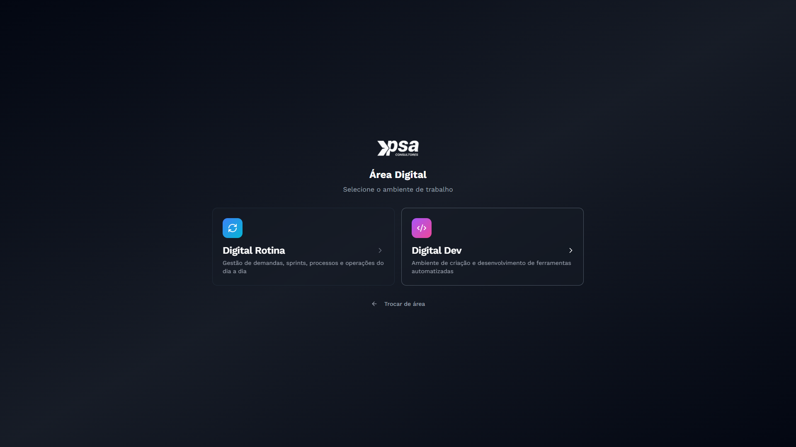
    

    
Escolha do ambiente da área Digital

### 2.5. Hub de Ferramentas
{: #secao-2-5}

Ao entrar no ambiente Digital Dev, o sistema carregará o **Hub de Ferramentas**. Utilize a seção "Sessões em Andamento" para retomar trabalhos recentes ou localize a ferramenta desejada no painel central.

Para iniciar a operação, utilize o menu lateral ou identifique o card correspondente e clique no botão **"Acessar Ferramenta"**.

    

        
    

    
Visão geral do Hub de Ferramentas e sessões ativas

## 3. Configuração da Classificação
{: #secao-3}

### 3.1. Acesso ao Módulo DIFAL
{: #secao-3-1}

No menu lateral esquerdo, clique em "DIFAL Inteligente" para abrir a tela de classificação tributária por NCM. É aqui que você configura o cliente e o período antes de iniciar a análise.

    

        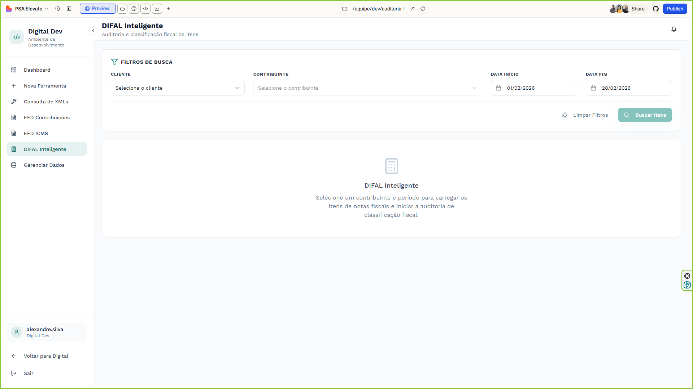
    

    
Navegação para o módulo de classificação tributária

### 3.2. Filtro de Cliente
{: #secao-3-2}

O primeiro passo da configuração é definir o cliente a ser analisado. O sistema carrega a lista de clientes disponíveis.

    

        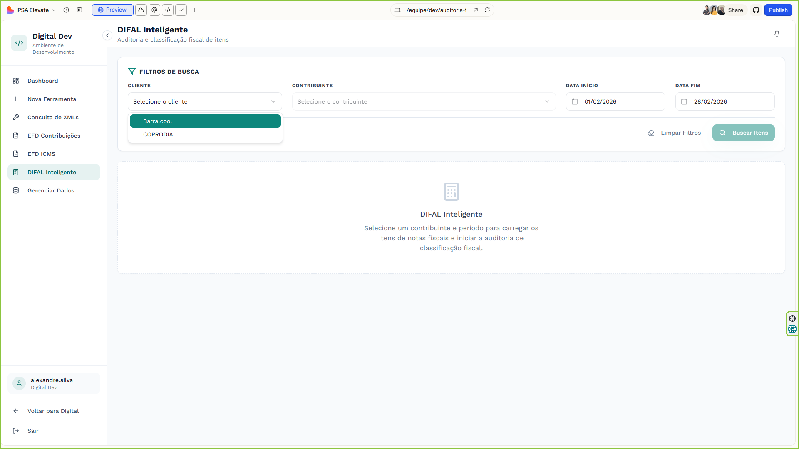
    

    
Definição do filtro do cliente

### 3.3. Listagem de Contribuintes
{: #secao-3-3}

Ao selecionar um cliente, o sistema carrega automaticamente a lista de contribuintes. Basta selecionar o contribuinte correspondente à análise.

    

        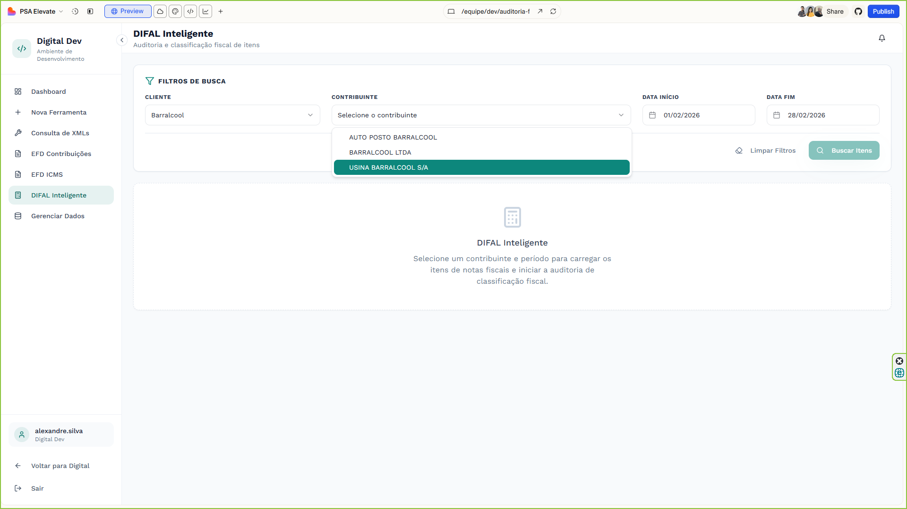
    

    
Visualização dos contribuintes disponíveis

### 3.4. Seleção do Contribuinte (Razão Social)
{: #secao-3-4}

Selecione o Contribuinte (Razão Social) correto do cliente. A escolha define quais notas fiscais e regras tributárias estaduais serão carregadas para a análise do DIFAL.

    

        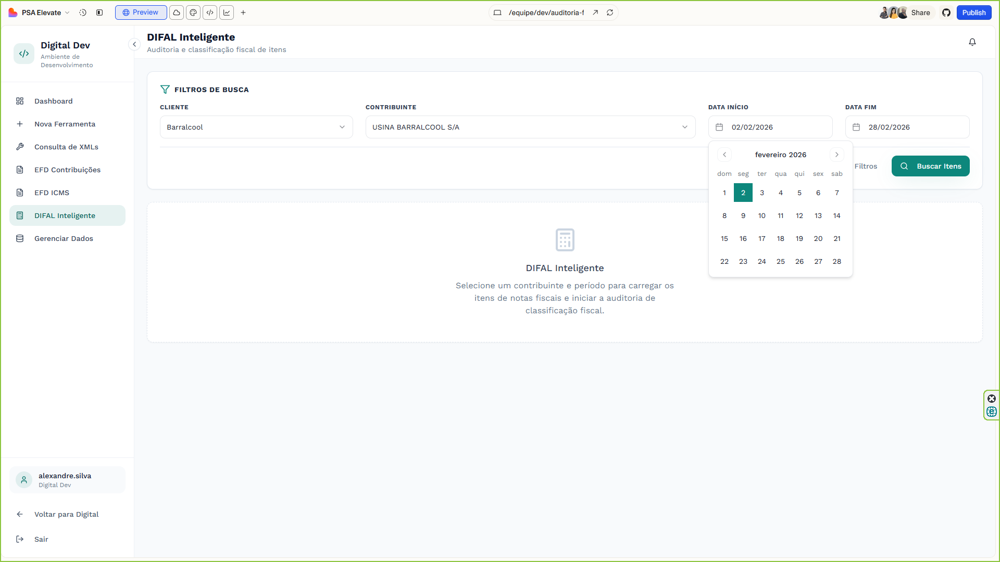
    

    
Confirmação da Razão Social da operação

### 3.5. Definição de Início do Período
{: #secao-3-5}

Informe a data inicial da competência a ser analisada. O sistema buscará todas as notas fiscais a partir dessa data.

    

        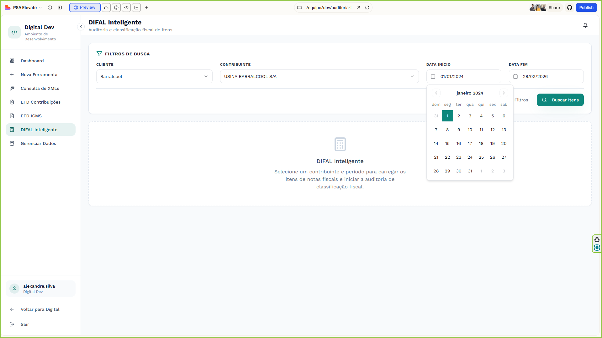
    

    
Configuração da data inicial

### 3.6. Definição de Fim do Período
{: #secao-3-6}

Informe a data final da competência. O sistema buscará todas as notas fiscais emitidas dentro do intervalo definido.

    

        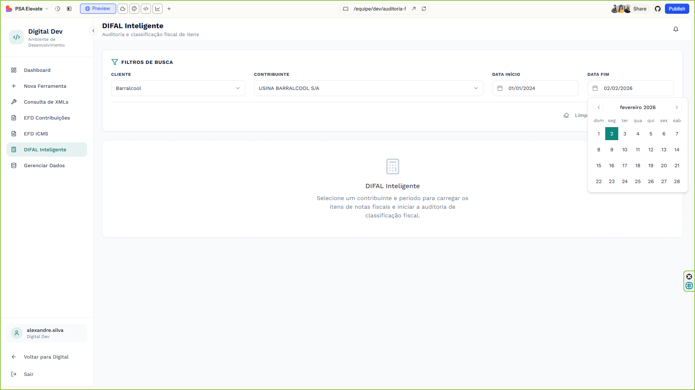
    

    
Configuração da data final

### 3.7. Execução da Busca
{: #secao-3-7}

Com todos os parâmetros definidos, clique no botão "Buscar Itens".

    

        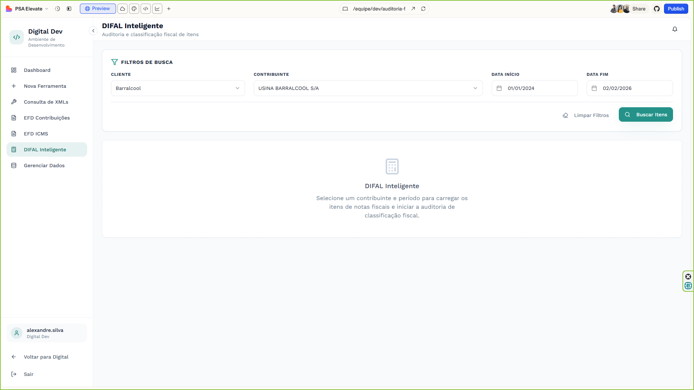
    

    
Execução da busca

## 4. Análise e Classificação
{: #secao-4}

### 4.1. Painel de Métricas
{: #secao-4-1}

Logo após a busca, cards no topo da tela exibem o resumo da classificação: total de NCMs identificados no período, quantos ainda precisam de regra tributária definida e quantos já foram classificados.

    

        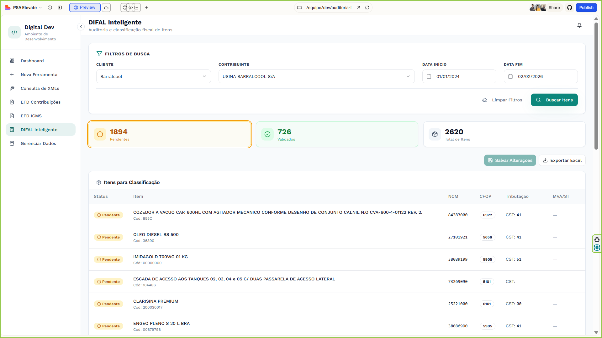
    

    
Carregamento da lista e resumo numérico

### 4.2. Grade de Itens
{: #secao-4-2}

A lista principal exibe todos os produtos retornados pela busca. Cada linha representa um item de nota fiscal com as informações fiscais essenciais: **NCM, CFOP**, descrição do produto e status de classificação atual.

### 4.3. Identificação de Pendências
{: #secao-4-3}

Itens com NCM sem regra tributária definida aparecem marcados com a etiqueta "Pendente" em amarelo. Esses são os produtos que ainda precisam de classificação para o cálculo do DIFAL.

    

        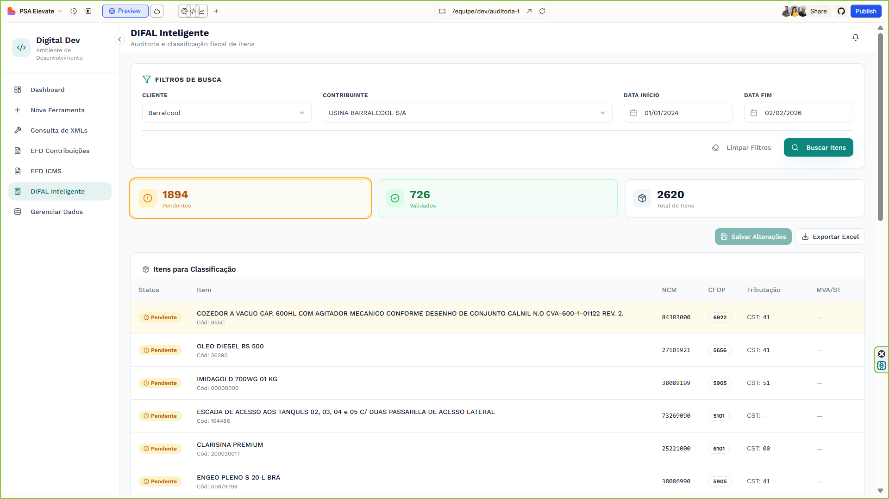
    

    
Destaque para itens aguardando classificação

### 4.4. Modal de Detalhes do Produto
{: #secao-4-4}

Ao clicar em um item, abre-se uma janela modal com informações detalhadas, incluindo NCM, CFOP, Valor Total e a descrição completa do produto conforme a nota fiscal.

    

        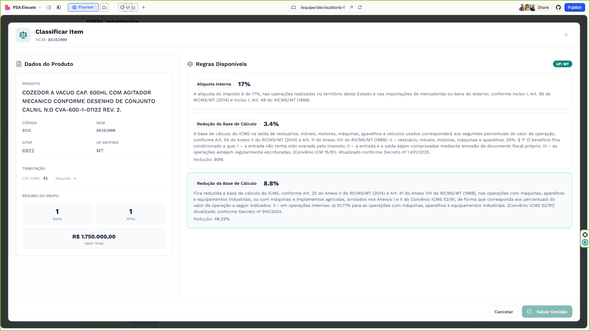
    

    
Interface de análise detalhada

### 4.5. Seleção de Regra Tributária
{: #secao-4-5}

No painel direito do modal, o sistema exibe as regras fiscais disponíveis para o NCM consultado: alíquota cheia, isenção ou redução de base de cálculo. Selecione o card correspondente à tributação correta conforme a legislação do estado de destino.

    

        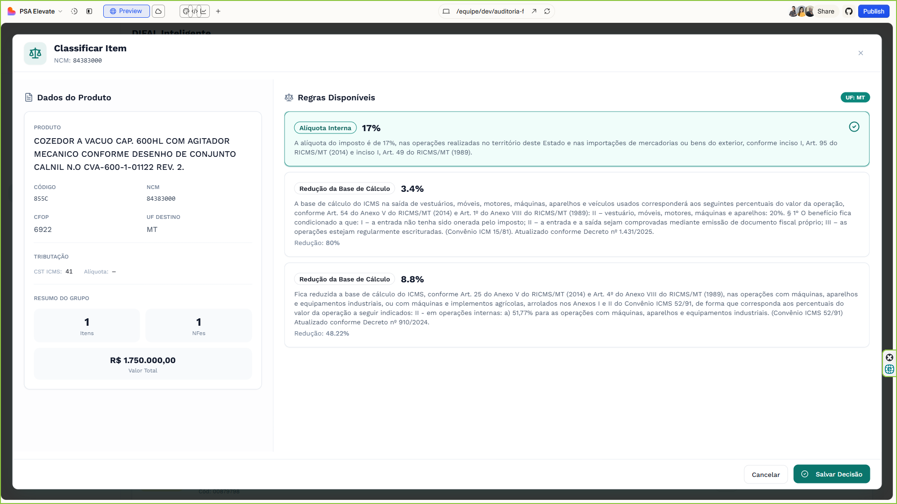
    

    
Aplicação da regra fiscal ao item

### 4.6. Confirmação da Decisão
{: #secao-4-6}

Após selecionar a regra, clique em "Salvar Decisão" para registrar a classificação daquele NCM. O modal fecha automaticamente e o item passa para o status "Validado" na lista.

    

        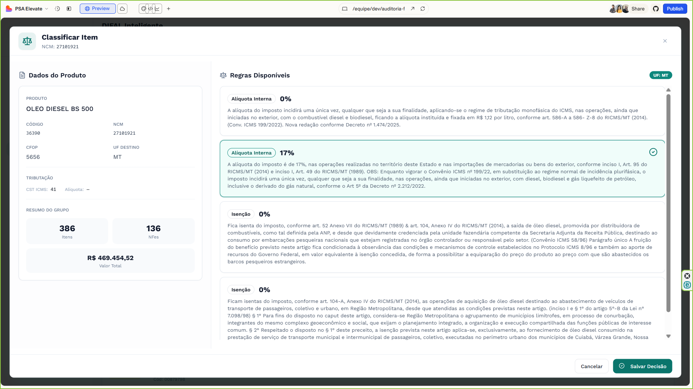
    

    
Efetivação da classificação individual

## 5. Conferência e Exemplos Práticos
{: #secao-5}

### 5.1. Atualização de Status
{: #secao-5-1}

Após salvar a classificação, o item é atualizado para "Validado" em verde na lista. Isso confirma que a regra tributária daquele NCM foi definida e registrada.

    

        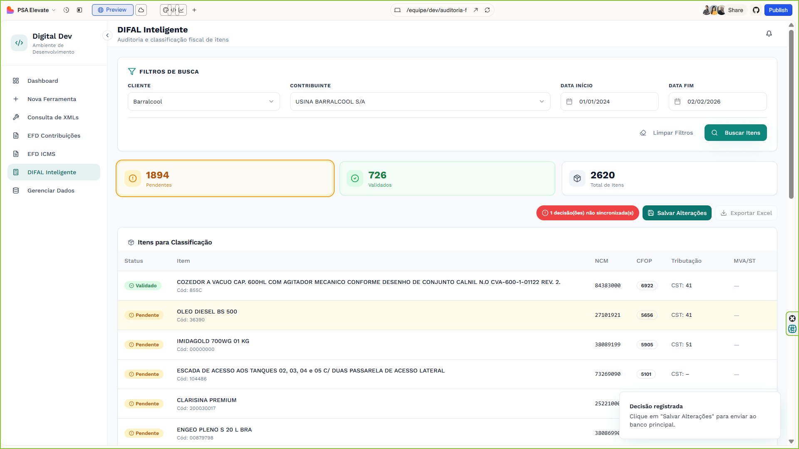
    

    
Feedback visual de conclusão

### 5.2. Acompanhamento na Lista Geral
{: #secao-5-2}

Use a lista para acompanhar o andamento da classificação: itens em amarelo ainda precisam de análise, itens em verde já foram classificados. Trabalhe de cima para baixo até zerar os pendentes.

    

        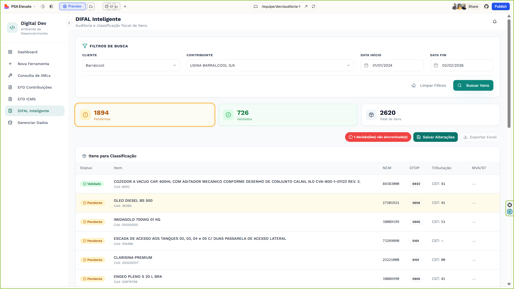
    

    
Monitoramento do progresso da classificação

### 5.3. Exemplos de Status: Pendente e Validado
{: #secao-5-3}

- **Item Pendente:** O NCM aparece na linha com status "Pendente" em amarelo, indicando que a classificação ainda precisa ser feita.
- **Item Validado:** O mesmo item após a classificação (ex: Cana de Açúcar), com status atualizado para "Validado" em verde. Use como referência para conferir se os dados foram aplicados corretamente.

    

        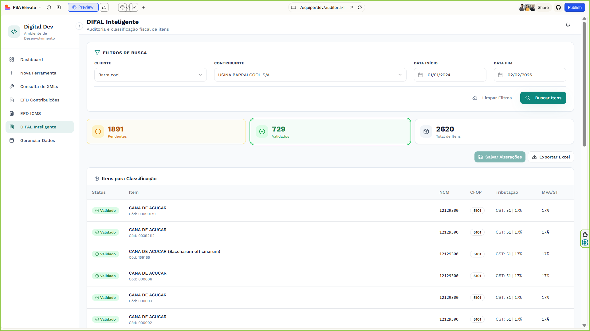
    

    
Estado dos registros mostrando a aplicação da regra

### 5.4. Consolidação da Lista
{: #secao-5-4}

Durante a sessão, você pode clicar no card "Pendentes" para atualizar a lista principal e focar naquilo que ainda aguarda análise. A presença de itens em amarelo indica que o trabalho de classificação tributária ainda está em andamento para a operação.

    

        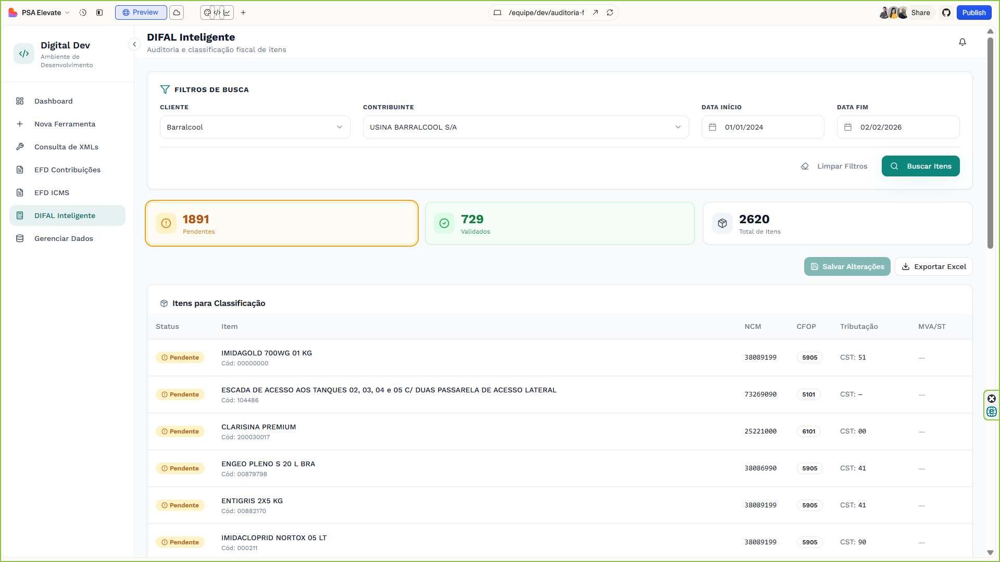
    

    
Visão consolidada do progresso

## 6. Sincronização de Dados
{: #secao-6}

### 6.1. Alerta de Sincronização Pendente
{: #secao-6-1}

Se aparecer um alerta vermelho na tela, significa que há classificações feitas que ainda não foram salvas no sistema. Clique em "Salvar Alterações" antes de fechar a página para não perder o trabalho realizado.

    

        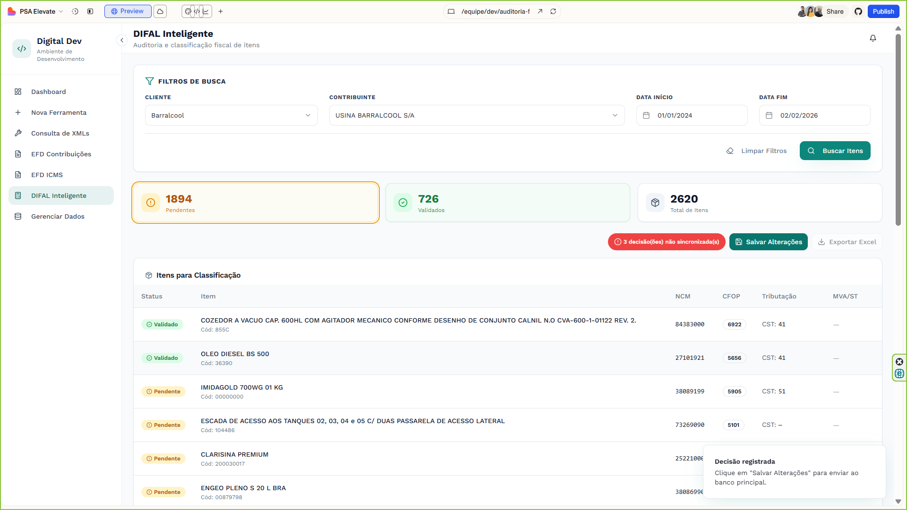
    

    
Indicação de dados pendentes de envio

    warning
    
<strong>Aviso:</strong>

    
Caso feche o navegador ou a página durante a classificação, o sistema irá salvar e restaurar a sessão no próximo acesso.

### 6.2. Confirmação de Salvamento
{: #secao-6-2}

Ao clicar em "Salvar Alterações", uma notificação de sucesso confirma que todas as classificações foram gravadas. Só após essa confirmação os dados estão seguros.

    

        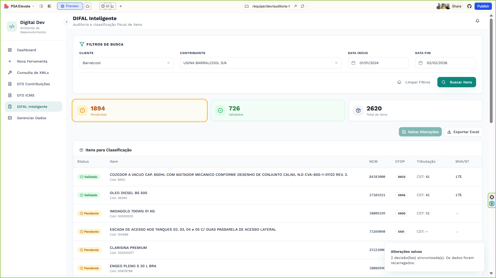
    

    
Conclusão do processo de sincronização

## 7. Exportação e Finalização
{: #secao-7}

### 7.1. Solicitação de Exportação
{: #secao-7-1}

Ao finalizar todas as classificações, clique em "Exportar Excel" para gerar a planilha com todos os NCMs classificados e suas regras tributárias definidas.

    

        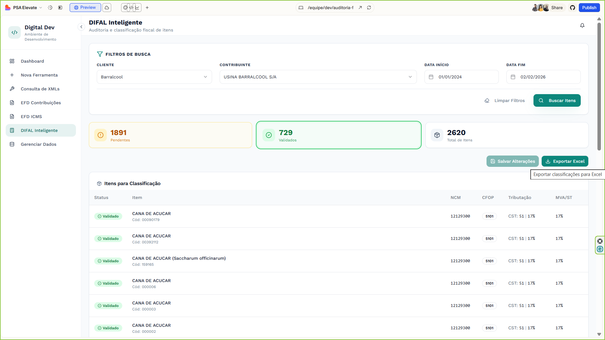
    

    
Início da exportação para Excel

### 7.2. Processamento do Arquivo
{: #secao-7-2}

Durante a geração da planilha, o botão exibe um indicador de carregamento, informando ao usuário que os dados estão sendo processados no servidor.

    

        
    

    
Aguardando compilação dos dados

### 7.3. Conclusão do Download
{: #secao-7-3}

Quando o arquivo estiver pronto, o download inicia automaticamente e um aviso de download do navegador será exibido na parte superior da tela. O arquivo gerado contém todos os itens classificados no período.

    

        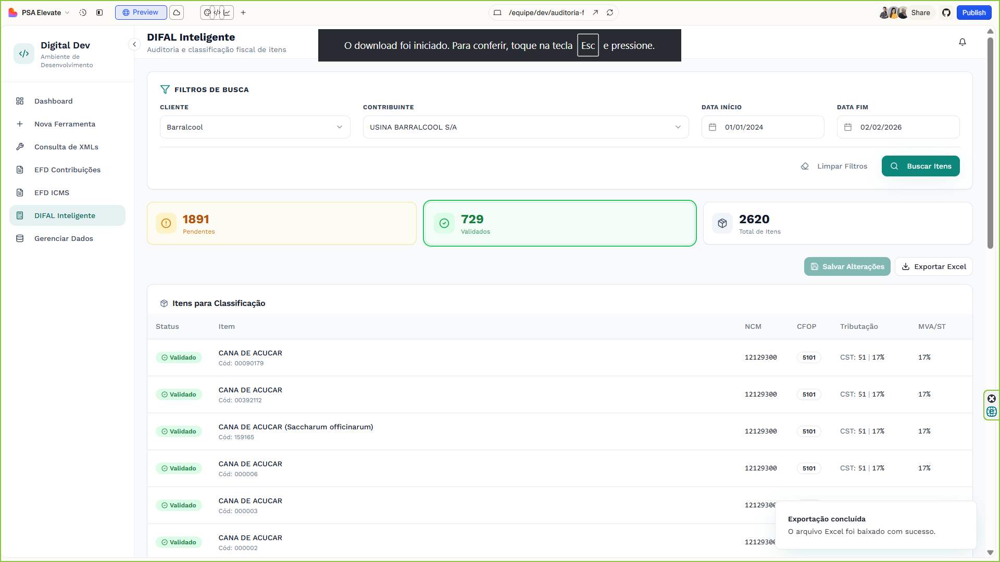
    

    
Aviso de download iniciado pelo navegador

### 7.4. Conferência Final
{: #secao-7-4}

Antes de encerrar ou exportar de forma parcial, você pode clicar no card de "Validados" para listar os itens já processados e conferir o andamento. Verifique se as regras preenchidas estão com status "Validado" em verde e certifique-se de que não há alertas de sincronização pendente na tela.

    

        
    

    
Revisão parcial ou final da classificação

### 7.5. Nova Busca e Encerramento
{: #secao-7-5}

A sua análise — seja ela parcial ou completa — é considerada encerrada quando os dados analisados estiverem devidamente salvos e exportados para o Excel sem alertas pendentes. Para iniciar uma nova busca de período ou redefinir a tela para classificar o restante, clique em "Limpar filtros".

    

        
    

    
Limpeza dos filtros para nova análise

