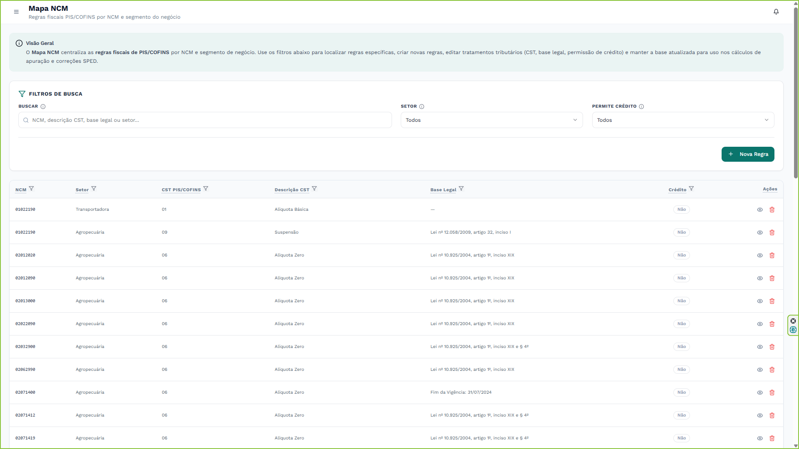
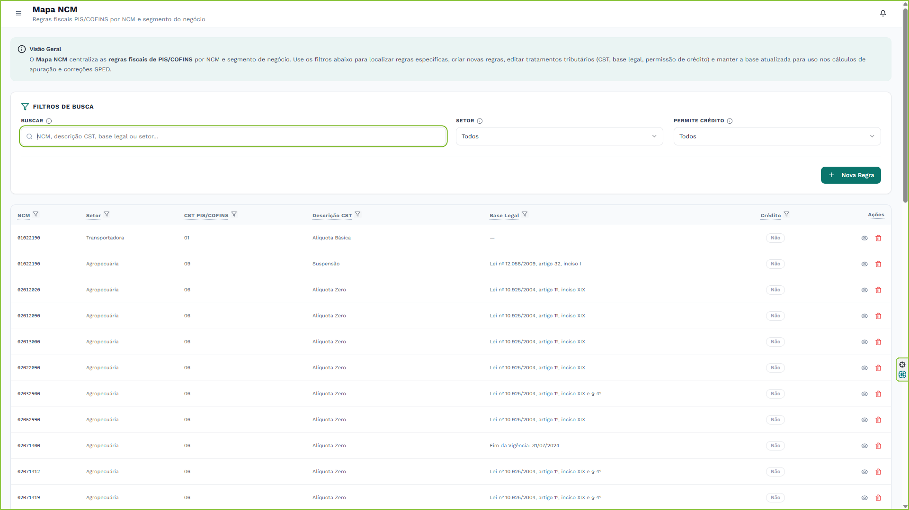
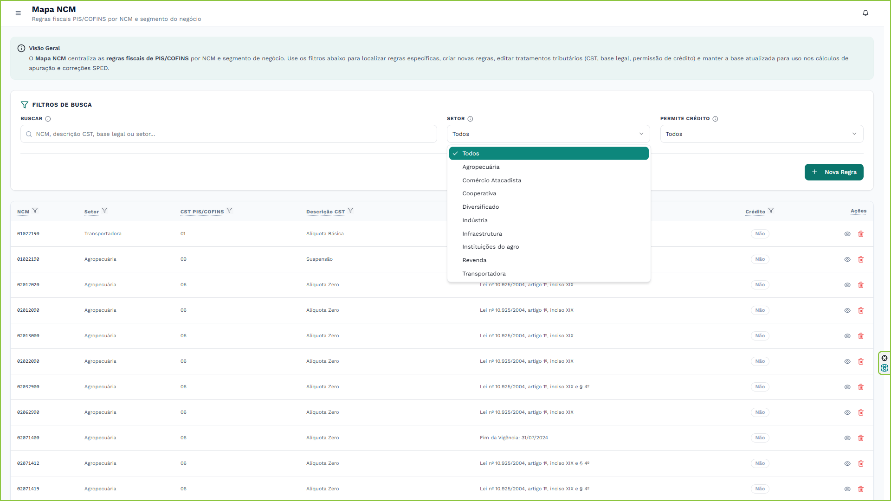
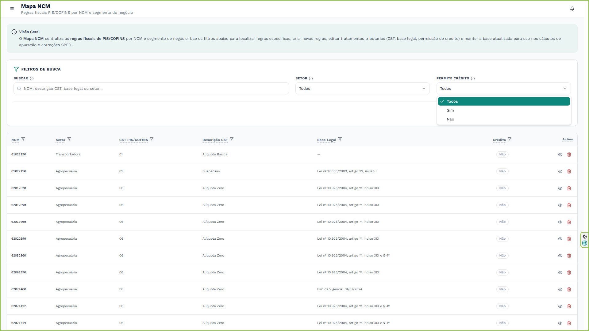
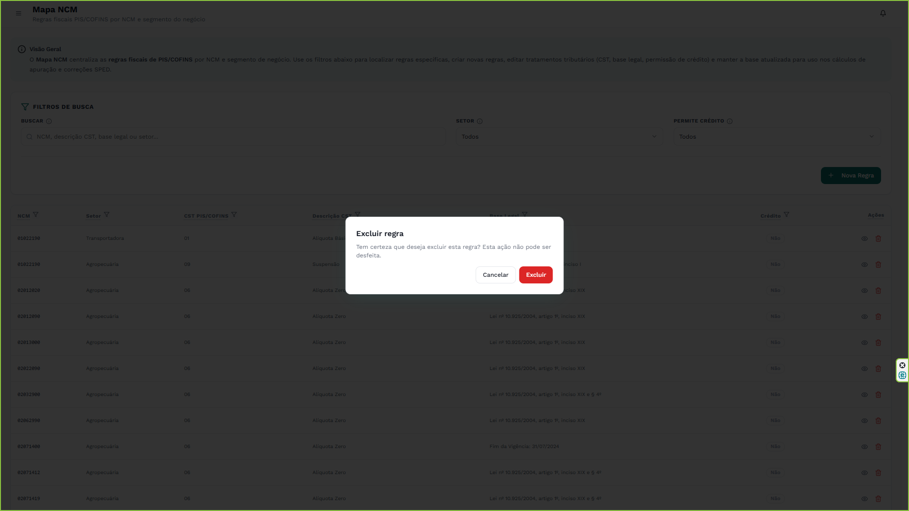
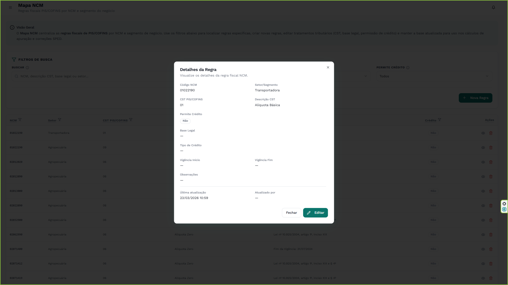
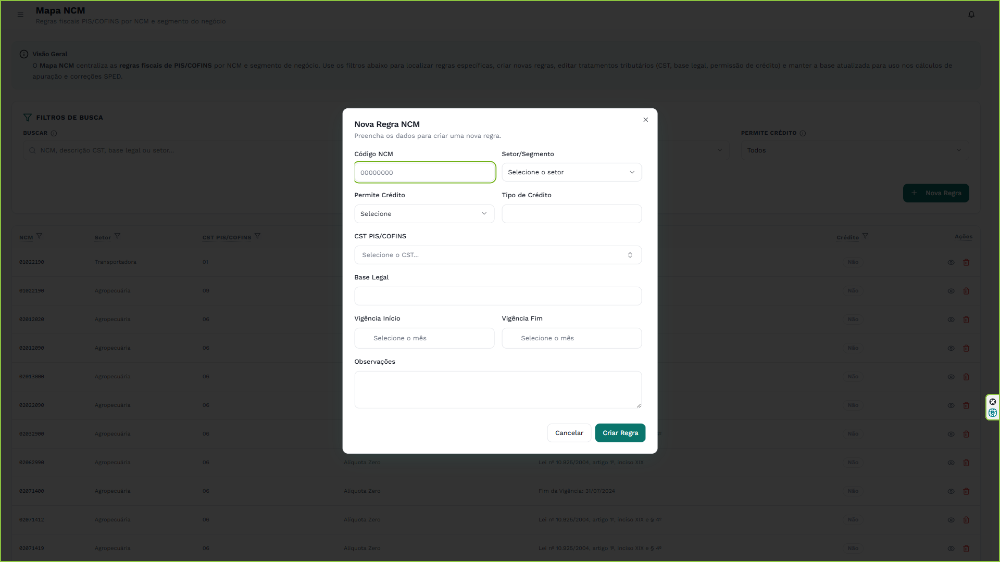
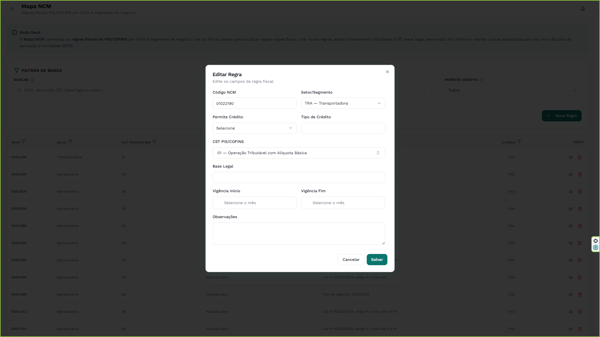

  

    1
    <h2 class="editable-text">Introdução</h2>
  

  

    
Este manual apresenta as funcionalidades da ferramenta <strong>Mapa NCM</strong>, parte integrante do sistema PSA Elevate. Esta ferramenta atua como a inteligência central para a parametrização de regras fiscais de PIS/COFINS por NCM (Nomenclatura Comum do Mercosul) e segmento de negócio.

    
O objetivo deste documento é orientar os analistas fiscais na manutenção da base de conhecimento tributário, garantindo que as regras de CST, base legal e permissões de crédito estejam atualizadas para consumo nos módulos de apuração e correções do SPED.

    <h3>Principais funcionalidades</h3>
    <ul>
        <li><strong>Busca inteligente:</strong> localize tratamentos tributários por NCM, base legal ou setor rapidamente.</li>
        <li><strong>Gestão de regras:</strong> criação, edição e exclusão de regras fiscais com trilha de análise.</li>
        <li><strong>Segmentação:</strong> definição de regras específicas baseadas no setor/segmento do contribuinte.</li>
        <li><strong>Controle de vigência:</strong> histórico de validade (Início/Fim) para cada regra estabelecida.</li>
    </ul>
    

        info
        
<strong>Organização da base:</strong> mantenha nomes de setor, vigências e bases legais sempre consistentes para evitar duplicidade de regras e conflitos de prioridade nos módulos consumidores.

    

  

  

    2
    <h2 class="editable-text">Acesso e autenticação</h2>
  

  

    <h3 id="secao-acesso-1">2.1. Acesso ao portal e área da equipe</h3>
    
O acesso às ferramentas começa pelo portal corporativo da PSA Consultores. Acesse o link <a href="https://psaconsultores.com.br" target="_blank">https://psaconsultores.com.br</a> e clique no ícone de <strong>"Equipe"</strong>, localizado no canto superior direito da tela, para entrar na área restrita.

    

        

            
        

        
Portal corporativo com destaque para o menu de acesso à Equipe

    

    <h3 id="secao-acesso-2">2.2. Seleção da área de atuação</h3>
    
Na tela de departamentos, abra a lista suspensa e selecione a opção <strong>"Digital"</strong> para acessar o sistema de gestão de demandas e as ferramentas internas.

    

        

            
        

        
Seleção da área de competência Digital

    

    <h3 id="secao-acesso-3">2.3. Login no sistema</h3>
    
A tela de autenticação será exibida. Insira suas credenciais corporativas (e-mail e senha) nos campos correspondentes e clique em <strong>"Entrar"</strong>.

    

        

            
        

        
Preenchimento dos dados de acesso

    

    <h3 id="secao-acesso-4">2.4. Seleção do ambiente de trabalho</h3>
    
Após o login, selecione o ambiente <strong>"Digital Dev"</strong>. Este é o ambiente de criação, desenvolvimento e utilização das ferramentas fiscais automatizadas.

    

        

            
        

        
Escolha do ambiente da área Digital

    

    <h3 id="secao-acesso-5">2.5. Hub de Ferramentas</h3>
    
Ao entrar no ambiente Digital Dev, o sistema carregará o <strong>Hub de Ferramentas</strong>. Utilize a seção "Sessões em Andamento" para retomar trabalhos recentes ou localize o cartão correspondente e clique no botão <strong>"Acessar Ferramenta"</strong>.

    

        

            
        

        
Visão geral do Hub de Ferramentas e sessões ativas

    

  

  

    3
    <h2 class="editable-text">Conhecendo a ferramenta</h2>
  

  

    <h3 id="secao-3-1">3.1. Navegação até o Mapa NCM</h3>
    
No menu lateral esquerdo do ambiente Digital Dev, localize a seção de ferramentas tributárias e clique na opção <strong>Mapa NCM</strong>.

    <h3 id="secao-3-2">3.2. Visão geral da interface</h3>
    
A tela é dividida em duas partes principais: o painel superior de <strong>Filtros de Busca</strong> e a grade de dados (tabela) contendo as regras fiscais de PIS/COFINS já cadastradas.

    

        

            
        

        
Interface principal do Mapa NCM

    

  

  

    4
    <h2 class="editable-text">Utilizando os filtros de busca</h2>
  

  

    
O painel de filtros permite localizar tratamentos tributários específicos em uma base de dados extensa.

    <h3 id="secao-4-1">4.1. Busca livre (texto)</h3>
    
Utilize o campo <strong>Buscar</strong> para digitar qualquer termo relacionado à regra. O sistema buscará instantaneamente correspondências no código do NCM, na descrição do CST, na base legal ou no nome do setor.

    

        

            
        

        
Filtro de texto para busca rápida

    

    
    <h3 id="secao-4-2">4.2. Filtro por setor</h3>
    
Selecione um segmento de negócio no menu suspenso <strong>Setor</strong> para visualizar apenas as regras aplicáveis a contribuintes daquela área específica de atuação.

    

        

            
        

        
Seleção do segmento de negócio aplicável à regra

    

    <h3 id="secao-4-3">4.3. Filtro por permissão de crédito</h3>
    
Utilize o filtro <strong>Permite Crédito</strong> (Sim/Não) para isolar rapidamente operações monofásicas, alíquota zero ou tributadas que geram ou não direito a crédito.

    

        

            
        

        
Isolando operações geradoras de crédito

    

    <h3 id="secao-4-4">4.4. Filtros de coluna e ordenação</h3>
    
Além dos filtros globais superiores, cada cabeçalho de coluna na tabela possui ícones para ordenação (crescente/decrescente) e filtros específicos (ex: exibir apenas CST 01 e CST 04).

  

  

    5
    <h2 class="editable-text">Navegando na tabela de regras</h2>
  

  

    <h3 id="secao-5-1">5.1. Colunas de dados fiscais</h3>
    
A tabela de resultados consolida as informações mais importantes:

    <ul>
        <li><strong>NCM:</strong> O código da mercadoria.</li>
        <li><strong>Setor:</strong> O segmento ao qual a regra se aplica.</li>
        <li><strong>CST PIS/COFINS e Descrição:</strong> O tratamento tributário definido.</li>
        <li><strong>Base Legal:</strong> O amparo normativo (Lei, Decreto, ADI) da regra.</li>
        <li><strong>Crédito:</strong> Status visual (em verde "Sim", em cinza "Não") indicando o direito a crédito.</li>
    </ul>

    <h3 id="secao-5-2">5.2. Ações: visualizar e excluir</h3>
    
Na última coluna à direita (Ações), você encontra os controles individuais:

    <ul>
        <li><strong>Ícone de olho (visualizar):</strong> abre os detalhes completos da regra. (Você também pode clicar em qualquer lugar da linha para obter o mesmo resultado).</li>
        <li><strong>Ícone de lixeira (excluir):</strong> remove a regra permanentemente. O sistema solicitará uma confirmação de segurança.</li>
    </ul>
    

        

            
        

        
Confirmação de segurança ao excluir uma regra do Mapa NCM

    

  

  

    6
    <h2 class="editable-text">Detalhamento e cadastro de regras</h2>
  

  

    <h3 id="secao-6-1">6.1. Visualização detalhada (cartões)</h3>
    
Ao clicar em uma regra ou buscar por um NCM específico no sistema, um painel lateral se abre exibindo as regras atreladas àquele código. É possível visualizar dados adicionais como o <strong>período de vigência</strong>, observações internas e os dados de quem criou/editou e quando.

    

        

            
        

        
Painel de visualização com todos os dados da regra fiscal

    

    <h3 id="secao-6-2">6.2. Cadastrando uma nova regra</h3>
    
Para adicionar um novo tratamento tributário, clique no botão verde <strong>+ Nova Regra</strong> no painel de filtros. Um formulário lateral se abrirá.

    
Preencha atentamente os campos obrigatórios: NCM, CST aplicável e a permissão de crédito. Recomenda-se sempre preencher a base legal correspondente e a vigência correta.

    

        

            
        

        
Painel lateral para cadastro de nova regra no Mapa NCM

    

    <h3 id="secao-6-3">6.3. Editando uma regra existente</h3>
    
Ao visualizar os detalhes de uma regra, clique no botão <strong>Editar</strong> com ícone de lápis. O mesmo formulário lateral se abrirá com os dados atuais preenchidos.

    

        

            
        

        
Editando as propriedades tributárias de uma regra já existente

    

    
Altere as informações necessárias e clique em "Salvar". O sistema registrará automaticamente a trilha de análise dessa alteração. Para sair do painel lateral e voltar à tabela principal, clique fora da janela ou utilize a tecla ESC.

    

        

            
        

        
Fechando o painel de detalhes da regra

    

  

  

    7
    <h2 class="editable-text">Boas práticas e análise</h2>
  

  

    

        lightbulb
        
<strong>Cuidado com vigências conflitantes:</strong> ao cadastrar uma regra para o mesmo NCM e mesmo Setor, certifique-se de que a data de vigência fim da regra anterior não se sobreponha à vigência início da nova regra.

    

    

        warning
        
<strong>Análise automática:</strong> todas as ações de criação, edição e exclusão no Mapa NCM são gravadas permanentemente nos registros de análise do sistema, contendo o autor da modificação e a diferença (o que foi alterado) de cada campo.

    

    

        info
        
<strong>Regras genéricas vs específicas:</strong> se uma regra se aplica a todos os setores de negócio, deixe o campo Setor vazio (ou genérico). O sistema de apuração sempre dará prioridade a uma regra com setor específico antes de aplicar a genérica.

    

  

